# 09_Windows 全架构 Hook 技术图谱 - 内核态 Hook（Ring 0）

进入内核态（Ring 0）后，Hook 的拦截能力与影响面都大幅提升，但同时必须面对 **PatchGuard（KPP，内核补丁保护）** 的监控。PatchGuard 会周期性校验 SSDT、IDT、GDT、MSR 等关键结构，发现篡改后延迟触发蓝屏（`CRITICAL_STRUCTURE_CORRUPTION`，0x109）。

---

## 导读：内核态 Hook 技术全景

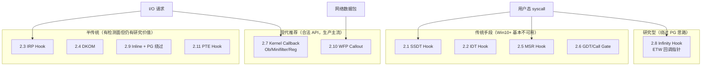

### 技术速查对比表

| 编号 | 技术 | 常用度 | 隐蔽性 | PatchGuard | 现代 Windows 状态 | 典型场景 |
|------|------|--------|--------|------------|-------------------|----------|
| 2.1 | SSDT Hook | ★☆☆☆☆ | ★★☆☆☆ | ❌ 必杀 | 已淘汰 | 历史学习（XP/7 时代） |
| 2.2 | IDT Hook | ★☆☆☆☆ | ★★☆☆☆ | ❌ 必杀 | 已淘汰 | 历史学习 |
| 2.3 | IRP Hook | ★★★☆☆ | ★★★☆☆ | ⚠️ 不直接监控 | 可用，推荐 Minifilter | 文件/设备 I/O 拦截 |
| 2.4 | DKOM | ★★☆☆☆ | ★★★☆☆ | ⚠️ 部分监控 | 高风险 | 进程/驱动隐藏（取证可发现） |
| 2.5 | MSR Hook | ★☆☆☆☆ | ★★☆☆☆ | ❌ 必杀 | 已淘汰 | 历史学习 |
| 2.6 | GDT/Call Gate | ★☆☆☆☆ | ★☆☆☆☆ | ❌ 必杀 | 已淘汰 | 历史学习 |
| 2.7 | Kernel Callback | ★★★★★ | ★★★★☆ | ✅ 合法 | **生产主流** | EDR/杀毒/安全软件 |
| 2.8 | Infinity Hook | ★★☆☆☆ | ★★★★☆ | ✅ 不监控 ETW 指针 | 部分版本已加固 | 研究型 syscall 监控 |
| 2.9 | Inline + PG 绕过 | ★★☆☆☆ | ★★★☆☆ | ⚠️ 对抗 PG | 高风险不稳定 | 研究/Rootkit |
| 2.10 | WFP Callout | ★★★★★ | ★★★★★ | ✅ 合法 | **生产主流** | 网络过滤/防火墙 |
| 2.11 | PTE Hook | ★★☆☆☆ | ★★★★☆ | ⚠️ 部分监控 | 研究型 | 无字节修改的执行劫持 |

### PatchGuard 监控范围（需牢记）

| 结构 | PatchGuard 是否监控 | 说明 |
|------|----------------------|------|
| SSDT / Shadow SSDT | ✅ | 修改 → 蓝屏 0x109 |
| IDT（每核） | ✅ | 必须全核一致 |
| GDT | ✅ | Call Gate 极可疑 |
| IA32_LSTAR (MSR) | ✅ | syscall 入口 |
| 驱动 MajorFunction | ❌ | 但可被安全软件扫描 |
| Ob/Process/Registry 回调 | ❌ | 官方合法机制 |
| WFP Callout | ❌ | 官方合法机制 |
| ETW 内部函数指针 | ❌ | Infinity Hook 利用点 |

### 阅读建议

- **驱动开发入门**：2.7 Kernel Callback → 2.10 WFP Callout → 2.3 IRP Hook（理解后迁移到 Minifilter）
- **安全研究**：2.1 SSDT（理解 syscall 内核路径）→ 2.8 Infinity Hook → 2.11 PTE Hook
- **历史/已淘汰**：2.1、2.2、2.5、2.6 — 了解原理即可，不要在 Win10+ 生产环境使用
- **深化阅读**：2.7 Minifilter 骨架 → 2.10 WFP 事务模板 → 附录 A syscall 链路

---

## 一、传统内核 Hook（PatchGuard 必杀，历史技术）

> 以下技术在 Windows XP/7 时代是主流，Win8+ 起被 PatchGuard 全面封杀。代码保留用于理解内核 Hook 演进，**不可用于现代系统生产环境**。

## 2.1 SSDT Hook（系统服务描述符表 Hook）

### 技术定位

**已淘汰的历史技术**。WinXP/7 时代内核 Hook 的"王者"，几乎所有早期杀毒/防火墙都用过。Win8+ PatchGuard 直接监控 SSDT，修改即蓝屏。

### 原理

SSDT（System Service Descriptor Table）是内核中的函数指针表（实际存相对偏移），用户态 `syscall` 进入内核后通过 SSN 索引到这张表，找到对应的内核服务函数。修改表项即可拦截所有系统调用。

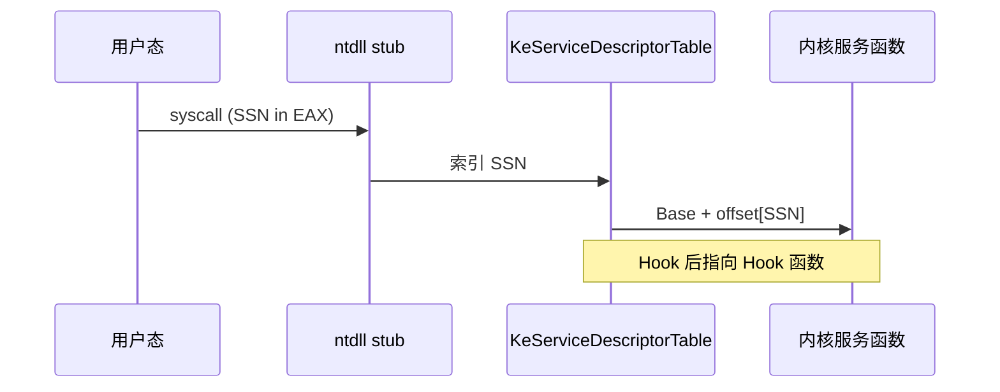

### 完整实现

```c
#include <ntddk.h>

typedef struct _KSERVICE_TABLE_DESCRIPTOR {
    PLONG Base;            // 函数偏移表基地址（Win64 存的是相对偏移）
    PULONG Count;          // 调用计数表
    ULONG Limit;           // 最大服务号
    PUCHAR Number;         // 参数字节数表
} KSERVICE_TABLE_DESCRIPTOR, *PKSERVICE_TABLE_DESCRIPTOR;

// KeServiceDescriptorTable 是导出符号（仅 x86），x64 需要手动定位
extern PKSERVICE_TABLE_DESCRIPTOR KeServiceDescriptorTable;

// x64 SSDT 使用相对偏移而非绝对地址
// 实际地址 = Base + (Base[SSN] >> 4)
// 低 4 位存储参数字节数

// 定位 SSDT（x64 方式：通过 KiSystemServiceRepeat 签名扫描）
PVOID FindSsdtBase() {
// KiSystemCall64 中的特征码搜索
// 4C 8D 15 XX XX XX XX  lea r10, [KeServiceDescriptorTable]
    ULONG64 kiSystemCall = __readmsr(0xC0000082); // IA32_LSTAR

// 从 KiSystemCall64 开始扫描特征码
for (ULONG i = 0; i < 0x500; i++) {
// 寻找 lea r10, [rip + offset] (4C 8D 15)
if (*(USHORT*)((BYTE*)kiSystemCall + i) == 0x8D4C &&
            *((BYTE*)kiSystemCall + i + 2) == 0x15) {
            INT32 offset = *(INT32*)((BYTE*)kiSystemCall + i + 3);
            PVOID ssdt = (PVOID)((BYTE*)kiSystemCall + i + 7 + offset);
return ssdt;
        }
    }
return NULL;
}

// 读取 SSDT 中某个 SSN 对应的内核函数地址
PVOID GetSsdtFunctionAddress(ULONG ssn) {
    PKSERVICE_TABLE_DESCRIPTOR ssdt = (PKSERVICE_TABLE_DESCRIPTOR)FindSsdtBase();
if (!ssdt || ssn >= ssdt->Limit) return NULL;

    LONG offset = ssdt->Base[ssn] >> 4;
return (PVOID)((BYTE*)ssdt->Base + offset);
}

// 修改 SSDT 条目（需要关闭写保护）
NTSTATUS HookSsdtEntry(ULONG ssn, PVOID hookFunction, PVOID* originalFunction) {
    PKSERVICE_TABLE_DESCRIPTOR ssdt = (PKSERVICE_TABLE_DESCRIPTOR)FindSsdtBase();
if (!ssdt || ssn >= ssdt->Limit) return STATUS_INVALID_PARAMETER;

// 保存原始函数地址
    LONG origOffset = ssdt->Base[ssn] >> 4;
    *originalFunction = (PVOID)((BYTE*)ssdt->Base + origOffset);

// 计算新的偏移
    LONG newOffset = (LONG)((BYTE*)hookFunction - (BYTE*)ssdt->Base);
    LONG newEntry = (newOffset << 4) | (ssdt->Base[ssn] & 0xF); // 保留低4位

// 关闭 CR0.WP 位（禁用写保护）
    ULONG64 cr0 = __readcr0();
    __writecr0(cr0 & ~0x10000);

// 关中断防止竞态
    _disable();

// 写入新偏移
InterlockedExchange(&ssdt->Base[ssn], newEntry);

    _enable();
    __writecr0(cr0);

return STATUS_SUCCESS;
}

// Hook 函数示例：拦截 NtOpenProcess
typedef NTSTATUS(*fnNtOpenProcess)(PHANDLE, ACCESS_MASK, POBJECT_ATTRIBUTES, PCLIENT_ID);
fnNtOpenProcess OriginalNtOpenProcess = NULL;

NTSTATUS HookedNtOpenProcess(PHANDLE ProcessHandle, ACCESS_MASK DesiredAccess,
    POBJECT_ATTRIBUTES ObjectAttributes, PCLIENT_ID ClientId) {
// 保护特定进程
if (ClientId && ClientId->UniqueProcess == (HANDLE)g_protectedPid) {
return STATUS_ACCESS_DENIED;
    }
return OriginalNtOpenProcess(ProcessHandle, DesiredAccess, ObjectAttributes, ClientId);
}
```

### SSDT x64 偏移计算说明

x64 的 SSDT 不存绝对地址，而是**相对偏移**：

```
实际函数地址 = ssdt->Base + (ssdt->Base[ssn] >> 4)
低 4 位 = 参数字节数（x86 遗留格式）
```

### 更易理解的 Hook 流程（三步）

```c
// 精简版：理解 SSDT Hook 核心逻辑（勿在 Win10+ 使用）
// 1. FindSsdtBase()     → 定位 KeServiceDescriptorTable
// 2. GetSsdtFunctionAddress(ssn) → 保存原始函数到 originalFunction
// 3. HookSsdtEntry(ssn, hookFunc, &originalFunction) → 写入新偏移
//
// Hook 函数模板：
NTSTATUS HookedNtXxx(...) {
    // 过滤/记录
    return OriginalNtXxx(...);  // 调用原始函数
}
```

### 检测难度：★★☆☆☆（PatchGuard 必杀）

PatchGuard 直接监控 SSDT，定期对比校验和。一旦发现修改 → 延迟蓝屏（故意随机延迟使调试困难）。

### 历史地位与现代替代

| 时代 | 做法 | 现状 |
|------|------|------|
| XP/7 | SSDT Hook 拦截 NtOpenProcess 等 | PatchGuard 封杀 |
| Win8+ | Infinity Hook / ETW 回调 | 研究型替代 |
| 生产推荐 | `ObRegisterCallbacks` + 进程回调 | 2.7 合法方案 |

* Windows XP/7 时代的内核 Hook 之王
* 几乎所有安全软件（杀毒/防火墙/HIPS）都用过
* Win8+ 之后被 PatchGuard 彻底封杀

### Shadow SSDT 补充

x64 内核实际上有**两张**服务表：

| 表 | 用途 | Hook 风险 |
|----|------|-----------|
| `KeServiceDescriptorTable` | `ntoskrnl` 原生 syscall | PatchGuard 监控 |
| Win32K 表（`win32k.sys`） | GUI 相关 syscall | 同样被 PG 监控 |

> GUI 进程的 `syscall` 部分会进入 `win32k`，但 PatchGuard 对两张表均做完整性校验，Shadow SSDT Hook 在现代系统上同样不可行。

---

## 2.2 IDT Hook（中断描述符表 Hook）

### 技术定位

**已淘汰**。通过修改 IDT 条目劫持中断/异常处理入口。PatchGuard 监控 IDT，且 x64 上每 CPU 核心有独立 IDT，Hook 必须全核同步。

### 原理

IDT（Interrupt Descriptor Table）存储中断/异常处理器的入口地址。修改 IDT 条目可以拦截特定中断，例如 int 0x2E（旧版系统调用入口）、int 0x03（断点）、int 0x0E（缺页异常）。

### 完整实现

```c
#include <ntddk.h>

#pragma pack(push, 1)
typedef struct _IDTENTRY64 {
    USHORT OffsetLow;      // 目标函数地址低16位
    USHORT Selector;       // 代码段选择器
    USHORT Ist : 3;        // IST 索引
    USHORT Reserved0 : 5;
    USHORT Type : 4;       // 门类型 (0xE = 中断门)
    USHORT Reserved1 : 1;
    USHORT Dpl : 2;        // 描述符特权级
    USHORT Present : 1;    // 存在位
    USHORT OffsetMid;      // 中16位
    ULONG  OffsetHigh;     // 高32位
    ULONG  Reserved2;
} IDTENTRY64, *PIDTENTRY64;

typedef struct _IDTR {
    USHORT Limit;
    ULONG64 Base;
} IDTR;
#pragma pack(pop)

// 获取当前 CPU 的 IDT 基地址
PIDTENTRY64 GetIdtBase() {
    IDTR idtr;
    __sidt(&idtr);
return (PIDTENTRY64)idtr.Base;
}

// 从 IDT 条目中提取完整的处理器地址
ULONG64 GetIdtHandlerAddress(PIDTENTRY64 entry) {
return (ULONG64)entry->OffsetLow | 
           ((ULONG64)entry->OffsetMid << 16) | 
           ((ULONG64)entry->OffsetHigh << 32);
}

// 设置 IDT 条目的处理器地址
void SetIdtHandlerAddress(PIDTENTRY64 entry, ULONG64 newHandler) {
    entry->OffsetLow  = (USHORT)(newHandler & 0xFFFF);
    entry->OffsetMid  = (USHORT)((newHandler >> 16) & 0xFFFF);
    entry->OffsetHigh = (ULONG)((newHandler >> 32) & 0xFFFFFFFF);
}

// Hook 特定中断向量
ULONG64 g_originalInt1Handler = 0;

void HookIdtVector(UCHAR vector, PVOID newHandler) {
    PIDTENTRY64 idt = GetIdtBase();
    PIDTENTRY64 entry = &idt[vector];

// 保存原始处理器
    g_originalInt1Handler = GetIdtHandlerAddress(entry);

// 关中断
    _disable();

// 修改处理器地址
SetIdtHandlerAddress(entry, (ULONG64)newHandler);

    _enable();
}

// int 1 (单步/硬件断点) Hook 处理器
// 必须是裸函数，正确保存/恢复上下文
__declspec(naked) void HookedInt1Handler() {
    __asm {
// 保存寄存器
        push rax
        push rcx
        push rdx
        push r8
        push r9
        push r10
        push r11

// 检查 DR6 确定触发原因
        mov rax, dr6
        test rax, 0xF        // 检查是否是 DR0-3 触发
        jz pass_through

// 是硬件断点触发，执行 Hook 逻辑
// ...自定义处理...

// 清除 DR6
xor rax, rax
        mov dr6, rax

    pass_through:
        pop r11
        pop r10
        pop r9
        pop r8
        pop rdx
        pop rcx
        pop rax

// 跳转到原始处理器
        jmp [g_originalInt1Handler]
    }
}

// 注意：x64 上 IDT Hook 需要对每个 CPU 核心都做修改
void HookIdtOnAllCpus(UCHAR vector, PVOID handler) {
    ULONG numCpus = KeQueryActiveProcessorCountEx(ALL_PROCESSOR_GROUPS);

for (ULONG i = 0; i < numCpus; i++) {
        PROCESSOR_NUMBER procNum;
KeGetProcessorNumberFromIndex(i, &procNum);

        GROUP_AFFINITY affinity = {0};
        affinity.Group = procNum.Group;
        affinity.Mask = 1ULL << procNum.Number;

        GROUP_AFFINITY oldAffinity;
KeSetSystemGroupAffinityThread(&affinity, &oldAffinity);

HookIdtVector(vector, handler);

KeRevertToUserGroupAffinityThread(&oldAffinity);
    }
}
```

### 检测难度：★★☆☆☆（PatchGuard 必杀）

PatchGuard 同样监控 IDT。而且 IDT 是每个 CPU 核心独立的，要 Hook 必须修改所有核心的 IDT，增加了暴露面。

> **现代替代**：syscall 入口已不走 int 0x2E，而是 `syscall` + MSR LSTAR。IDT Hook 对现代 syscall 路径无效。

---

## 2.3 IRP Hook（I/O 请求包 Hook）

### 技术定位

**仍可用，但官方推荐 Minifilter**。通过替换 `DRIVER_OBJECT->MajorFunction[]` 拦截发往特定驱动的 I/O 请求。PatchGuard 不直接监控，但指针异常可被安全软件发现。

### 原理

Windows 驱动使用 IRP（I/O Request Packet）进行通信。每个驱动对象（`DRIVER_OBJECT`）有一个 `MajorFunction` 数组，存放 28 种 IRP 处理函数指针。替换这些指针即可拦截所有发往该驱动的 I/O 操作。

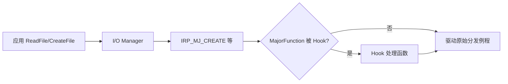

**常见 MajorFunction 类型**：

| 值 | 名称 | 用途 |
|----|------|------|
| `IRP_MJ_CREATE` | 0x00 | 创建/打开文件 |
| `IRP_MJ_READ` | 0x03 | 读文件 |
| `IRP_MJ_WRITE` | 0x04 | 写文件 |
| `IRP_MJ_DEVICE_CONTROL` | 0x0E | IOCTL |

### 完整实现

```c
#include <ntddk.h>

typedef struct _IRP_HOOK {
    PDRIVER_OBJECT targetDriver;
    ULONG majorFunction;
    PDRIVER_DISPATCH originalDispatch;
    PDRIVER_DISPATCH hookDispatch;
} IRP_HOOK;

#define MAX_IRP_HOOKS 16
IRP_HOOK g_irpHooks[MAX_IRP_HOOKS] = {0};
int g_irpHookCount = 0;

// 获取驱动对象
NTSTATUS GetDriverObjectByName(PUNICODE_STRING driverName, PDRIVER_OBJECT* ppDriver) {
return ObReferenceObjectByName(
        driverName,
        OBJ_CASE_INSENSITIVE,
NULL,
0,
        *IoDriverObjectType,
        KernelMode,
NULL,
        (PVOID*)ppDriver
    );
}

// Hook 某个驱动的特定 IRP 处理函数
NTSTATUS InstallIrpHook(PUNICODE_STRING driverName, ULONG majorFunc, PDRIVER_DISPATCH hookFunc) {
    PDRIVER_OBJECT pDriver = NULL;
    NTSTATUS status = GetDriverObjectByName(driverName, &pDriver);
if (!NT_SUCCESS(status)) return status;

if (g_irpHookCount >= MAX_IRP_HOOKS) {
ObDereferenceObject(pDriver);
return STATUS_INSUFFICIENT_RESOURCES;
    }

    IRP_HOOK* hook = &g_irpHooks[g_irpHookCount];
    hook->targetDriver = pDriver;
    hook->majorFunction = majorFunc;
    hook->originalDispatch = pDriver->MajorFunction[majorFunc];
    hook->hookDispatch = hookFunc;

// 原子替换函数指针
InterlockedExchangePointer(
        (PVOID*)&pDriver->MajorFunction[majorFunc],
        hookFunc
    );

    g_irpHookCount++;
return STATUS_SUCCESS;
}

// 卸载 IRP Hook
void RemoveIrpHook(int index) {
if (index >= g_irpHookCount) return;
    IRP_HOOK* hook = &g_irpHooks[index];

InterlockedExchangePointer(
        (PVOID*)&hook->targetDriver->MajorFunction[hook->majorFunction],
        hook->originalDispatch
    );

ObDereferenceObject(hook->targetDriver);
}

// 示例：Hook NTFS 驱动的文件创建操作（隐藏文件）
NTSTATUS HookedNtfsCreate(PDEVICE_OBJECT DevObj, PIRP Irp) {
    PIO_STACK_LOCATION irpSp = IoGetCurrentIrpStackLocation(Irp);
    PFILE_OBJECT fileObj = irpSp->FileObject;

if (fileObj && fileObj->FileName.Buffer) {
// 检查是否是要隐藏的文件
if (wcsstr(fileObj->FileName.Buffer, L"secret.dat")) {
            Irp->IoStatus.Status = STATUS_OBJECT_NAME_NOT_FOUND;
            Irp->IoStatus.Information = 0;
IoCompleteRequest(Irp, IO_NO_INCREMENT);
return STATUS_OBJECT_NAME_NOT_FOUND;
        }
    }

// 放行其他请求
return g_irpHooks[0].originalDispatch(DevObj, Irp);
}

// 安装示例
void InstallNtfsHook() {
    UNICODE_STRING ntfsDriver = RTL_CONSTANT_STRING(L"\\FileSystem\\Ntfs");
InstallIrpHook(&ntfsDriver, IRP_MJ_CREATE, HookedNtfsCreate);
}
```

### 检测难度：★★★☆☆

* PatchGuard 不直接检测驱动的 `MajorFunction` 表
* 但安全软件可以对比 `MajorFunction` 指针是否指向该驱动的地址范围
* **Minifilter 框架是官方替代方案**（见 2.7），更难被检测、生命周期更完整

### 更易理解的最小 IRP Hook 示例

```c
// 精简版：Hook 文件系统驱动的 CREATE 分发例程
PDRIVER_DISPATCH g_OriginalCreate = NULL;

NTSTATUS HookedCreate(PDEVICE_OBJECT DeviceObject, PIRP Irp) {
    // 前置检查：可在此过滤/记录/拒绝
    PIO_STACK_LOCATION sp = IoGetCurrentIrpStackLocation(Irp);
    // ... 自定义逻辑 ...
    return g_OriginalCreate(DeviceObject, Irp);  // 调用原始例程
}

NTSTATUS InstallSimpleIrpHook(PDRIVER_OBJECT DriverObject) {
    g_OriginalCreate = DriverObject->MajorFunction[IRP_MJ_CREATE];
    InterlockedExchangePointer(
        (PVOID*)&DriverObject->MajorFunction[IRP_MJ_CREATE],
        (PVOID)HookedCreate);
    return STATUS_SUCCESS;
}
```

### IRP Hook vs Minifilter 对比（迁移必读）

| 维度 | IRP Hook（2.3） | Minifilter（2.7） |
|------|-----------------|-------------------|
| 拦截对象 | 特定 `DRIVER_OBJECT` 的 `MajorFunction` | 文件系统过滤栈（官方框架） |
| 栈上下文 | 无 Filter Manager 上下文 | 有 `PFLT_INSTANCE`、`PFLT_CALLBACK_DATA` |
| 文件名获取 | 需自己解析 IRP 栈 | `FltGetFileNameInformation` |
| 卸载安全 | 需确保无在途 IRP | `FltUnregisterFilter` 等待排空 |
| PatchGuard | 不直接监控 | 不直接监控 |
| 微软态度 | 非官方推荐 | **官方推荐** |
| 典型产品 | 老 Rootkit/研究代码 | Windows Defender、杀毒软件 |

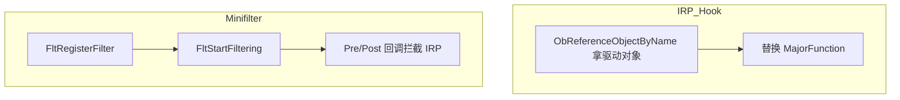

> **迁移建议**：需要文件隐藏/审计时，不要 Hook `\\FileSystem\\Ntfs`，应编写 Minifilter 驱动并申请独立 Altitude（如 `360000` 段）。

---

## 2.4 DKOM（直接内核对象操作）

### 技术定位

**高风险研究技术**，不是传统 Hook，而是通过直接修改内核数据结构（链表）隐藏进程/驱动。PatchGuard 检查部分链表完整性，取证工具仍可通过 CID 表、Pool Tag 扫描发现。

### 原理

DKOM（Direct Kernel Object Manipulation）通过直接修改内核数据结构来隐藏进程、驱动、端口等。典型做法：把目标进程从 `ActiveProcessLinks` 双向链表中摘除，任务管理器就看不见了。

### 完整实现

```c
#include <ntddk.h>

// EPROCESS 结构偏移（Windows 版本相关，需要动态获取）
// Windows 10 22H2 x64:
// ActiveProcessLinks: 0x448
// ImageFileName: 0x5A8
// UniqueProcessId: 0x440

// 动态获取 ActiveProcessLinks 偏移
ULONG GetActiveProcessLinksOffset() {
// 方法：找到 System 进程（PID=4），通过 PsGetProcessId 验证
    PEPROCESS systemProcess = PsInitialSystemProcess;

// 遍历 EPROCESS 寻找 PID=4 的偏移
for (ULONG offset = 0; offset < 0x800; offset += sizeof(PVOID)) {
if (*(HANDLE*)((BYTE*)systemProcess + offset) == (HANDLE)4) {
// 找到 UniqueProcessId 偏移
// ActiveProcessLinks 通常紧随其后（+8）
            PLIST_ENTRY pList = (PLIST_ENTRY)((BYTE*)systemProcess + offset + 8);
// 验证：链表应该指向其他 EPROCESS
if (MmIsAddressValid(pList->Flink) && MmIsAddressValid(pList->Blink)) {
return offset + 8;
            }
        }
    }
return 0;
}

// 隐藏进程
NTSTATUS HideProcess(ULONG targetPid) {
    PEPROCESS process;
    NTSTATUS status = PsLookupProcessByProcessId((HANDLE)(ULONG_PTR)targetPid, &process);
if (!NT_SUCCESS(status)) return status;

    ULONG offset = GetActiveProcessLinksOffset();
if (offset == 0) {
ObDereferenceObject(process);
return STATUS_UNSUCCESSFUL;
    }

    PLIST_ENTRY pList = (PLIST_ENTRY)((BYTE*)process + offset);

// 从双向链表中摘除（需要锁保护）
    KIRQL oldIrql;
KeRaiseIrql(DISPATCH_LEVEL, &oldIrql);

    PLIST_ENTRY prev = pList->Blink;
    PLIST_ENTRY next = pList->Flink;
    prev->Flink = next;
    next->Blink = prev;

// 指向自己，防止后续遍历崩溃
    pList->Flink = pList;
    pList->Blink = pList;

KeLowerIrql(oldIrql);
ObDereferenceObject(process);
return STATUS_SUCCESS;
}

// 隐藏驱动（从 PsLoadedModuleList 摘除）
NTSTATUS HideDriver(PDRIVER_OBJECT driverObject) {
    typedef struct _KLDR_DATA_TABLE_ENTRY {
        LIST_ENTRY InLoadOrderLinks;
        PVOID ExceptionTable;
        ULONG ExceptionTableSize;
        PVOID GpValue;
        PVOID NonPagedDebugInfo;
        PVOID ImageBase;
        PVOID EntryPoint;
        ULONG ImageSize;
        UNICODE_STRING FullImageName;
        UNICODE_STRING BaseImageName;
// ...
    } KLDR_DATA_TABLE_ENTRY, *PKLDR_DATA_TABLE_ENTRY;

    PKLDR_DATA_TABLE_ENTRY entry = (PKLDR_DATA_TABLE_ENTRY)driverObject->DriverSection;
if (!entry) return STATUS_UNSUCCESSFUL;

    KIRQL oldIrql;
KeRaiseIrql(DISPATCH_LEVEL, &oldIrql);

// 从链表摘除
RemoveEntryList(&entry->InLoadOrderLinks);
    entry->InLoadOrderLinks.Flink = &entry->InLoadOrderLinks;
    entry->InLoadOrderLinks.Blink = &entry->InLoadOrderLinks;

KeLowerIrql(oldIrql);
return STATUS_SUCCESS;
}

// 隐藏网络端口（修改 NSI 表或 Hook tcpip.sys）
// 这个比较复杂，通常通过 Hook tcpip.sys 的 nsiEnumerateObjectsAllParameters 实现
```

### 检测难度：★★★☆☆

* 进程虽然从链表摘除，但通过 CID 表（`PspCidTable`）、线程调度队列仍可找到
* PatchGuard 会检查 `PsActiveProcessHead` 链表完整性
* 内存取证工具可以通过物理内存扫描 `EPROCESS` 的 Pool Tag 发现隐藏进程

### DKOM 常见目标与检测面

| 目标 | 操作对象 | 检测方式 |
|------|----------|----------|
| 隐藏进程 | `EPROCESS.ActiveProcessLinks` | `PsLookupProcessByProcessId`、CID 表 |
| 隐藏驱动 | `KLDR_DATA_TABLE_ENTRY.InLoadOrderLinks` | `ZwQuerySystemInformation`、签名扫描 |
| 隐藏端口 | NSI/tcpip 内部表 | `netstat`、WFP 审计 |

### EPROCESS 偏移：不要硬编码

上文 `ActiveProcessLinks: 0x448` 仅适用于特定版本。生产/研究代码应通过 **WinDbg + PDB** 动态获取：

```
// WinDbg 查看当前版本偏移
dt nt!_EPROCESS ActiveProcessLinks
dt nt!_EPROCESS UniqueProcessId
dt nt!_EPROCESS ImageFileName
```

驱动中可用签名扫描或注册表缓存偏移，但最稳妥的方式是编译时绑定目标内核版本，或使用微软未文档化的 `PsGetProcessId` 等导出函数间接定位（如上文 `GetActiveProcessLinksOffset` 的遍历验证法）。

---

## 2.5 MSR Hook（IA32_LSTAR 劫持）

### 技术定位

**已淘汰**。修改 MSR `IA32_LSTAR`（0xC0000082）劫持所有 syscall 的内核入口。威力极大但 PatchGuard 直接监控该 MSR 值。

### 原理

x64 Windows 执行 `syscall` 指令时，CPU 从 IA32_LSTAR（MSR 0xC0000082）读取内核入口地址（`KiSystemCall64`）。修改这个 MSR 值，所有系统调用都会先经过你的函数。

### 完整实现

```c
#include <ntddk.h>
#include <intrin.h>

#define MSR_LSTAR 0xC0000082

ULONG64 g_originalKiSystemCall64 = 0;
ULONG g_targetSsn = 0;
PVOID g_hookHandler = NULL;

// MSR Hook 处理器（纯汇编，必须正确管理 kernel GS 和栈）
// 这是 Windows x64 syscall 入口的精确复刻 + Hook 逻辑
extern void HookKiSystemCall64(void);

// MASM 实现 (hook_entry.asm):
// HookKiSystemCall64 PROC
//     ; syscall 执行时：
//     ; RCX = 用户态返回地址（已保存到 RCX by CPU）
//     ; R11 = 用户态 RFLAGS（已保存到 R11 by CPU）
//     ; RAX = SSN（系统调用号）
//     ; R10 = 第一个参数（用户态的 RCX 被 CPU 覆盖了）
//     
//     ; 先执行 swapgs（切换到内核 GS 基址）
//     swapgs
//     
//     ; 保存用户态栈指针
//     mov qword ptr gs:[10h], rsp   ; KPCR.UserRsp
//     
//     ; 切换到内核栈
//     mov rsp, qword ptr gs:[1A8h]  ; KPCR.Prcb.RspBase
//     
//     ; 检查 SSN
//     cmp eax, TARGET_SSN
//     jne original_path
//     
//     ; 是我们的目标 syscall，执行 Hook
//     push rax
//     push rcx
//     push rdx
//     push r10
//     push r11
//     sub rsp, 20h
//     call g_hookHandler
//     add rsp, 20h
//     pop r11
//     pop r10
//     pop rdx
//     pop rcx
//     pop rax
//     
// original_path:
//     ; 恢复用户态栈
//     mov rsp, qword ptr gs:[10h]
//     swapgs
//     ; 跳转到原始 KiSystemCall64
//     jmp g_originalKiSystemCall64
// HookKiSystemCall64 ENDP

// 在所有 CPU 上安装 MSR Hook
typedef struct _MSR_HOOK_DPC_CONTEXT {
    ULONG64 newLstar;
} MSR_HOOK_DPC_CONTEXT;

VOID MsrHookDpcRoutine(PKDPC Dpc, PVOID Context, PVOID Arg1, PVOID Arg2) {
    MSR_HOOK_DPC_CONTEXT* ctx = (MSR_HOOK_DPC_CONTEXT*)Context;
    __writemsr(MSR_LSTAR, ctx->newLstar);
KeSignalCallDpcSynchronize(Arg2);
KeSignalCallDpcDone(Arg1);
}

NTSTATUS InstallMsrHook() {
    g_originalKiSystemCall64 = __readmsr(MSR_LSTAR);

    MSR_HOOK_DPC_CONTEXT ctx;
    ctx.newLstar = (ULONG64)HookKiSystemCall64;

// 在所有 CPU 上同时修改 MSR
KeGenericCallDpc(MsrHookDpcRoutine, &ctx);

return STATUS_SUCCESS;
}

NTSTATUS RemoveMsrHook() {
    MSR_HOOK_DPC_CONTEXT ctx;
    ctx.newLstar = g_originalKiSystemCall64;
KeGenericCallDpc(MsrHookDpcRoutine, &ctx);
return STATUS_SUCCESS;
}
```

### 检测难度：★★☆☆☆（PatchGuard 监控）

* 威力无比——一个 Hook 拦截所有系统调用
* 但 PatchGuard 直接检查 IA32_LSTAR 值
* `rdmsr` 指令在 Ring 0 可以直接读取，非常容易检测
* **必须在所有 CPU 上同步修改**（通过 `KeGenericCallDpc`）

---

## 2.6 GDT/Call Gate Hook

### 技术定位

**已淘汰**。通过 GDT 中的 Call Gate 实现用户态到内核态的直接跳转。现代 Windows 几乎不使用 Call Gate，出现一个就极其可疑，PatchGuard 监控 GDT。

### 原理

通过在 GDT（全局描述符表）中创建 Call Gate，用户态程序可以通过 `call far` 指令直接跳转到内核态指定地址，绕过 syscall 路径。也可以修改现有 GDT 条目来劫持段切换。

### 完整实现

```c
#include <ntddk.h>

#pragma pack(push, 1)
typedef struct _CALL_GATE_DESCRIPTOR {
    USHORT OffsetLow;
    USHORT Selector;
    BYTE   Ist;
    BYTE   Attributes;    // P=1, DPL=3, Type=0xC (64-bit Call Gate)
    USHORT OffsetMid;
    ULONG  OffsetHigh;
    ULONG  Reserved;
} CALL_GATE_DESCRIPTOR;

typedef struct _GDTR {
    USHORT Limit;
    ULONG64 Base;
} GDTR;
#pragma pack(pop)

// 定义 Ring 0 代码段选择器
#define KGDT64_R0_CODE 0x10

// 获取 GDT 基址
PVOID GetGdtBase() {
    GDTR gdtr;
    _sgdt(&gdtr);
return (PVOID)gdtr.Base;
}

// 在 GDT 中找到空闲 slot
int FindFreeGdtSlot() {
    GDTR gdtr;
    _sgdt(&gdtr);

    ULONG64* gdt = (ULONG64*)gdtr.Base;
int maxSlots = (gdtr.Limit + 1) / 16; // Call Gate 占 16 字节

// 从 slot 10 开始找（前面的被系统使用）
for (int i = 10; i < maxSlots; i++) {
// 检查 Present 位
if ((gdt[i * 2] & (1ULL << 47)) == 0) {
return i;
        }
    }
return -1;
}

// 安装 Call Gate
USHORT InstallCallGate(PVOID kernelHandler) {
int slot = FindFreeGdtSlot();
if (slot < 0) return 0;

    CALL_GATE_DESCRIPTOR gate = {0};
    gate.OffsetLow  = (USHORT)((ULONG64)kernelHandler & 0xFFFF);
    gate.Selector   = KGDT64_R0_CODE;
    gate.Ist        = 0;
    gate.Attributes = 0xEC; // Present=1, DPL=3, Type=0xC (64-bit Call Gate)
    gate.OffsetMid  = (USHORT)(((ULONG64)kernelHandler >> 16) & 0xFFFF);
    gate.OffsetHigh = (ULONG)(((ULONG64)kernelHandler >> 32) & 0xFFFFFFFF);
    gate.Reserved   = 0;

// 写入 GDT
    PVOID gdtBase = GetGdtBase();
    ULONG64 cr0 = __readcr0();
    __writecr0(cr0 & ~0x10000); // 关闭写保护

memcpy((BYTE*)gdtBase + slot * 16, &gate, sizeof(gate));

    __writecr0(cr0);

// 返回选择器（slot * 8 + RPL=3）
return (USHORT)(slot * 8 + 3);
}

// 内核处理函数（用户态通过 call far 调用时进入这里）
void __fastcall CallGateHandler(void) {
// 此时已在 Ring 0
// 可以做任何内核操作
// 通过 iretq 返回用户态
}

// 用户态调用方式（需要内联汇编或 shellcode）
// call far [selector:0]
// 其中 selector 是 InstallCallGate 返回的值
```

### 检测难度：★★☆☆☆（PatchGuard 监控）

PatchGuard 监控 GDT。而且现代 Windows 几乎不使用 Call Gate，出现一个就极其可疑。

---

## 二、现代内核 Hook（合法 API 与研究型技术）

> 以下技术不直接修改 PatchGuard 监控的关键结构（SSDT/IDT/MSR/GDT），在现代 Windows 上仍有生存空间。其中 **2.7 Kernel Callback** 和 **2.10 WFP Callout** 是安全软件/驱动的生产主流。

## 2.7 Kernel Callback / Notify Routine（内核回调机制）

### 技术定位

**生产环境最常用、最合法的内核"Hook"**。不修改任何内核结构，通过 Windows 官方回调 API 在事件发生时执行自定义逻辑。EDR、杀毒、HIPS 的核心实现方式。

### 原理

Windows 内核提供了大量官方回调注册 API，用于监控系统事件。这不算传统 Hook，但效果类似——你能在关键事件发生时执行自定义代码。

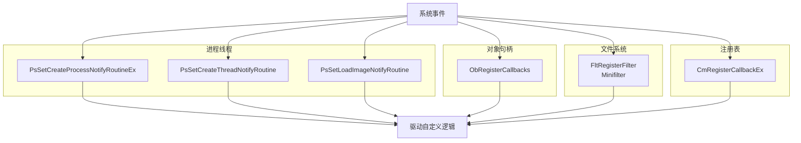

### 常用回调 API 速查

| API | 拦截点 | 典型用途 |
|-----|--------|----------|
| `PsSetCreateProcessNotifyRoutineEx` | 进程创建/退出 | 阻止恶意进程启动 |
| `PsSetCreateThreadNotifyRoutine` | 线程创建 | 检测远程线程注入 |
| `PsSetLoadImageNotifyRoutine` | DLL/EXE 加载 | 检测可疑模块 |
| `ObRegisterCallbacks` | 句柄创建/复制 | 剥离 `PROCESS_VM_READ` 等权限 |
| `FltRegisterFilter` | 文件 I/O（Minifilter） | 文件隐藏/审计（替代 IRP Hook） |
| `CmRegisterCallbackEx` | 注册表操作 | 保护注册表键值 |
| `PsSetCreateProcessNotifyRoutineEx2` | 进程创建（扩展信息） | 获取命令行、父进程等 |

### 完整实现

```c
#include <ntddk.h>
#include <fltKernel.h>

// ========== 进程/线程/镜像回调 ==========

void ProcessNotifyCallback(PEPROCESS Process, HANDLE ProcessId,
    PPS_CREATE_NOTIFY_INFO CreateInfo) {
if (CreateInfo) {
// 进程创建
DbgPrint("[Hook] Process created: PID=%lu Image=%wZ\n", 
            (ULONG)(ULONG_PTR)ProcessId, CreateInfo->ImageFileName);

// 可以阻止进程创建
if (CreateInfo->ImageFileName && 
wcsstr(CreateInfo->ImageFileName->Buffer, L"malware.exe")) {
            CreateInfo->CreationStatus = STATUS_ACCESS_DENIED;
        }
    } else {
// 进程退出
DbgPrint("[Hook] Process exited: PID=%lu\n", (ULONG)(ULONG_PTR)ProcessId);
    }
}

void ThreadNotifyCallback(HANDLE ProcessId, HANDLE ThreadId, BOOLEAN Create) {
if (Create) {
// 可以在这里记录线程创建，或阻止远程线程注入
        PEPROCESS targetProcess;
PsLookupProcessByProcessId(ProcessId, &targetProcess);
if (targetProcess == g_protectedProcess && PsGetCurrentProcess() != targetProcess) {
// 外部进程在我们保护的进程中创建线程 — 可能是注入
DbgPrint("[Hook] Remote thread injection detected!\n");
        }
if (targetProcess) ObDereferenceObject(targetProcess);
    }
}

void ImageLoadCallback(PUNICODE_STRING FullImageName, HANDLE ProcessId,
    PIMAGE_INFO ImageInfo) {
// DLL 加载通知
if (FullImageName && ProcessId == g_targetPid) {
DbgPrint("[Hook] Image loaded in target: %wZ @ %p\n", 
            FullImageName, ImageInfo->ImageBase);
    }
}

// ========== ObRegisterCallbacks（句柄操作拦截）==========

OB_PREOP_CALLBACK_STATUS ProcessHandlePreCallback(
    PVOID RegistrationContext, POB_PRE_OPERATION_INFORMATION OpInfo) {

    PEPROCESS targetProcess = (PEPROCESS)OpInfo->Object;
    HANDLE targetPid = PsGetProcessId(targetProcess);

// 保护指定进程：剥离危险权限
if (targetPid == g_protectedPid && PsGetCurrentProcess() != targetProcess) {
if (OpInfo->Operation == OB_OPERATION_HANDLE_CREATE) {
// 剥离读写内存、终止进程的权限
            OpInfo->Parameters->CreateHandleInformation.DesiredAccess &= 
                ~(PROCESS_VM_READ | PROCESS_VM_WRITE | PROCESS_VM_OPERATION | 
                  PROCESS_TERMINATE | PROCESS_SUSPEND_RESUME);
        }
if (OpInfo->Operation == OB_OPERATION_HANDLE_DUPLICATE) {
            OpInfo->Parameters->DuplicateHandleInformation.DesiredAccess &=
                ~(PROCESS_VM_READ | PROCESS_VM_WRITE | PROCESS_TERMINATE);
        }
    }
return OB_PREOP_SUCCESS;
}

NTSTATUS RegisterObCallbacks(PVOID* pHandle) {
    OB_CALLBACK_REGISTRATION obReg = {0};
    OB_OPERATION_REGISTRATION opReg[2] = {0};

    opReg[0].ObjectType = PsProcessType;
    opReg[0].Operations = OB_OPERATION_HANDLE_CREATE | OB_OPERATION_HANDLE_DUPLICATE;
    opReg[0].PreOperation = ProcessHandlePreCallback;

    opReg[1].ObjectType = PsThreadType;
    opReg[1].Operations = OB_OPERATION_HANDLE_CREATE;
    opReg[1].PreOperation = ProcessHandlePreCallback;

    obReg.Version = OB_FLT_REGISTRATION_VERSION;
    obReg.OperationRegistrationCount = 2;
    obReg.OperationRegistration = opReg;

// Altitude 决定回调优先级（需要唯一值）
RtlInitUnicodeString(&obReg.Altitude, L"321000");

return ObRegisterCallbacks(&obReg, pHandle);
}

// ========== Minifilter（文件系统回调）==========

FLT_PREOP_CALLBACK_STATUS PreCreateCallback(
    PFLT_CALLBACK_DATA Data, PCFLT_RELATED_OBJECTS FltObjects, 
    PVOID* CompletionContext) {

    PFLT_FILE_NAME_INFORMATION nameInfo;
if (NT_SUCCESS(FltGetFileNameInformation(Data, 
        FLT_FILE_NAME_NORMALIZED | FLT_FILE_NAME_QUERY_DEFAULT, &nameInfo))) {

FltParseFileNameInformation(nameInfo);

// 隐藏特定文件
if (wcsstr(nameInfo->Name.Buffer, L"hidden_file.dat")) {
FltReleaseFileNameInformation(nameInfo);
            Data->IoStatus.Status = STATUS_OBJECT_NAME_NOT_FOUND;
return FLT_PREOP_COMPLETE;
        }
FltReleaseFileNameInformation(nameInfo);
    }
return FLT_PREOP_SUCCESS_NO_CALLBACK;
}

// ========== 注册表回调 ==========

NTSTATUS RegistryCallback(PVOID CallbackContext, PVOID Argument1, PVOID Argument2) {
    REG_NOTIFY_CLASS notifyClass = (REG_NOTIFY_CLASS)(ULONG_PTR)Argument1;

switch (notifyClass) {
case RegNtPreSetValueKey: {
            PREG_SET_VALUE_KEY_INFORMATION info = (PREG_SET_VALUE_KEY_INFORMATION)Argument2;
// 阻止修改受保护的注册表值
if (info->ValueName && wcsstr(info->ValueName->Buffer, L"ProtectedValue")) {
return STATUS_ACCESS_DENIED;
            }
break;
        }
case RegNtPreDeleteKey: {
// 阻止删除受保护的注册表键
break;
        }
    }
return STATUS_SUCCESS;
}

// ========== 安装所有回调 ==========

NTSTATUS InstallAllCallbacks() {
    NTSTATUS status;

    status = PsSetCreateProcessNotifyRoutineEx(ProcessNotifyCallback, FALSE);
if (!NT_SUCCESS(status)) return status;

    status = PsSetCreateThreadNotifyRoutine(ThreadNotifyCallback);
if (!NT_SUCCESS(status)) return status;

    status = PsSetLoadImageNotifyRoutine(ImageLoadCallback);
if (!NT_SUCCESS(status)) return status;

    status = RegisterObCallbacks(&g_obHandle);
if (!NT_SUCCESS(status)) return status;

    LARGE_INTEGER cookie;
    status = CmRegisterCallbackEx(RegistryCallback, &g_altitude, g_driverObject, NULL, &cookie, NULL);

return status;
}
```

### 检测难度：★☆☆☆☆（但合法性最高）

* 使用完全合法的 API，PatchGuard 不会干扰
* 但所有回调数组都可被枚举（`PspCreateProcessNotifyRoutine` 等）
* 发现未知模块注册的回调 = 可疑
* **这是安全软件最常用的方式**

### 更易理解的 ObRegisterCallbacks 最小示例

```c
// 精简版：保护指定进程，剥离外部进程的危险句柄权限
HANDLE g_ObRegHandle = NULL;
HANDLE g_ProtectedPid = NULL;

OB_PREOP_CALLBACK_STATUS PreOpCallback(
    PVOID Ctx, POB_PRE_OPERATION_INFORMATION Info)
{
    UNREFERENCED_PARAMETER(Ctx);
    if (PsGetProcessId((PEPROCESS)Info->Object) != g_ProtectedPid)
        return OB_PREOP_SUCCESS;

    if (Info->Operation == OB_OPERATION_HANDLE_CREATE) {
        Info->Parameters->CreateHandleInformation.DesiredAccess &=
            ~(PROCESS_VM_READ | PROCESS_VM_WRITE | PROCESS_TERMINATE);
    }
    return OB_PREOP_SUCCESS;
}

NTSTATUS RegisterProtection(void) {
    OB_OPERATION_REGISTRATION op = {0};
    op.ObjectType = PsProcessType;
    op.Operations = OB_OPERATION_HANDLE_CREATE | OB_OPERATION_HANDLE_DUPLICATE;
    op.PreOperation = PreOpCallback;

    OB_CALLBACK_REGISTRATION reg = {0};
    reg.Version = OB_FLT_REGISTRATION_VERSION;
    reg.OperationRegistrationCount = 1;
    reg.OperationRegistration = &op;
    RtlInitUnicodeString(&reg.Altitude, L"321000.5");  // 需唯一

    return ObRegisterCallbacks(&reg, &g_ObRegHandle);
}
```

> **Altitude 规则**：回调按 Altitude 字符串排序执行，值越小越先执行。不同厂商需申请不冲突的 Altitude（如 Minifilter 用 360000-389999 范围）。

### Minifilter 完整驱动骨架（生产模板）

下面是在上方 `PreCreateCallback` 基础上，可独立编译运行的 **Minifilter 最小驱动框架**（含注册、启动、对称卸载）。比 IRP Hook 多了 Filter Manager 生命周期管理。

```c
#include <fltKernel.h>

PFLT_FILTER g_FilterHandle = NULL;

// ---------- 回调：CREATE 前拦截 ----------
FLT_PREOP_CALLBACK_STATUS PreCreateCallback(
    PFLT_CALLBACK_DATA Data,
    PCFLT_RELATED_OBJECTS FltObjects,
    PVOID* CompletionContext)
{
    UNREFERENCED_PARAMETER(FltObjects);
    UNREFERENCED_PARAMETER(CompletionContext);

    PFLT_FILE_NAME_INFORMATION nameInfo = NULL;
    NTSTATUS status = FltGetFileNameInformation(
        Data,
        FLT_FILE_NAME_NORMALIZED | FLT_FILE_NAME_QUERY_DEFAULT,
        &nameInfo);
    if (!NT_SUCCESS(status)) {
        return FLT_PREOP_SUCCESS_NO_CALLBACK;
    }
    status = FltParseFileNameInformation(nameInfo);
    if (!NT_SUCCESS(status)) {
        FltReleaseFileNameInformation(nameInfo);
        return FLT_PREOP_SUCCESS_NO_CALLBACK;
    }
    if (wcsstr(nameInfo->Name.Buffer, L"hidden_file.dat") != NULL) {
        FltReleaseFileNameInformation(nameInfo);
        Data->IoStatus.Status = STATUS_OBJECT_NAME_NOT_FOUND;
        Data->IoStatus.Information = 0;
        return FLT_PREOP_COMPLETE;
    }
    FltReleaseFileNameInformation(nameInfo);
    return FLT_PREOP_SUCCESS_NO_CALLBACK;
}

// ---------- 卸载：等待在途 I/O 排空 ----------
NTSTATUS FilterUnload(FLT_FILTER_UNLOAD_FLAGS Flags) {
    UNREFERENCED_PARAMETER(Flags);
    FltUnregisterFilter(g_FilterHandle);
    g_FilterHandle = NULL;
    return STATUS_SUCCESS;
}

// ---------- 操作注册表 ----------
CONST FLT_OPERATION_REGISTRATION Callbacks[] = {
    { IRP_MJ_CREATE, 0, PreCreateCallback, NULL },
    { IRP_MJ_OPERATION_END }
};

CONST FLT_REGISTRATION FilterRegistration = {
    sizeof(FLT_REGISTRATION),
    FLT_REGISTRATION_VERSION,
    0,                          // Flags
    NULL,                       // ContextRegistration
    Callbacks,
    FilterUnload,
    NULL, NULL, NULL, NULL, NULL, NULL, NULL, NULL
};

// ---------- 入口 ----------
NTSTATUS DriverEntry(PDRIVER_OBJECT DriverObject, PUNICODE_STRING RegistryPath) {
    UNREFERENCED_PARAMETER(RegistryPath);
    NTSTATUS status = FltRegisterFilter(DriverObject, &FilterRegistration, &g_FilterHandle);
    if (!NT_SUCCESS(status)) {
        return status;
    }
    status = FltStartFiltering(g_FilterHandle);
    if (!NT_SUCCESS(status)) {
        FltUnregisterFilter(g_FilterHandle);
        g_FilterHandle = NULL;
    }
    return status;
}
```

**Minifilter 关键约束**：

| 项目 | 要求 |
|------|------|
| IRQL | `PreCreate` 等回调通常在 `PASSIVE_LEVEL`，可分页访问 |
| 文件名 | 必须 `FltGetFileNameInformation` + `FltReleaseFileNameInformation` 配对 |
| 完成 IRP | `FLT_PREOP_COMPLETE` 时必须设置 `Data->IoStatus` |
| 卸载 | `FilterUnload` 中 `FltUnregisterFilter`，驱动不得再接收新回调 |
| Altitude | 在 INF 的 `HKR,"Instances"..."Altitude"` 中配置，决定过滤栈顺序 |

### 多回调安装的失败回滚模板

上方 `InstallAllCallbacks` 在任一步失败时未回滚已注册项。生产代码应使用对称卸载：

```c
typedef struct _CALLBACK_STATE {
    BOOLEAN processNotify;
    BOOLEAN threadNotify;
    BOOLEAN imageNotify;
    PVOID obHandle;
    LARGE_INTEGER regCookie;
} CALLBACK_STATE;

static CALLBACK_STATE g_cbState = {0};

VOID UninstallAllCallbacks(VOID) {
    if (g_cbState.regCookie.QuadPart != 0) {
        CmUnRegisterCallback(g_cbState.regCookie);
        g_cbState.regCookie.QuadPart = 0;
    }
    if (g_cbState.obHandle != NULL) {
        ObUnRegisterCallbacks(g_cbState.obHandle);
        g_cbState.obHandle = NULL;
    }
    if (g_cbState.imageNotify) {
        PsRemoveLoadImageNotifyRoutine(ImageLoadCallback);
        g_cbState.imageNotify = FALSE;
    }
    if (g_cbState.threadNotify) {
        PsRemoveCreateThreadNotifyRoutine(ThreadNotifyCallback);
        g_cbState.threadNotify = FALSE;
    }
    if (g_cbState.processNotify) {
        PsSetCreateProcessNotifyRoutineEx(ProcessNotifyCallback, TRUE);
        g_cbState.processNotify = FALSE;
    }
}

NTSTATUS InstallAllCallbacksSafe(PDRIVER_OBJECT driverObject) {
    NTSTATUS status;
    UNICODE_STRING altitude = RTL_CONSTANT_STRING(L"360000");

    status = PsSetCreateProcessNotifyRoutineEx(ProcessNotifyCallback, FALSE);
    if (!NT_SUCCESS(status)) return status;
    g_cbState.processNotify = TRUE;

    status = PsSetCreateThreadNotifyRoutine(ThreadNotifyCallback);
    if (!NT_SUCCESS(status)) goto rollback;

    status = PsSetLoadImageNotifyRoutine(ImageLoadCallback);
    if (!NT_SUCCESS(status)) goto rollback;

    status = RegisterObCallbacks(&g_cbState.obHandle);
    if (!NT_SUCCESS(status)) goto rollback;

    status = CmRegisterCallbackEx(
        RegistryCallback, &altitude, driverObject, NULL,
        &g_cbState.regCookie, NULL);
    if (!NT_SUCCESS(status)) goto rollback;

    g_cbState.threadNotify = TRUE;
    g_cbState.imageNotify = TRUE;
    return STATUS_SUCCESS;

rollback:
    UninstallAllCallbacks();
    return status;
}
```

### 回调 IRQL 与禁止操作速查

| 回调 | 典型 IRQL | 禁止操作 |
|------|-----------|----------|
| `PsSetCreateProcessNotifyRoutineEx` | `PASSIVE_LEVEL` | 长时间阻塞、分页内存（若 APC 级别升高需注意） |
| `ObRegisterCallbacks` PreOp | `PASSIVE_LEVEL` | 获取锁后阻塞 |
| Minifilter PreCreate | `PASSIVE_LEVEL` | 在回调内执行同步网络 I/O |
| `CmRegisterCallbackEx` | `PASSIVE_LEVEL` | 递归注册表操作导致死锁 |
| WFP Classify | `<= DISPATCH_LEVEL` | 分页访问、等待对象、文件 I/O |

---

## 2.8 Infinity Hook（ETW-based Syscall Hook）

### 技术定位

**研究型技术**。利用内核 ETW syscall 日志路径中的函数指针实现 syscall 监控，不修改 SSDT/MSR。部分 Windows 版本已加固，不适合生产。

### 原理

利用 Windows 内核的 ETW（Event Tracing for Windows）日志机制。内核在执行系统调用时可能调用 syscall ETW provider 发送日志回调。通过替换该回调的函数指针，可以在每次 syscall 时获得控制权，而不需要修改 SSDT 或 MSR。

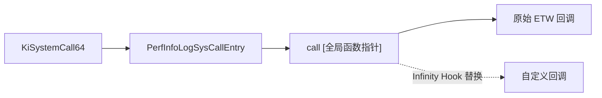

### 完整实现（含 ETW 函数指针定位）

```c
#include <ntddk.h>

// Infinity Hook 的核心：定位 ETW syscall logger 的函数指针
// 路径：KiSystemCall64 → PerfInfoLogSysCallEntry → [函数指针]
// 这个指针存储在 HalPrivateDispatchTable 或 EtwpDebuggerData 中（版本相关）

typedef void (*fnEtwpCallback)(ULONG SystemCallNumber, PVOID StackPointer);
fnEtwpCallback g_originalEtwCallback = NULL;

// 特征码搜索：在 KiSystemCall64 中寻找 call [PerfInfoLogSysCallEntry]
// PerfInfoLogSysCallEntry 内部会 call 一个存在全局变量中的函数指针
PVOID* FindEtwSyscallLogPointer() {
// 方法 1：从 KiSystemCall64 搜索 PerfInfoLogSysCallEntry 调用
    ULONG64 kiSystemCall = __readmsr(0xC0000082);
    BYTE* p = (BYTE*)kiSystemCall;

// 搜索 call PerfInfoLogSysCallEntry 的特征
// Windows 10 1903+: E8 XX XX XX XX (call rel32)
for (ULONG i = 0; i < 0x600; i++) {
if (p[i] == 0xE8) {
            INT32 offset = *(INT32*)(p + i + 1);
            BYTE* target = p + i + 5 + offset;

// 验证目标是否为 PerfInfoLogSysCallEntry
// 通过进一步搜索其内部的间接调用来确认
for (ULONG j = 0; j < 0x50; j++) {
// 寻找 call qword ptr [rip + offset] (FF 15 XX XX XX XX)
if (target[j] == 0xFF && target[j+1] == 0x15) {
                    INT32 ripOffset = *(INT32*)(target + j + 2);
                    PVOID* pFuncPtr = (PVOID*)(target + j + 6 + ripOffset);

// 验证：该指针应该指向内核空间
if (MmIsAddressValid(pFuncPtr) && MmIsAddressValid(*pFuncPtr)) {
return pFuncPtr;
                    }
                }

// 也可能是 mov rax, [地址]; call rax 的模式
// 48 8B 05 XX XX XX XX (mov rax, [rip+offset])
if (target[j] == 0x48 && target[j+1] == 0x8B && target[j+2] == 0x05) {
                    INT32 ripOffset = *(INT32*)(target + j + 3);
                    PVOID* pFuncPtr = (PVOID*)(target + j + 7 + ripOffset);

if (MmIsAddressValid(pFuncPtr) && MmIsAddressValid(*pFuncPtr)) {
// 检查后面几条指令是否有 call rax (FF D0)
for (ULONG k = j + 7; k < j + 20; k++) {
if (target[k] == 0xFF && target[k+1] == 0xD0) {
return pFuncPtr;
                            }
                        }
                    }
                }
            }
        }
    }

// 方法 2：通过 HalPrivateDispatchTable (旧版 Windows)
// HalPrivateDispatchTable 中的 HalPerfInfoLogSysCallEntry 字段
// 偏移因版本而异

return NULL;
}

// Hook 回调函数
void InfinityHookCallback(ULONG SystemCallNumber, PVOID StackPointer) {
// 获取当前线程的系统调用信息
    PETHREAD currentThread = PsGetCurrentThread();

// 根据 SSN 过滤
switch (SystemCallNumber) {
case 0x26: // NtOpenProcess (SSN 因版本而异)
        {
// 可以读取/修改栈上的参数
// StackPointer 指向 syscall 时的用户态栈
// 参数通过寄存器传递（R10, RDX, R8, R9）
break;
        }
case 0x3A: // NtReadVirtualMemory
        {
// 拦截读内存操作
break;
        }
    }

// 调用原始 ETW 函数（或者直接不调用，提升性能）
if (g_originalEtwCallback) {
g_originalEtwCallback(SystemCallNumber, StackPointer);
    }
}

// 安装 Infinity Hook
NTSTATUS InstallInfinityHook() {
    PVOID* pTarget = FindEtwSyscallLogPointer();
if (!pTarget) return STATUS_NOT_FOUND;

    g_originalEtwCallback = (fnEtwpCallback)*pTarget;

// 原子替换函数指针
InterlockedExchangePointer(pTarget, (PVOID)InfinityHookCallback);

return STATUS_SUCCESS;
}

NTSTATUS RemoveInfinityHook() {
    PVOID* pTarget = FindEtwSyscallLogPointer();
if (!pTarget || !g_originalEtwCallback) return STATUS_UNSUCCESSFUL;

InterlockedExchangePointer(pTarget, (PVOID)g_originalEtwCallback);
    g_originalEtwCallback = NULL;

return STATUS_SUCCESS;
}
```

### 检测难度：★★★★☆

* 不修改 SSDT，不修改 MSR，不修改 IDT

* 只修改了 ETW 系统内部的一个函数指针

* PatchGuard 不监控该位置（不是关键结构）

* 但微软已在新版 Windows 中加固了某些 Infinity Hook 变种

* 安全软件可以通过检查 ETW 相关全局变量发现异常

### 优点

* 绕过 PatchGuard（不修改 SSDT/MSR/IDT）
* 能拦截所有 syscall
* 性能开销相对小（ETW 日志本来就在关键路径上）
* 不需要 Hypervisor 支持

### 局限与现状

| 问题 | 说明 |
|------|------|
| 版本依赖 | `KiSystemCall64` 内部结构随 Windows 版本变化，特征码需维护 |
| SSN 硬编码 | 文中示例 SSN 因版本而异，必须动态获取 |
| 微软加固 | 新版 Windows 对部分 Infinity Hook 变种做了限制 |
| 检测 | 安全软件可检查 ETW 相关全局变量是否被篡改 |

### 内核 syscall 路径演进（与 2.1 / 2.5 对照）

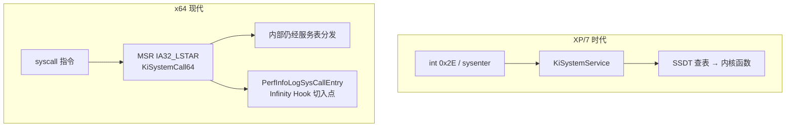

| 技术 | 劫持点 | PatchGuard |
|------|--------|------------|
| 2.1 SSDT Hook | 服务表偏移 | ❌ 必杀 |
| 2.5 MSR Hook | `KiSystemCall64` 入口 | ❌ 必杀 |
| 2.8 Infinity Hook | ETW 日志函数指针 | ✅ 不监控 |

### 内核中获取 SSN 的正确方式（勿硬编码）

Infinity Hook 回调里收到的 `SystemCallNumber` 即为 SSN，但自行 Hook 特定 `Nt*` 时需动态解析：

```c
// 从 ntoskrnl 导出函数 stub 读取 SSN（需验证 stub 头未被篡改）
ULONG GetNtoskrnlSsn(PCSTR funcName) {
    UNICODE_STRING name;
    ANSI_STRING ansiName;
    RtlInitAnsiString(&ansiName, funcName);
    NTSTATUS status = RtlAnsiStringToUnicodeString(&name, &ansiName, TRUE);
    if (!NT_SUCCESS(status)) {
        return (ULONG)-1;
    }
    PVOID stub = MmGetSystemRoutineAddress(&name);
    RtlFreeUnicodeString(&name);
    if (stub == NULL) {
        return (ULONG)-1;
    }
    PUCHAR p = (PUCHAR)stub;
    // x64: 4C 8B D1 B8 [SSN] ...
    if (p[0] == 0x4C && p[1] == 0x8B && p[2] == 0xD1 && p[3] == 0xB8) {
        return *(PULONG)(p + 4);
    }
    return (ULONG)-1;
}
```

> SSN 随 Windows 版本（甚至同版本累积更新）变化，**禁止**在驱动中写死 `0x26` 等常量。

---

## 2.9 Kernel Inline Hook + PatchGuard 绕过

### 技术定位

**高风险研究技术**。在内核中做 Inline Hook 同时尝试绕过 PatchGuard。极不稳定，属于猫鼠游戏，不适合生产。

### 原理

仍然使用 Inline Hook，但配合 PatchGuard 绕过技术。PatchGuard 的检查有固定的定时 DPC 机制，可以通过多种方式使其失效或规避。

### 完整实现

```c
#include <ntddk.h>

// ===== 方案 1: Hook KeBugCheckEx 阻止蓝屏 =====

typedef VOID(*fnKeBugCheckEx)(ULONG, ULONG_PTR, ULONG_PTR, ULONG_PTR, ULONG_PTR);
fnKeBugCheckEx OriginalKeBugCheckEx = NULL;

VOID HookedKeBugCheckEx(ULONG BugCheckCode, ULONG_PTR P1, ULONG_PTR P2, ULONG_PTR P3, ULONG_PTR P4) {
if (BugCheckCode == 0x109) { // CRITICAL_STRUCTURE_CORRUPTION
// PatchGuard 检测到异常，阻止蓝屏
// 恢复被修改的数据，让 PatchGuard 下次检查时通过
RestoreAllHooks();

// 不调用原始 KeBugCheckEx，直接返回
// 注意：这不一定安全，PG 可能在蓝屏前已经做了不可逆操作
return;
    }
OriginalKeBugCheckEx(BugCheckCode, P1, P2, P3, P4);
}

// ===== 方案 2: 定位并取消 PatchGuard DPC 定时器 =====

// PatchGuard 使用加密的 DPC 定时器，特征：
// - DPC routine 地址指向 ntoskrnl 内部
// - 定时器的 DueTime 通常在 5-10 分钟范围
// - DPC 的 DeferredContext 包含加密的校验数据

NTSTATUS DisablePatchGuardTimers() {
// 遍历系统 DPC 定时器队列
// 需要逆向 KiTimerTableListHead 结构
// 这是极其复杂的操作，需要版本特定的偏移

// 简化版思路：
// 1. 定位 KiTimerTableListHead (通过签名扫描)
// 2. 遍历所有 KTIMER 条目
// 3. 识别 PatchGuard 的定时器（通过 DPC routine 范围、加密特征）
// 4. KeCancelTimer 取消这些定时器

return STATUS_NOT_IMPLEMENTED; // 实际实现极其版本相关
}

// ===== 方案 3: 利用 PatchGuard 的时间窗口 =====

// PG 检查间隔约 5-10 分钟（随机化）
// 策略：在检查之前恢复，检查之后再安装
typedef struct _PG_AWARE_HOOK {
    PVOID target;
    PVOID detour;
    BYTE originalBytes[14];
    BOOLEAN isInstalled;
    KTIMER cycleTimer;
    KDPC cycleDpc;
} PG_AWARE_HOOK;

// 周期性安装/卸载 Hook（在 PG 检查时间窗口内）
VOID PgCycleDpcRoutine(PKDPC Dpc, PVOID Context, PVOID Arg1, PVOID Arg2) {
    PG_AWARE_HOOK* hook = (PG_AWARE_HOOK*)Context;

if (hook->isInstalled) {
// 卸载 Hook（PG 可能即将检查）
RestoreInlineHook(hook);
        hook->isInstalled = FALSE;

// 500ms 后重新安装
        LARGE_INTEGER interval;
        interval.QuadPart = -5000000; // 500ms
KeSetTimer(&hook->cycleTimer, interval, &hook->cycleDpc);
    } else {
// 安装 Hook
InstallInlineHook(hook);
        hook->isInstalled = TRUE;

// 4 分钟后卸载（在 PG 5 分钟周期之前）
        LARGE_INTEGER interval;
        interval.QuadPart = -2400000000LL; // 240 seconds
KeSetTimer(&hook->cycleTimer, interval, &hook->cycleDpc);
    }
}
```

### 检测难度：★★★☆☆

* 绕过 PatchGuard 后 Inline Hook 本身仍可通过代码完整性校验对比发现
* 时间窗口方案有风险：PG 的定时有随机性
* 是猫鼠游戏中的一个折中方案

### 三种绕过思路对比

| 方案 | 思路 | 风险 |
|------|------|------|
| Hook `KeBugCheckEx` | 阻止 PG 蓝屏 | 系统可能已处于不一致状态 |
| 取消 PG DPC 定时器 | 阻止 PG 运行 | 需逆向 `KiTimerTableListHead`，极复杂 |
| 周期性装/卸 Hook | 在 PG 检查窗口外 Hook | 有竞态窗口，不可靠 |

> **生产建议**：不要对抗 PatchGuard。使用 2.7 合法回调或 2.10 WFP 实现同等监控能力。

---

## 2.10 WFP Callout Hook（网络层）

### 技术定位

**网络过滤生产主流**。微软官方推荐的网络过滤框架，替代已弃用的 TDI Hook、NDIS 中间层和 LSP。完全合法，需签名驱动。

### 原理

Windows Filtering Platform（WFP）允许驱动注册 Callout 来处理网络数据包。这是微软官方推荐的网络过滤方式，替代了旧的 TDI/NDIS Hook。

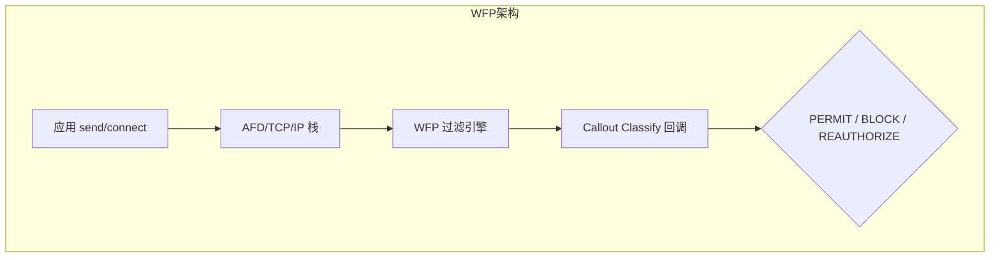

**注册顺序（必须对称卸载）**：
1. `FwpmEngineOpen` → 2. `FwpmSubLayerAdd` → 3. `FwpsCalloutRegister` + `FwpmCalloutAdd` → 4. `FwpmFilterAdd`

### 完整实现

```c
#include <ntddk.h>
#include <fwpsk.h>
#include <fwpmk.h>

HANDLE g_engineHandle = NULL;
UINT32 g_calloutId = 0;
UINT64 g_filterId = 0;

// WFP Callout GUID（需要唯一）
DEFINE_GUID(WFP_CALLOUT_GUID, 
0x12345678, 0xABCD, 0xEF01, 0x23, 0x45, 0x67, 0x89, 0xAB, 0xCD, 0xEF, 0x01);

// 数据包分类回调（核心逻辑在这里）
void NTAPI ClassifyCallback(
const FWPS_INCOMING_VALUES0* inFixedValues,
const FWPS_INCOMING_METADATA_VALUES0* inMetaValues,
void* layerData,
const FWPS_FILTER0* filter,
UINT64 flowContext,
    FWPS_CLASSIFY_OUT0* classifyOut)
{
// 获取远程 IP 和端口
UINT32 remoteIp = inFixedValues->incomingValue[
        FWPS_FIELD_OUTBOUND_TRANSPORT_V4_IP_REMOTE_ADDRESS].value.uint32;
UINT16 remotePort = inFixedValues->incomingValue[
        FWPS_FIELD_OUTBOUND_TRANSPORT_V4_IP_REMOTE_PORT].value.uint16;
UINT8 protocol = inFixedValues->incomingValue[
        FWPS_FIELD_OUTBOUND_TRANSPORT_V4_IP_PROTOCOL].value.uint8;

// 获取发起进程
UINT64 processId = 0;
if (FWPS_IS_METADATA_FIELD_PRESENT(inMetaValues, FWPS_METADATA_FIELD_PROCESS_ID)) {
        processId = inMetaValues->processId;
    }

// 过滤逻辑
if (ShouldBlockConnection(remoteIp, remotePort, processId)) {
        classifyOut->actionType = FWP_ACTION_BLOCK;
        classifyOut->rights &= ~FWPS_RIGHT_ACTION_WRITE;
    } else {
        classifyOut->actionType = FWP_ACTION_PERMIT;
    }
}

// 通知回调
NTSTATUS NTAPI NotifyCallback(FWPS_CALLOUT_NOTIFY_TYPE notifyType,
const GUID* filterKey, FWPS_FILTER0* filter) {
return STATUS_SUCCESS;
}

// 注册 WFP Callout + Filter
NTSTATUS InstallWfpHook(PDEVICE_OBJECT deviceObject) {
    NTSTATUS status;
    FWPM_SESSION0 session = {0};
    session.flags = FWPM_SESSION_FLAG_DYNAMIC; // 驱动卸载时自动清理

// 打开 WFP 引擎
    status = FwpmEngineOpen0(NULL, RPC_C_AUTHN_WINNT, NULL, &session, &g_engineHandle);
if (!NT_SUCCESS(status)) return status;

// 注册 Callout（内核层）
    FWPS_CALLOUT0 sCallout = {0};
    sCallout.calloutKey = WFP_CALLOUT_GUID;
    sCallout.classifyFn = ClassifyCallback;
    sCallout.notifyFn = NotifyCallback;

    status = FwpsCalloutRegister0(deviceObject, &sCallout, &g_calloutId);
if (!NT_SUCCESS(status)) goto cleanup;

// 注册 Callout（管理层）
    FWPM_CALLOUT0 mCallout = {0};
    mCallout.calloutKey = WFP_CALLOUT_GUID;
    mCallout.displayData.name = L"My Network Hook";
    mCallout.applicableLayer = FWPM_LAYER_OUTBOUND_TRANSPORT_V4;

    status = FwpmCalloutAdd0(g_engineHandle, &mCallout, NULL, NULL);
if (!NT_SUCCESS(status)) goto cleanup;

// 添加 Filter
    FWPM_FILTER0 filter = {0};
    filter.layerKey = FWPM_LAYER_OUTBOUND_TRANSPORT_V4;
    filter.displayData.name = L"My Network Filter";
    filter.action.type = FWP_ACTION_CALLOUT_TERMINATING;
    filter.action.calloutKey = WFP_CALLOUT_GUID;
    filter.weight.type = FWP_UINT8;
    filter.weight.uint8 = 0xF; // 高优先级

    status = FwpmFilterAdd0(g_engineHandle, &filter, NULL, &g_filterId);

cleanup:
if (!NT_SUCCESS(status)) {
if (g_engineHandle) FwpmEngineClose0(g_engineHandle);
    }
return status;
}
```

### 检测难度：★☆☆☆☆（但完全合法）

* 完全合法的 API，所有安全软件都用这个
* 通过 `FwpmFilterEnum` / `FwpmCalloutEnum` 可以枚举所有注册的过滤器
* 需要签名驱动（Win10+ 强制 DSE）

### WFP 常用过滤层

| 层 | 用途 |
|----|------|
| `FWPM_LAYER_ALE_AUTH_CONNECT_V4` | 连接授权（出站 TCP） |
| `FWPM_LAYER_OUTBOUND_TRANSPORT_V4` | 出站传输层 |
| `FWPM_LAYER_INBOUND_TRANSPORT_V4` | 入站传输层 |
| `FWPM_LAYER_STREAM_V4` | 流层（可检查 payload） |

### 更易理解的 Classify 回调骨架

```c
// 精简版：出站连接按端口阻断
void NTAPI SimpleClassify(
    const FWPS_INCOMING_VALUES0* inFixed,
    const FWPS_INCOMING_METADATA_VALUES0* inMeta,
    void* layerData,
    const FWPS_FILTER0* filter,
    UINT64 flowContext,
    FWPS_CLASSIFY_OUT0* classifyOut)
{
    UNREFERENCED_PARAMETER(layerData);
    UNREFERENCED_PARAMETER(filter);
    UNREFERENCED_PARAMETER(flowContext);

    UINT16 remotePort = inFixed->incomingValue[
        FWPS_FIELD_OUTBOUND_TRANSPORT_V4_IP_REMOTE_PORT].value.uint16;

    if (remotePort == 4444) {
        classifyOut->actionType = FWP_ACTION_BLOCK;
        classifyOut->rights &= ~FWPS_RIGHT_ACTION_WRITE;
        return;
    }
    classifyOut->actionType = FWP_ACTION_PERMIT;
}
```

### WFP 完整注册模板（含事务回滚与对称卸载）

上方 `InstallWfpHook` 缺少 SubLayer、事务保护和卸载路径。下面是符合 WDK 规范的完整流程：

```c
#include <ntddk.h>
#include <fwpsk.h>
#include <fwpmk.h>

HANDLE g_engineHandle = NULL;
UINT32 g_calloutId = 0;
UINT64 g_filterId = 0;

// 三个 GUID 必须固定且集中定义
DEFINE_GUID(WFP_SUBLAYER_GUID,
    0x11111111, 0x2222, 0x3333, 0x44, 0x55, 0x66, 0x77, 0x88, 0x99, 0xAA, 0xBB);
DEFINE_GUID(WFP_CALLOUT_GUID,
    0x12345678, 0xABCD, 0xEF01, 0x23, 0x45, 0x67, 0x89, 0xAB, 0xCD, 0xEF, 0x01);
DEFINE_GUID(WFP_FILTER_GUID,
    0xAAAAAAAA, 0xBBBB, 0xCCCC, 0xDD, 0xEE, 0xFF, 0x00, 0x11, 0x22, 0x33, 0x44);

void NTAPI ClassifyCallback(
    const FWPS_INCOMING_VALUES0* inFixedValues,
    const FWPS_INCOMING_METADATA_VALUES0* inMetaValues,
    void* layerData,
    const FWPS_FILTER0* filter,
    UINT64 flowContext,
    FWPS_CLASSIFY_OUT0* classifyOut)
{
    UNREFERENCED_PARAMETER(layerData);
    UNREFERENCED_PARAMETER(filter);
    UNREFERENCED_PARAMETER(flowContext);
    UNREFERENCED_PARAMETER(inMetaValues);

    UINT16 remotePort = inFixedValues->incomingValue[
        FWPS_FIELD_OUTBOUND_TRANSPORT_V4_IP_REMOTE_PORT].value.uint16;
    if (remotePort == 4444) {
        classifyOut->actionType = FWP_ACTION_BLOCK;
        classifyOut->rights &= ~FWPS_RIGHT_ACTION_WRITE;
        return;
    }
    classifyOut->actionType = FWP_ACTION_PERMIT;
}

NTSTATUS NTAPI NotifyCallback(
    FWPS_CALLOUT_NOTIFY_TYPE notifyType,
    const GUID* filterKey,
    FWPS_FILTER0* filter)
{
    UNREFERENCED_PARAMETER(notifyType);
    UNREFERENCED_PARAMETER(filterKey);
    UNREFERENCED_PARAMETER(filter);
    return STATUS_SUCCESS;
}

NTSTATUS InstallWfpCalloutFull(PDEVICE_OBJECT deviceObject) {
    NTSTATUS status;
    FWPM_SESSION0 session = {0};
    session.flags = FWPM_SESSION_FLAG_DYNAMIC;

    status = FwpmEngineOpen0(NULL, RPC_C_AUTHN_WINNT, NULL, &session, &g_engineHandle);
    if (!NT_SUCCESS(status)) return status;

    status = FwpmTransactionBegin0(g_engineHandle, 0);
    if (!NT_SUCCESS(status)) goto close_engine;

    // 1) SubLayer
    FWPM_SUBLAYER0 subLayer = {0};
    subLayer.subLayerKey = WFP_SUBLAYER_GUID;
    subLayer.displayData.name = L"My WFP SubLayer";
    subLayer.weight = 0x100;
    status = FwpmSubLayerAdd0(g_engineHandle, &subLayer, NULL);
    if (!NT_SUCCESS(status)) goto abort_tx;

    // 2) 内核 Callout 注册
    FWPS_CALLOUT0 sCallout = {0};
    sCallout.calloutKey = WFP_CALLOUT_GUID;
    sCallout.classifyFn = ClassifyCallback;
    sCallout.notifyFn = NotifyCallback;
    status = FwpsCalloutRegister0(deviceObject, &sCallout, &g_calloutId);
    if (!NT_SUCCESS(status)) goto abort_tx;

    // 3) 管理 Callout
    FWPM_CALLOUT0 mCallout = {0};
    mCallout.calloutKey = WFP_CALLOUT_GUID;
    mCallout.displayData.name = L"My Network Callout";
    mCallout.applicableLayer = FWPM_LAYER_OUTBOUND_TRANSPORT_V4;
    status = FwpmCalloutAdd0(g_engineHandle, &mCallout, NULL, NULL);
    if (!NT_SUCCESS(status)) goto unreg_callout;

    // 4) Filter
    FWPM_FILTER0 filter = {0};
    filter.filterKey = WFP_FILTER_GUID;
    filter.layerKey = FWPM_LAYER_OUTBOUND_TRANSPORT_V4;
    filter.displayData.name = L"My Network Filter";
    filter.action.type = FWP_ACTION_CALLOUT_TERMINATING;
    filter.action.calloutKey = WFP_CALLOUT_GUID;
    filter.subLayerKey = WFP_SUBLAYER_GUID;
    filter.weight.type = FWP_UINT8;
    filter.weight.uint8 = 0x0F;
    status = FwpmFilterAdd0(g_engineHandle, &filter, NULL, &g_filterId);
    if (!NT_SUCCESS(status)) goto unreg_callout;

    status = FwpmTransactionCommit0(g_engineHandle);
    if (!NT_SUCCESS(status)) goto unreg_callout;
    return STATUS_SUCCESS;

unreg_callout:
    if (g_calloutId != 0) {
        FwpsCalloutUnregisterById0(g_calloutId);
        g_calloutId = 0;
    }
abort_tx:
    FwpmTransactionAbort0(g_engineHandle);
close_engine:
    if (g_engineHandle != NULL) {
        FwpmEngineClose0(g_engineHandle);
        g_engineHandle = NULL;
    }
    return status;
}

VOID UninstallWfpCalloutFull(VOID) {
    if (g_engineHandle != NULL) {
        if (g_filterId != 0) {
            FwpmFilterDeleteById0(g_engineHandle, g_filterId);
            g_filterId = 0;
        }
        FwpmSubLayerDeleteByKey0(g_engineHandle, &WFP_SUBLAYER_GUID);
        FwpmEngineClose0(g_engineHandle);
        g_engineHandle = NULL;
    }
    if (g_calloutId != 0) {
        FwpsCalloutUnregisterById0(g_calloutId);
        g_calloutId = 0;
    }
}
```

**WFP Classify 路径约束**：

| 约束 | 说明 |
|------|------|
| IRQL | 通常 `<= DISPATCH_LEVEL`，禁止分页访问 |
| 输出初始化 | `classifyOut->actionType` 必须明确设置 |
| 阻塞动作 | `FWP_ACTION_BLOCK` 时需清除 `FWPS_RIGHT_ACTION_WRITE` |
| 注册顺序 | 引擎 → 子层 → Callout → 过滤器；卸载反向 |
| 事务 | 多步 `Fwpm*` 注册建议包在 `FwpmTransactionBegin/Commit` 中 |

---

## 2.11 Page Table Hook（PTE 修改）

### 技术定位

**高级研究技术**。通过修改 PTE 的 PFN 让目标页执行时映射到 Hook 页，读取时可能仍见原始内容（取决于实现）。PatchGuard 不校验所有 PTE，但安全软件可遍历页表发现异常。

### 原理

修改页表（PTE）中的页帧号（PFN），让目标虚拟地址映射到另外准备好的包含 Hook 代码的物理页帧。复制原始页内容到 Hook 页，仅在 Hook 页中修改目标偏移处的指令。

### 完整实现（含动态 PTE Base 定位）

```c
#include <ntddk.h>

// PTE Base 地址（Windows 10 RS1+ 每次启动随机化）
ULONG64 g_pteBase = 0;
ULONG64 g_pdeBase = 0;

// 动态定位 PTE Base（核心难点）
ULONG64 FindPteBase() {
// 方法 1：通过 MiGetPteAddress 内部引用
// MiGetPteAddress 是一个内联函数，但某些导出函数内部会使用它
// 可以从 MmGetVirtualForPhysical 等函数中搜索特征

// 方法 2：暴力搜索 — 利用自引用页表原理
// PTE base 的 PTE 条目指向自己的物理页
// 遍历可能的 PTE base 值，验证自引用

// 方法 3：通过 nt!MmPteBase 全局变量
// 在 ntoskrnl 的 .data 段中搜索

// 实现方法 1：从导出函数签名定位
    UNICODE_STRING funcName;
RtlInitUnicodeString(&funcName, L"MmGetVirtualForPhysical");
    BYTE* pFunc = (BYTE*)MmGetSystemRoutineAddress(&funcName);

if (pFunc) {
// 搜索 mov rax, [MmPteBase] 模式
// 48 8B 05 XX XX XX XX (mov rax, [rip+offset])
for (ULONG i = 0; i < 0x100; i++) {
if (pFunc[i] == 0x48 && pFunc[i+1] == 0x8B && pFunc[i+2] == 0x05) {
                INT32 offset = *(INT32*)(pFunc + i + 3);
                ULONG64* pPteBase = (ULONG64*)(pFunc + i + 7 + offset);
if (MmIsAddressValid(pPteBase)) {
return *pPteBase;
                }
            }
        }
    }

// 方法 2：暴力方式
// Windows 10 PTE base 范围：0xFFFF800000000000 - 0xFFFFF00000000000
// 步进 0x8000000000 (512GB for each PML4 entry)
for (ULONG64 base = 0xFFFF800000000000ULL; base < 0xFFFFF00000000000ULL; base += 0x8000000000ULL) {
// 验证：PTE of PTE base 应该是有效的且 Present
        __try {
            ULONG64 pteOfBase = base + ((base >> 9) & 0x7FFFFFFFF8ULL);
if (MmIsAddressValid((PVOID)pteOfBase)) {
// 进一步验证自引用
                ULONG64 value = *(ULONG64*)pteOfBase;
if (value & 1) { // Present bit
                    g_pteBase = base;
return base;
                }
            }
        } __except(EXCEPTION_EXECUTE_HANDLER) {
continue;
        }
    }

return 0;
}

// 虚拟地址 → PTE 地址
PULONG64 GetPteAddress(PVOID virtualAddress) {
if (!g_pteBase) g_pteBase = FindPteBase();
    ULONG64 va = (ULONG64)virtualAddress;
return (PULONG64)(g_pteBase + ((va >> 9) & 0x7FFFFFFFF8ULL));
}

// 虚拟地址 → PDE 地址  
PULONG64 GetPdeAddress(PVOID virtualAddress) {
    PULONG64 pte = GetPteAddress(virtualAddress);
return GetPteAddress(pte);
}

// PTE Hook 实现
typedef struct _PTE_HOOK {
    PVOID targetVa;              // 目标虚拟地址
    PHYSICAL_ADDRESS origPhys;   // 原始物理页
    PHYSICAL_ADDRESS hookPhys;   // Hook 物理页
    ULONG64 origPte;             // 原始 PTE 值
    PVOID hookPage;              // Hook 页内容
} PTE_HOOK;

NTSTATUS InstallPteHook(PTE_HOOK* hook, PVOID targetVa, PVOID hookCode, ULONG hookSize) {
    hook->targetVa = (PVOID)((ULONG_PTR)targetVa & ~0xFFF); // 页对齐

// 获取原始物理地址
    hook->origPhys = MmGetPhysicalAddress(hook->targetVa);

// 分配 Hook 页（NonPaged，确保物理连续）
    hook->hookPage = MmAllocateNonCachedMemory(PAGE_SIZE);
if (!hook->hookPage) return STATUS_INSUFFICIENT_RESOURCES;

// 复制原始页内容到 Hook 页
RtlCopyMemory(hook->hookPage, hook->targetVa, PAGE_SIZE);

// 在 Hook 页的目标偏移写入我们的代码
    ULONG offset = (ULONG)((ULONG_PTR)targetVa & 0xFFF);
RtlCopyMemory((BYTE*)hook->hookPage + offset, hookCode, hookSize);

// 获取 Hook 页的物理地址
    hook->hookPhys = MmGetPhysicalAddress(hook->hookPage);

// 修改 PTE：将 PFN 指向 Hook 页
    PULONG64 pte = GetPteAddress(hook->targetVa);
    hook->origPte = *pte;

// 构建新 PTE：保留原有属性，只改 PFN
    ULONG64 newPte = hook->origPte;
    newPte &= 0xFFF0000000000FFFULL; // 清除 PFN 位
    newPte |= (hook->hookPhys.QuadPart & 0x000FFFFFFFFFF000ULL); // 设置新 PFN

// 原子写入 PTE
    _disable();
InterlockedExchange64((LONG64*)pte, newPte);
// 刷新 TLB
    __invlpg(hook->targetVa);
    _enable();

return STATUS_SUCCESS;
}

NTSTATUS RemovePteHook(PTE_HOOK* hook) {
    PULONG64 pte = GetPteAddress(hook->targetVa);

    _disable();
InterlockedExchange64((LONG64*)pte, hook->origPte);
    __invlpg(hook->targetVa);
    _enable();

if (hook->hookPage) {
MmFreeNonCachedMemory(hook->hookPage, PAGE_SIZE);
        hook->hookPage = NULL;
    }
return STATUS_SUCCESS;
}
```

### 检测难度：★★★★☆

* 不直接修改代码字节（取决于实现：读/执行是否分离）
* 单纯 PTE Hook 读写走同一物理页时，完整性校验仍会失败
* PTE 条目 PFN 被修改，遍历页表可发现异常
* PatchGuard 不直接校验所有 PTE，但关键页面可能在监控范围内
* Windows 10 RS1+ 的 PTE base 随机化增加了定位难度

### 进阶：读/执行分离的双映射思路

上方实现中，读和执行走**同一 PTE**，因此内存完整性校验（对比磁盘映像）仍能发现 Hook 字节。研究型方案会维护两套映射：

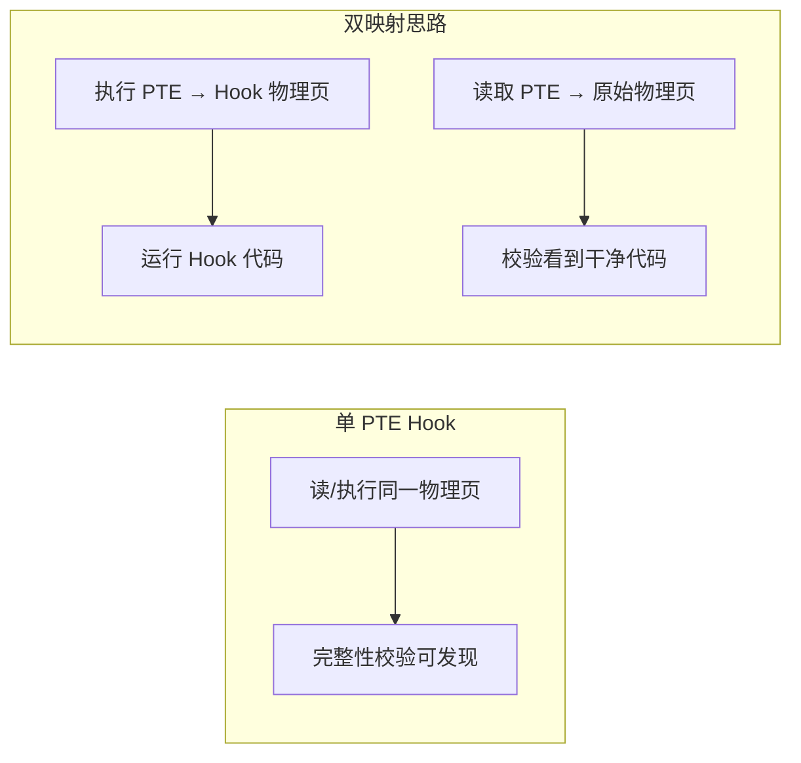

| 方案 | 实现要点 | 难点 |
|------|----------|------|
| 单 PTE（上文代码） | 改 PFN 到 Hook 页 | 简单，但读写执行一致 |
| 双 PTE / 分页故障 | 执行触发 #PF，故障处理切换 PFN | 需处理多核 TLB、竞态 |
| 硬件断点 | DR 寄存器（见第 08 章 1.4 VEH Hook） | 仅 4 个断点 |

> 双映射在生产环境极难维护，且多核 TLB 一致性是主要坑点。理解概念即可，不建议实战使用。

### PTE 操作安全检查清单

- [ ] `FindPteBase` 是否针对目标 Windows 版本验证过
- [ ] 修改 PTE 前是否 `_disable()` / 修改后 `__invlpg()`
- [ ] Hook 页是否 NonPagedPool / NonCached（避免执行属性异常）
- [ ] 卸载时是否恢复原始 PTE 并释放 Hook 页
- [ ] 是否考虑 SMP 下其他核心的 TLB（必要时 `KeFlushEntireTb`）

---

## 本章总结

### 技术选型决策树

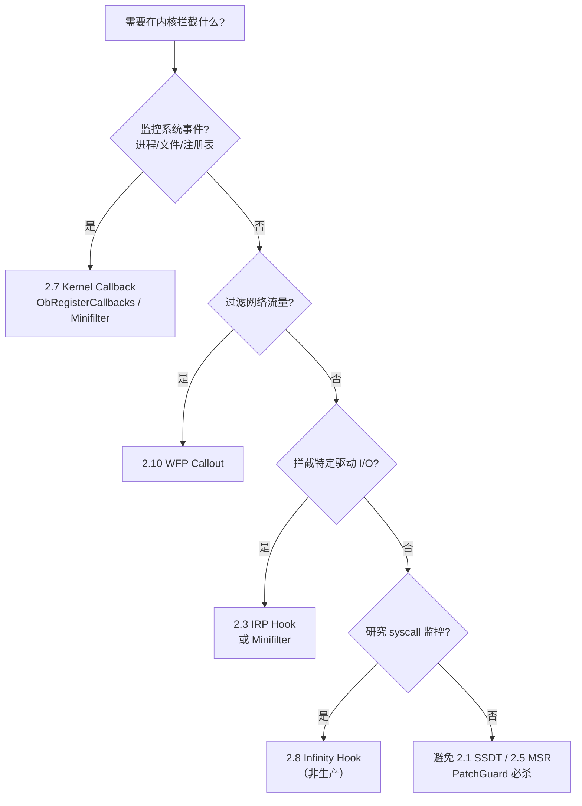

### 与用户态 Hook 的协作关系

| 层次 | 用户态（第 08 章） | 内核态（本章） |
|------|-------------------|----------------|
| API 拦截 | IAT / Inline Hook | ObCallback / 进程回调 |
| 文件操作 | — | Minifilter（2.7） |
| 网络 | LSP（已弃用） | WFP Callout（2.10） |
| syscall | Instrumentation Callback | Infinity Hook / 合法回调 |
| 隐蔽性 | 低（内存扫描） | 合法 API 高 / 传统 Hook 被 PG 封杀 |

### 学习路径建议

| 阶段 | 内容 | 目标 |
|------|------|------|
| 第一阶段 | 2.7 Kernel Callback | 掌握合法监控 API |
| 第二阶段 | 2.10 WFP + Minifilter | 网络/文件过滤驱动 |
| 第三阶段 | 2.1 SSDT + 2.8 Infinity Hook | 理解 syscall 内核路径演进 |
| 第四阶段 | 2.11 PTE Hook | 理解页表级执行劫持 |

### 核心认知

1. **Win10+ 内核开发铁律**：不要修改 PatchGuard 监控的结构（SSDT/IDT/GDT/MSR）。
2. **生产主流 = 合法回调**：`ObRegisterCallbacks`、Minifilter、WFP、注册表回调。
3. **IRP Hook → Minifilter**：IRP 直接 Hook 仍可用，但 Minifilter 是微软官方推荐的文件系统过滤框架。
4. **驱动签名**：Win10+ 强制驱动签名（DSE），测试阶段可用测试签名模式。

### 推荐工具与资源

| 资源 | 用途 |
|------|------|
| WDK + Visual Studio | 内核驱动开发 |
| OSR Driver Loader / sc create | 驱动加载测试 |
| WinDbg 双机调试 | 内核调试（避免 PatchGuard 蓝屏影响本机） |
| [Windows Driver Samples](https://github.com/microsoft/Windows-driver-samples) | Minifilter / WFP 官方示例 |
| Sysinternals Process Explorer | 观察回调与驱动加载 |

### 驱动开发通用检查清单

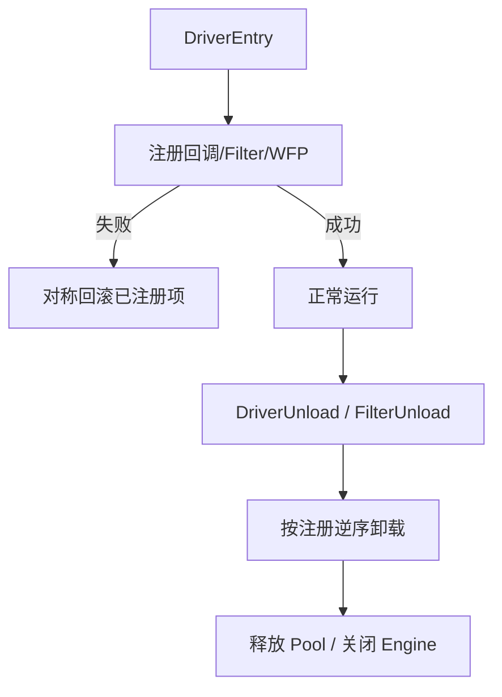

| 检查项 | 说明 |
|--------|------|
| 注册/卸载对称 | 每多一个 `PsSet*` / `ObRegister*` / `FltRegister*`，卸载多一个对应 Remove |
| PoolTag | 每次 `ExAllocatePool2` 带 4 字符 Tag，失败路径释放 |
| IRQL 标注 | 回调函数注释可调用 API 范围 |
| 分页 vs 非分页 | `PAGE` 段代码不可在 `DISPATCH_LEVEL` 调用 |
| 签名 | 发布版需 EV 代码签名证书 |

### WinDbg 常用调试命令

| 命令 | 用途 |
|------|------|
| `!process 0 0` | 列出所有进程（验证 DKOM 隐藏效果） |
| `lm` | 列出已加载内核模块 |
| `dt nt!_EPROCESS` | 查看结构偏移（版本相关） |
| `!fltkd.filters` | 枚举 Minifilter |
| `!wfpkd help` | WFP 调试扩展（需 WDK 调试包） |
| `rdmsr 0xC0000082` | 查看 IA32_LSTAR（MSR Hook 检测） |

### 常见 NTSTATUS 与排障

| 状态码 | 常见原因 |
|--------|----------|
| `STATUS_ACCESS_DENIED` | 回调中拒绝操作；或 ObCallback 剥离权限后返回 |
| `STATUS_INSUFFICIENT_RESOURCES` | 回调注册数量达上限（如进程通知 64 个） |
| `STATUS_FLT_INSTANCE_ALTITUDE_COLLISION` | Minifilter Altitude 与已有过滤器冲突 |
| `STATUS_FWP_ALREADY_EXISTS` | WFP GUID 重复注册 |
| `0x109 CRITICAL_STRUCTURE_CORRUPTION` | 触发了 PatchGuard（SSDT/IDT/MSR 等被改） |

---

## 附录 A：x64 syscall 从用户态到内核的完整链路

```mermaid
sequenceDiagram
    participant App as 应用
    participant Ntdll as ntdll!NtXxx stub
    participant CPU as CPU syscall
    participant Ki as KiSystemCall64
    participant Svc as nt!NtXxx 内核实现

    App->>Ntdll: call NtXxx
    Ntdll->>CPU: mov eax,SSN; syscall
    CPU->>Ki: IA32_LSTAR 入口
    Note over Ki: 2.5 MSR Hook 劫持点
    Ki->>Ki: PerfInfoLogSysCallEntry
    Note over Ki: 2.8 Infinity Hook 劫持点
    Ki->>Svc: 服务表分发
    Note over Ki,Svc: 2.1 SSDT Hook 劫持点
    Svc-->>App: 返回值经 RAX
```

| 阶段 | 可拦截技术 | 生产推荐 |
|------|-----------|----------|
| 用户态 stub | 第 08 章 Inline/IAT | MinHook / Detours |
| syscall 返回 | Instrumentation Callback | 研究用途 |
| KiSystemCall64 入口 | MSR Hook（已淘汰） | — |
| ETW 日志指针 | Infinity Hook | 研究用途 |
| 服务表分发 | SSDT Hook（已淘汰） | — |
| 对象/句柄层 | ObRegisterCallbacks | **推荐** |
| 文件 I/O 层 | Minifilter | **推荐** |
| 网络层 | WFP Callout | **推荐** |

---

## 附录 B：回调注册数量上限（实测参考）

| 回调类型 | 大致上限 | 超出时行为 |
|----------|----------|------------|
| `PsSetCreateProcessNotifyRoutine(Ex)` | 64 | `STATUS_INSUFFICIENT_RESOURCES` |
| `PsSetCreateThreadNotifyRoutine` | 64 | 同上 |
| `PsSetLoadImageNotifyRoutine` | 64 | 同上 |
| `ObRegisterCallbacks` | 无固定公开上限 | Altitude 冲突导致注册失败 |
| Minifilter 实例 | 系统资源限制 | Altitude 碰撞 |

> 上限可能随 Windows 版本调整，驱动应在 `DriverEntry` 检查返回值而非假设一定成功。
