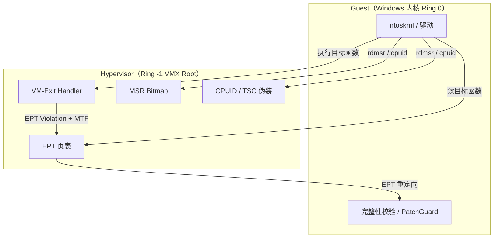
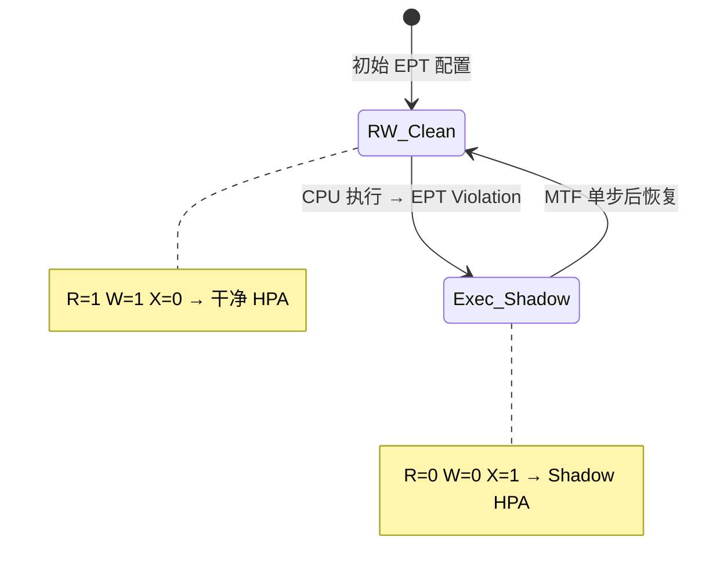
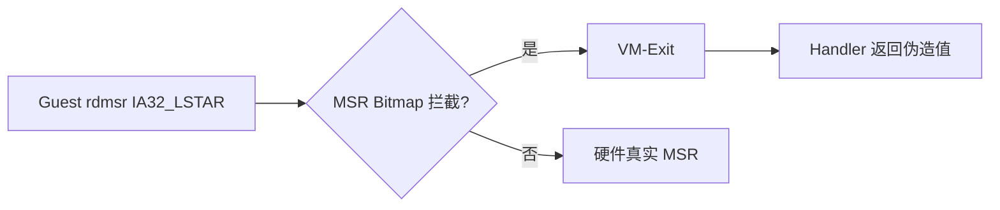
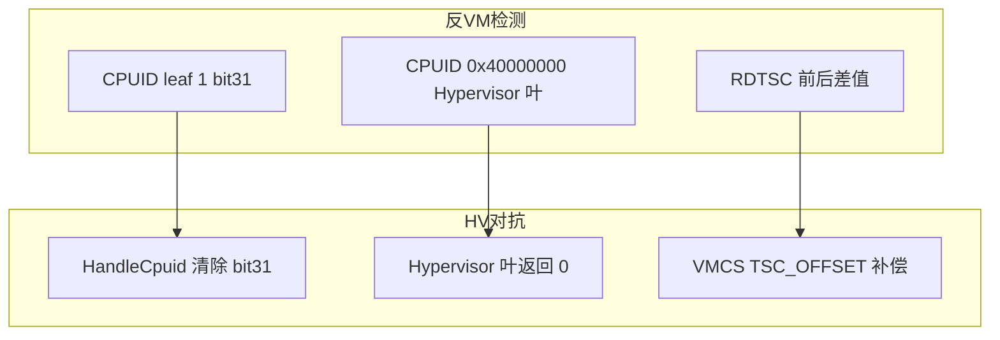
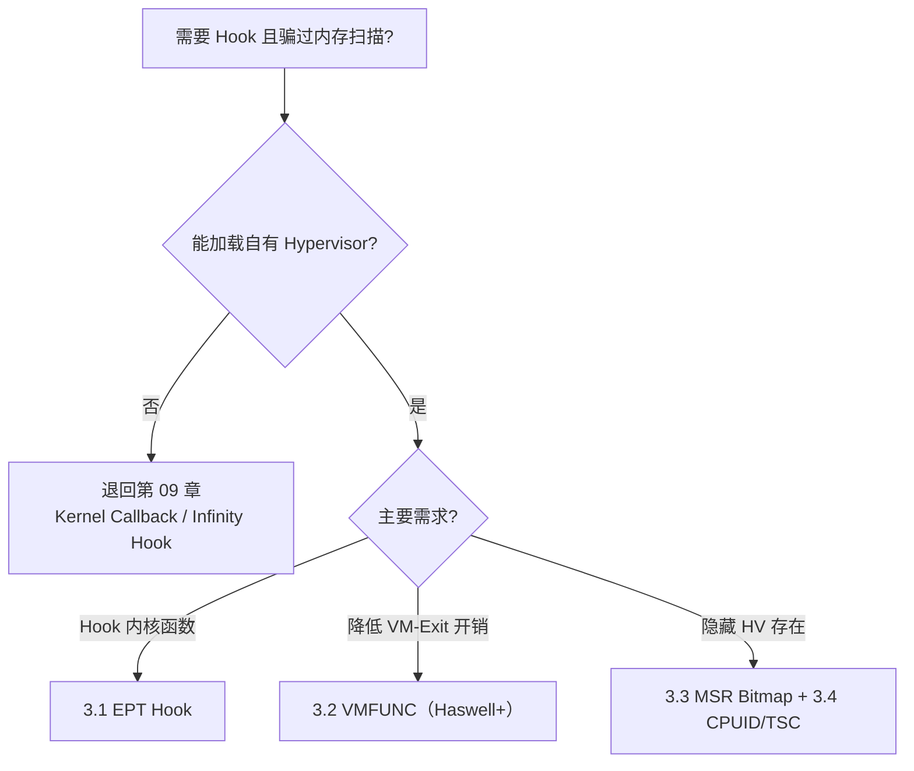

# 10_Windows 全架构 Hook 技术图谱 - Hypervisor 级 Hook（Ring -1）

> **术语说明**：文件名中的 "Ring 1" 是常见误称。Hypervisor 实际运行在 **Ring -1（VMX Root Operation）**，比 Windows 内核（Ring 0）更高。x86 的 Ring 1/2 在现代 Windows 中几乎不使用。

这是 Windows 平台上隐蔽性最强的一层。基于 **Intel VT-x**（或 AMD-V）的 Type-1/Type-2 Hypervisor 运行在所有软件之下（包括 Windows 内核），拥有对 Guest 物理内存视图、CPU 状态、部分 MSR 的完全控制权。在此层面实施的 Hook，操作系统读到的代码/数据都可以被 EPT 重定向伪造。

**现实约束**：Win10+ 启用 **VBS / HVCI / Hyper-V** 后，第三方 Hypervisor 难以抢占 VT-x，需绕过或利用嵌套虚拟化。下文技术主要见于安全研究、开源 HV 框架（HyperPlatform、hvpp、DdiMon 等），而非普通应用开发。

---

## 导读：Hypervisor Hook 技术全景



### 技术速查对比表

| 编号 | 技术 | 常用度 | 隐蔽性 | 性能开销 | CPU 要求 | 现代状态 |
|------|------|--------|--------|----------|----------|----------|
| 3.1 | EPT Hook（读写/执行分离） | ★★★★★ | ★★★★★ | 中（VM-Exit） | VT-x + EPT | **HV Hook 核心** |
| 3.2 | VMFUNC EPTP Switching | ★★☆☆☆ | ★★★★★+ | 低（无 VM-Exit） | Haswell+ 2013+ | 研究型，复杂度高 |
| 3.3 | EPT + MSR Bitmap | ★★★★☆ | ★★★★★ | 低~中 | VT-x + EPT | HV 反检测标配 |
| 3.4 | CPUID 隐藏 + TSC 补偿 | ★★★★☆ | ★★★★☆ | 中 | VT-x | HV 反检测标配 |

### 与第 08/09 章的关系

| 层次 | 章节 | Hook 能力边界 |
|------|------|---------------|
| Ring 3 | 第 08 章 | 进程内 API/syscall stub |
| Ring 0 | 第 09 章 | 内核回调 / Infinity Hook |
| Ring -1 | 本章 | **Guest 物理内存视图级**，可骗过 PatchGuard 读取 |

### 阅读建议

- **必学核心**：3.1 EPT Hook（理解 Violation + MTF 状态机）
- **反检测组合**：3.3 MSR Bitmap + 3.4 CPUID/TSC
- **进阶优化**：3.2 VMFUNC（降低 VM-Exit 频率）
- **环境前提**：先理解 VT-x 基础（VMCS、VM-Exit、EPTP）

### VT-x 最小概念（读代码前必知）

| 概念 | 含义 |
|------|------|
| **VMX Root** | Hypervisor 运行模式（Ring -1） |
| **VMX Non-Root** | Guest（Windows）运行模式 |
| **VMCS** | 虚拟机控制结构，保存 Guest/Host 状态 |
| **VM-Exit** | Guest 触发事件后陷入 Hypervisor |
| **EPT** | 扩展页表，GPA → HPA 二次地址翻译 |
| **INVEPT** | 刷新 EPT TLB（修改 EPT 后必须调用） |

---

## 3.1 EPT Hook（扩展页表 Hook）— 读写/执行分离

### 技术定位

**Hypervisor Hook 最核心技术**。利用 EPT 对同一 Guest 物理页配置不同 HPA 映射：读/写走干净页，执行走 Shadow Hook 页。这是 DdiMon、HyperPlatform 等开源框架的实现基础。

### 原理

EPT（Extended Page Table）是 Intel VT-x 提供的第二层地址翻译。Guest 的物理地址（GPA）通过 EPT 映射到实际的主机物理地址（HPA）。EPT 的每个条目都有独立的 Read/Write/Execute 权限位。

核心思想：**对同一个 GPA，让读写操作映射到干净原始页，让执行操作映射到包含 Hook 代码的页**。



**与普通内核 PTE Hook（09 章 2.11）的区别**：EPT 在 Hypervisor 层操作，Guest 内核的 `MmGetPhysicalAddress` 和页表遍历看到的仍是"正常"视图，且可对 Guest 只读重定向。

### EPT 条目结构

```c
typedef union _EPT_PTE {
ULONG64 Value;
struct {
ULONG64 ReadAccess :1;
ULONG64 WriteAccess :1;
ULONG64 ExecuteAccess :1;
ULONG64 MemoryType :3;        // 0=UC, 6=WB
ULONG64 IgnorePat :1;
ULONG64 LargePage :1;         // 2MB/1GB 大页
ULONG64 Accessed :1;
ULONG64 Dirty :1;
ULONG64 UserModeExecute :1;   // MBEC
ULONG64 Reserved1 :1;
ULONG64 PhysicalAddress :40;  // 物理页帧号
ULONG64 Reserved2 :11;
ULONG64 SuppressVE :1;        // #VE 抑制
    };
} EPT_PTE, *PEPT_PTE;

typedef union _EPTP {
ULONG64 Value;
struct {
ULONG64 MemoryType :3;        // EPT 页表自身的内存类型
ULONG64 PageWalkLength :3;    // 页表遍历深度-1 (3 = 4级)
ULONG64 DirtyAndAccessEnabled :1;
ULONG64 Reserved1 :5;
ULONG64 PML4PhysicalAddress :40;
ULONG64 Reserved2 :12;
    };
} EPTP;
```

### 地址翻译链路（Guest 视角）


> **Hook 操作点**：修改 EPT 最后一级 PTE 的 `PhysicalAddress`（PFN）和 R/W/X 位，Guest 页表无需改动。

### 完整实现（从 Hypervisor 初始化到 Hook 安装）

```c
#include <ntddk.h>
#include <intrin.h>

// ===== EPT 页表构建 =====

typedef struct _EPT_STATE {
DECLSPEC_ALIGN(PAGE_SIZE) EPT_PTE PML4[512];
DECLSPEC_ALIGN(PAGE_SIZE) EPT_PTE PDPT[512];
DECLSPEC_ALIGN(PAGE_SIZE) EPT_PTE PD[512][512];   // 512 个 PD，每个 512 条目
// 对于 2MB 大页映射，不需要 PT 层
// 对于需要精确控制的页，单独分配 PT
    EPTP Eptp;
} EPT_STATE;

// 构建恒等映射 EPT（GPA == HPA，2MB 大页）
NTSTATUS BuildIdentityEpt(EPT_STATE* ept) {
RtlZeroMemory(ept, sizeof(EPT_STATE));

// PML4[0] -> PDPT
    ept->PML4[0].ReadAccess = 1;
    ept->PML4[0].WriteAccess = 1;
    ept->PML4[0].ExecuteAccess = 1;
    ept->PML4[0].PhysicalAddress = MmGetPhysicalAddress(ept->PDPT).QuadPart >> 12;

// PDPT -> PD
for (int i = 0; i < 512; i++) {
        ept->PDPT[i].ReadAccess = 1;
        ept->PDPT[i].WriteAccess = 1;
        ept->PDPT[i].ExecuteAccess = 1;
        ept->PDPT[i].PhysicalAddress = MmGetPhysicalAddress(&ept->PD[i]).QuadPart >> 12;
    }

// PD -> 2MB 大页直接映射（覆盖 0 - 512GB 物理内存）
for (int i = 0; i < 512; i++) {
for (int j = 0; j < 512; j++) {
            ULONG64 physAddr = ((ULONG64)i * 512 + j) * 0x200000; // 2MB per entry
            ept->PD[i][j].ReadAccess = 1;
            ept->PD[i][j].WriteAccess = 1;
            ept->PD[i][j].ExecuteAccess = 1;
            ept->PD[i][j].LargePage = 1;
            ept->PD[i][j].MemoryType = 6; // WB
            ept->PD[i][j].PhysicalAddress = physAddr >> 12;
        }
    }

// 配置 EPTP
    ept->Eptp.MemoryType = 6; // WB
    ept->Eptp.PageWalkLength = 3; // 4-level
    ept->Eptp.PML4PhysicalAddress = MmGetPhysicalAddress(ept->PML4).QuadPart >> 12;

return STATUS_SUCCESS;
}

// ===== 将 2MB 大页拆分为 4KB 页（精确控制单个页的权限）=====

typedef struct _EPT_SPLIT_PAGE {
DECLSPEC_ALIGN(PAGE_SIZE) EPT_PTE PT[512];  // 512 个 4KB PTE
} EPT_SPLIT_PAGE;

NTSTATUS SplitLargePage(EPT_STATE* ept, ULONG64 targetPhysAddr) {
// 确定目标在哪个 PD entry
    ULONG pdptIndex = (targetPhysAddr >> 30) & 0x1FF;
    ULONG pdIndex = (targetPhysAddr >> 21) & 0x1FF;

    EPT_PTE* pdEntry = &ept->PD[pdptIndex][pdIndex];
if (!pdEntry->LargePage) return STATUS_SUCCESS; // 已经拆分过

// 分配 PT 页
    EPT_SPLIT_PAGE* splitPage = ExAllocatePoolWithTag(NonPagedPool, sizeof(EPT_SPLIT_PAGE), 'tpES');
if (!splitPage) return STATUS_INSUFFICIENT_RESOURCES;

// 用 512 个 4KB 条目填充，恒等映射
    ULONG64 basePhys = (pdEntry->PhysicalAddress << 12) & ~0x1FFFFFULL; // 2MB 对齐
for (int i = 0; i < 512; i++) {
        splitPage->PT[i].ReadAccess = 1;
        splitPage->PT[i].WriteAccess = 1;
        splitPage->PT[i].ExecuteAccess = 1;
        splitPage->PT[i].MemoryType = 6;
        splitPage->PT[i].PhysicalAddress = (basePhys + i * PAGE_SIZE) >> 12;
    }

// 将 PD entry 从大页改为指向 PT
    pdEntry->Value = 0;
    pdEntry->ReadAccess = 1;
    pdEntry->WriteAccess = 1;
    pdEntry->ExecuteAccess = 1;
    pdEntry->PhysicalAddress = MmGetPhysicalAddress(splitPage->PT).QuadPart >> 12;
// LargePage = 0（默认，表示指向下一级 PT）

// 刷新 EPT TLB
InveptAllContexts();

return STATUS_SUCCESS;
}

// ===== EPT Hook 安装 =====

typedef struct _EPT_HOOK_ENTRY {
    ULONG64 targetPhysAddr;    // 目标物理地址（页对齐）
    ULONG64 originalHpa;       // 原始 HPA（干净页）
    ULONG64 shadowHpa;         // Shadow HPA（Hook 代码页）
    EPT_PTE* pEptPte;          // 对应的 EPT PTE
    PVOID shadowPage;          // Shadow 页虚拟地址
    ULONG functionOffset;      // 函数在页内的偏移
    LIST_ENTRY listEntry;
} EPT_HOOK_ENTRY;

LIST_ENTRY g_hookList;

NTSTATUS InstallEptHook(EPT_STATE* ept, PVOID targetFunction, PVOID hookFunction) {
// 获取目标函数的物理地址
    PHYSICAL_ADDRESS targetPhys = MmGetPhysicalAddress(targetFunction);
    ULONG64 targetPhysPage = targetPhys.QuadPart & ~0xFFF;

// 拆分大页
SplitLargePage(ept, targetPhysPage);

// 分配 Shadow Page
    PVOID shadowPage = ExAllocatePoolWithTag(NonPagedPool, PAGE_SIZE, 'wdhS');
if (!shadowPage) return STATUS_INSUFFICIENT_RESOURCES;

// 复制原始页内容
    PVOID mappedOriginal = MmMapIoSpace(targetPhys, PAGE_SIZE, MmNonCached);
RtlCopyMemory(shadowPage, mappedOriginal, PAGE_SIZE);
MmUnmapIoSpace(mappedOriginal, PAGE_SIZE);

// 在 Shadow Page 中目标偏移处写入跳转
    ULONG offset = targetPhys.LowPart & 0xFFF;
    BYTE* hookPoint = (BYTE*)shadowPage + offset;

// 写入 14 字节绝对跳转
    hookPoint[0] = 0xFF;
    hookPoint[1] = 0x25;
    *(UINT32*)(hookPoint + 2) = 0;
    *(UINT64*)(hookPoint + 6) = (UINT64)hookFunction;

// 配置 EPT：初始状态 = Read+Write, 禁止 Execute
    ULONG ptIndex = (targetPhysPage >> 12) & 0x1FF;
    ULONG pdIndex = (targetPhysPage >> 21) & 0x1FF;
    ULONG pdptIndex = (targetPhysPage >> 30) & 0x1FF;

// 定位 PT（需要从拆分后的 PD entry 找到 PT）
// ... 这里需要根据你的 EPT 结构定位到正确的 PTE

// 保存 Hook 信息
    EPT_HOOK_ENTRY* entry = ExAllocatePoolWithTag(NonPagedPool, sizeof(EPT_HOOK_ENTRY), 'kooH');
    entry->targetPhysAddr = targetPhysPage;
    entry->originalHpa = targetPhysPage;
    entry->shadowHpa = MmGetPhysicalAddress(shadowPage).QuadPart;
    entry->shadowPage = shadowPage;
    entry->functionOffset = offset;
InsertTailList(&g_hookList, &entry->listEntry);

// 设置 EPT PTE：RW=干净页, X=禁止（触发 Execute 时切换到 shadow）
    entry->pEptPte->ReadAccess = 1;
    entry->pEptPte->WriteAccess = 1;
    entry->pEptPte->ExecuteAccess = 0;  // 执行时触发 EPT Violation
    entry->pEptPte->PhysicalAddress = entry->originalHpa >> 12;

InveptAllContexts();
return STATUS_SUCCESS;
}

// ===== VM-Exit Handler: EPT Violation 处理 =====

void HandleEptViolation(PVMX_VCPU vcpu) {
    ULONG64 guestPhysAddr = __vmx_vmread(VMCS_GUEST_PHYSICAL_ADDRESS);
    ULONG64 qualification = __vmx_vmread(VMCS_EXIT_QUALIFICATION);

    BOOLEAN isExecute = (qualification >> 2) & 1;
    BOOLEAN isRead = qualification & 1;
    BOOLEAN isWrite = (qualification >> 1) & 1;

// 查找对应的 Hook
    EPT_HOOK_ENTRY* hook = FindHookByPhysAddr(guestPhysAddr & ~0xFFF);
if (!hook) {
// 不是我们的 Hook，注入异常
InjectException(vcpu, EXCEPTION_GENERAL_PROTECTION);
return;
    }

if (isExecute) {
// CPU 要执行这个页 → 切换到 Shadow Page（含 Hook 跳转）
        hook->pEptPte->ReadAccess = 0;
        hook->pEptPte->WriteAccess = 0;
        hook->pEptPte->ExecuteAccess = 1;
        hook->pEptPte->PhysicalAddress = hook->shadowHpa >> 12;
    } else {
// CPU 要读/写这个页 → 切换到 Original Page（干净代码）
        hook->pEptPte->ReadAccess = 1;
        hook->pEptPte->WriteAccess = 1;
        hook->pEptPte->ExecuteAccess = 0;
        hook->pEptPte->PhysicalAddress = hook->originalHpa >> 12;
    }

InveptSingleContext(vcpu->eptp);

// 设置 Monitor Trap Flag：执行一条指令后恢复初始状态
    ULONG64 procCtls = __vmx_vmread(VMCS_PROC_BASED_CONTROLS);
    __vmx_vmwrite(VMCS_PROC_BASED_CONTROLS, procCtls | VMX_PROC_CTL_MONITOR_TRAP_FLAG);
}

// MTF 处理：单条指令执行完毕后恢复
void HandleMonitorTrapFlag(PVMX_VCPU vcpu) {
// 恢复所有 Hook 页为初始状态（RW=原始, X=禁止）
    PLIST_ENTRY entry = g_hookList.Flink;
while (entry != &g_hookList) {
        EPT_HOOK_ENTRY* hook = CONTAINING_RECORD(entry, EPT_HOOK_ENTRY, listEntry);
        hook->pEptPte->ReadAccess = 1;
        hook->pEptPte->WriteAccess = 1;
        hook->pEptPte->ExecuteAccess = 0;
        hook->pEptPte->PhysicalAddress = hook->originalHpa >> 12;
        entry = entry->Flink;
    }

// 关闭 MTF
    ULONG64 procCtls = __vmx_vmread(VMCS_PROC_BASED_CONTROLS);
    __vmx_vmwrite(VMCS_PROC_BASED_CONTROLS, procCtls & ~VMX_PROC_CTL_MONITOR_TRAP_FLAG);

InveptSingleContext(vcpu->eptp);
}
```

### 检测难度：★★★★★

* 操作系统读取目标函数时，看到的是**完全干净的原始代码**
* PatchGuard 所有完整性校验读取都被 EPT 重定向到干净页
* CRC 校验、`memcmp` 对比、内存扫描全部通过
* 理论检测：时序分析（EPT Violation + VM-Exit 引入微延迟）、嵌套 HV 检测、硬件性能计数器

### EPT Violation + MTF 状态机（通俗版）

```
1. 初始：EPT PTE → 干净页，权限 RW=1, X=0
2. Guest 执行该页 → EPT Violation（执行权限不足）→ VM-Exit
3. Handler：改 PTE → Shadow 页，权限 X=1, RW=0；开启 MTF
4. VM-Entry 继续执行 Shadow 页中的 Hook 跳转
5. 执行 1 条指令后 MTF VM-Exit → 恢复 PTE 为步骤 1
```

### 更易理解的最小伪代码

```c
// 精简版：仅展示 EPT Hook 的三态切换逻辑（省略 EPT 建表细节）

typedef enum _EPT_HOOK_VIEW {
    ViewCleanRw,    // 读/写：干净页
    ViewShadowExec  // 执行：Shadow 页
} EPT_HOOK_VIEW;

void OnEptViolation(ULONG64 gpa, BOOLEAN isExecute) {
    EPT_HOOK_ENTRY* hook = FindHook(gpa & ~0xFFF);
    if (hook == NULL) return;

    if (isExecute) {
        // 切换到 Shadow 页，仅允许执行
        SetEptPte(hook, hook->shadowHpa, /*r*/0, /*w*/0, /*x*/1);
        EnableMonitorTrapFlag();  // 执行一条后触发 MTF
    } else {
        // 读/写始终走干净页
        SetEptPte(hook, hook->originalHpa, /*r*/1, /*w*/1, /*x*/0);
    }
    InveptSingleContext();
}

void OnMonitorTrapFlag(void) {
    // 恢复所有 Hook 页为 CleanRw 视图
    RestoreAllHooksToCleanRw();
    DisableMonitorTrapFlag();
    InveptSingleContext();
}
```

### 开源参考实现

| 项目 | 说明 |
|------|------|
| [HyperPlatform](https://github.com/tandasat/HyperPlatform) | 经典 Windows VT-x 研究框架，含 EPT Hook |
| [DdiMon](https://github.com/tandasat/DdiMon) | 基于 HyperPlatform 的监控/Hook 示例 |
| [hvpp](https://github.com/wbenny/hvpp) | 现代 C++ Hypervisor 库 |

> AMD 平台对应技术为 **NPT（Nested Page Tables）**，概念与 EPT 等价，实现细节不同。

---

## 3.2 VMFUNC EPTP Switching（零 VM-Exit 的 EPT 切换）

### 技术定位

**研究型性能优化**。在 Haswell+ CPU 上通过 `VMFUNC` 指令无 VM-Exit 切换 EPTP，避免 3.1 中每次 Violation 的高开销。需维护多套完整 EPT，复杂度高，生产案例极少。

### 原理

VMFUNC 是 Intel 在 Haswell+ 处理器上引入的指令，允许 Guest 在**不触发 VM-Exit** 的情况下切换 EPTP（EPT Pointer），即瞬间切换到不同的物理内存视图。

### 完整实现

```c
// ===== VMCS 配置：启用 VMFUNC =====

void EnableVmfuncInVmcs() {
// 启用 Secondary Proc-Based Controls 中的 VMFUNC bit
    ULONG64 secondary = __vmx_vmread(VMCS_SECONDARY_PROC_BASED_CONTROLS);
    secondary |= (1ULL << 13); // Enable VMFUNC
    __vmx_vmwrite(VMCS_SECONDARY_PROC_BASED_CONTROLS, secondary);

// VMFUNC Controls: 只启用 function 0 (EPTP Switching)
    __vmx_vmwrite(VMCS_VMFUNC_CONTROLS, 1ULL);

// 配置 EPTP List（最多 512 个 EPTP）
DECLSPEC_ALIGN(PAGE_SIZE) ULONG64 eptpList[512] = {0};

    eptpList[0] = g_cleanEptp.Value;    // Index 0: 干净视图（默认）
    eptpList[1] = g_hookedEptp.Value;   // Index 1: Hook 视图

    PHYSICAL_ADDRESS eptpListPhys = MmGetPhysicalAddress(eptpList);
    __vmx_vmwrite(VMCS_EPTP_LIST_ADDRESS, eptpListPhys.QuadPart);
}

// ===== Guest 端切换代码 =====

// 切换到 Hook 视图（Guest 内核代码调用）
__forceinline void SwitchToHookView() {
// VMFUNC: EAX=0 (function=EPTP Switching), ECX=1 (EPTP index)
    __asm {
xor eax, eax    // function 0
        mov ecx, 1      // switch to index 1
        _emit 0x0F      // VMFUNC opcode
        _emit 0x01
        _emit 0xC4
    }
}

// 切换到干净视图
__forceinline void SwitchToCleanView() {
    __asm {
xor eax, eax
xor ecx, ecx    // switch to index 0
        _emit 0x0F
        _emit 0x01
        _emit 0xC4
    }
}

// ===== 高级应用：自动切换的 Hook Trampoline =====
// 在 Hook 函数入口自动切换视图，退出时切换回来

// 汇编 Trampoline：
// 1. 进入时切换到干净视图（这样读内存看到的是原始代码）
// 2. 调用真正的 Hook 处理函数
// 3. 退出时切换回 Hook 视图
// 4. 跳转到原始函数（在 Hook 视图中执行原始代码的 trampoline）

BYTE g_vmfuncTrampoline[] = {
// Switch to clean view (index 0)
0x31, 0xC0,                         // xor eax, eax
0x31, 0xC9,                         // xor ecx, ecx
0x0F, 0x01, 0xC4,                   // vmfunc

// Call hook handler (address patched at runtime)
0xFF, 0x15, 0x02, 0x00, 0x00, 0x00, // call [rip+2]
0xEB, 0x08,                         // jmp over address
0x00, 0x00, 0x00, 0x00, 0x00, 0x00, 0x00, 0x00, // hook_handler address

// Switch back to hook view (index 1)
0x31, 0xC0,                         // xor eax, eax
0xB9, 0x01, 0x00, 0x00, 0x00,       // mov ecx, 1
0x0F, 0x01, 0xC4,                   // vmfunc

// Jump to original function trampoline (address patched)
0xFF, 0x25, 0x00, 0x00, 0x00, 0x00, // jmp [rip+0]
0x00, 0x00, 0x00, 0x00, 0x00, 0x00, 0x00, 0x00  // original_trampoline address
};
```

### 对比普通 EPT Hook

| 维度 | 普通 EPT Hook（3.1） | VMFUNC EPTP Switching（3.2） |
|------|----------------------|------------------------------|
| 视图切换方式 | EPT Violation → VM-Exit | VMFUNC 指令（无 VM-Exit） |
| 性能开销 | 每次切换约 1000–3000 cycles | 约 100 cycles |
| 时序攻击风险 | 有（VM-Exit 延迟可测量） | 极低（指令级速度） |
| CPU 要求 | VT-x + EPT | Haswell+（2013+） |
| 复杂度 | 中等 | 高（需维护多套 EPT） |
| 常用度 | 高 | 低（研究/极致隐蔽） |

### 现状说明

| 项目 | 说明 |
|------|------|
| 启用条件 | VMCS 中 `Enable VMFUNC` + `EPTP List` 配置 |
| Guest 配合 | 需在 Guest 内核/用户态执行 `vmfunc`（需注入或内核模块） |
| 检测 | 几乎无时序特征，但 `CPUID` 可暴露 VMFUNC 支持（可被 3.4 隐藏） |
| 适用场景 | 高频 Hook 点、对 VM-Exit 延迟敏感的研究原型 |

### 检测难度：★★★★★+

* 没有 VM-Exit，时序攻击基本无效
* CPUID 可以被拦截来隐藏 VMFUNC 支持
* 目前没有已知的广泛部署检测方案（不代表绝对不可检测）

---

## 3.3 EPT + MSR Bitmap 联合 Hook

### 技术定位

**HV 反检测标配**。单独 EPT 只能骗过内存读取；配合 MSR Bitmap 可拦截 `rdmsr`/`wrmsr`，伪造 `IA32_LSTAR` 等关键 MSR，形成"代码 + 数据"双重伪装。

### 原理

VMX 的 MSR Bitmap 可以选择性地让某些 MSR 的读写触发 VM-Exit。配合 EPT Hook，可以拦截任何通过 MSR 实现的功能（性能计数器、电源控制、安全特性等），同时让检测工具读到伪造的 MSR 值。



### 完整实现

```c
// MSR Bitmap 结构（4KB 页，4个区域各 1KB）
// 0x000-0x3FF: Low MSRs read  (MSR 0x00000000 - 0x00001FFF)
// 0x400-0x7FF: High MSRs read (MSR 0xC0000000 - 0xC0001FFF)
// 0x800-0xBFF: Low MSRs write
// 0xC00-0xFFF: High MSRs write

DECLSPEC_ALIGN(PAGE_SIZE) UCHAR g_msrBitmap[PAGE_SIZE] = {0};

void SetupMsrBitmap() {
    RtlZeroMemory(g_msrBitmap, PAGE_SIZE);

// 拦截 IA32_LSTAR 的读取（让检测工具看到假值）
// IA32_LSTAR = 0xC0000082
// 在 High MSR read bitmap 中: offset = 0x400 + (0x82 / 8) = 0x410, bit = 0x82 % 8 = 2
    g_msrBitmap[0x410] |= (1 << 2);  // RDMSR 触发 VM-Exit

// 也可以拦截写入
    g_msrBitmap[0xC10] |= (1 << 2);  // WRMSR 触发 VM-Exit

// 拦截 IA32_DEBUGCTL (用于隐藏调试特性)
// 0x1D9 → Low MSR read: offset = 0x000 + (0x1D9 / 8) = 0x3B, bit = 0x1D9 % 8 = 1
    g_msrBitmap[0x3B] |= (1 << 1);

// 写入 VMCS
    PHYSICAL_ADDRESS msrBitmapPhys = MmGetPhysicalAddress(g_msrBitmap);
    __vmx_vmwrite(VMCS_MSR_BITMAP_ADDRESS, msrBitmapPhys.QuadPart);
}

// VM-Exit Handler: 伪造 MSR 值
void HandleMsrRead(PVMX_VCPU vcpu) {
    ULONG msrIndex = (ULONG)vcpu->guestState.Rcx;
    ULONG64 realValue;

switch (msrIndex) {
case 0xC0000082: // IA32_LSTAR
// 返回原始的 KiSystemCall64 地址（即使实际已被修改）
            realValue = g_originalKiSystemCall64;
break;

case 0x1D9: // IA32_DEBUGCTL
// 隐藏任何调试相关设置
            realValue = 0;
break;

default:
            realValue = __readmsr(msrIndex);
break;
    }

    vcpu->guestState.Rax = (ULONG)(realValue & 0xFFFFFFFF);
    vcpu->guestState.Rdx = (ULONG)(realValue >> 32);
    AdvanceGuestRip(vcpu);
}

// VM-Exit Handler: 拦截 MSR 写入
void HandleMsrWrite(PVMX_VCPU vcpu) {
    ULONG msrIndex = (ULONG)vcpu->guestState.Rcx;
    ULONG64 newValue = ((ULONG64)vcpu->guestState.Rdx << 32) | (vcpu->guestState.Rax & 0xFFFFFFFF);

switch (msrIndex) {
case 0xC0000082: // IA32_LSTAR
// 阻止修改（或记录后放行）
// 如果放行，更新我们的记录
            g_originalKiSystemCall64 = newValue;
            __writemsr(msrIndex, newValue);
break;

default:
            __writemsr(msrIndex, newValue);
break;
    }
    AdvanceGuestRip(vcpu);
}
```

### 检测难度：★★★★★

* 检测工具用 `rdmsr` 读 `IA32_LSTAR` 看到的是假值
* 配合 EPT Hook，代码内存读取也是假的
* 双重伪装：代码伪装 + MSR 数据伪装

### 常拦截 MSR 速查

| MSR | 地址 | 拦截目的 |
|-----|------|----------|
| `IA32_LSTAR` | 0xC0000082 | 隐藏 syscall 入口是否被改 |
| `IA32_DEBUGCTL` | 0x1D9 | 隐藏调试/断点相关设置 |
| `IA32_EFER` | 0xC0000080 | 控制 SCE/NXE 等 |
| `IA32_SYSENTER_*` | 0x174–0x176 | 旧版 sysenter 路径检测 |

### MSR Bitmap 偏移计算公式

```
High MSR（0xC0000000–0xC0001FFF）读拦截：
  字节偏移 = 0x400 + ((msr & 0x1FFF) / 8)
  位索引   = (msr & 0x1FFF) % 8

示例 IA32_LSTAR (0xC0000082)：
  偏移 0x410，bit 2  → g_msrBitmap[0x410] |= (1 << 2)
```

---

## 3.4 CPUID 虚拟化隐藏 + TSC 补偿

### 技术定位

**HV 反虚拟机检测标配**。任何 Hypervisor 都会引入 CPUID 特征位和 VM-Exit 时序差异；本节是 Hypervisor 隐藏自身存在的标准手段，与 3.1 EPT Hook 配合使用。

### 原理

Hypervisor 的存在可以通过 CPUID 指令被检测（VMX 会让 `CPUID.1:ECX.bit31 = 1`）。同时 VM-Exit 会引入可测量的时间延迟。通过拦截 CPUID 和补偿 TSC（时间戳计数器），可以让检测工具更难发现 Hypervisor。



### 完整实现

```c
// ===== CPUID 伪装 =====
void HandleCpuid(PVMX_VCPU vcpu) {
    int cpuInfo[4];
    __cpuidex(cpuInfo, (int)vcpu->guestState.Rax, (int)vcpu->guestState.Rcx);

ULONG leaf = (ULONG)vcpu->guestState.Rax;

switch (leaf) {
case 0x1:
// 清除 Hypervisor Present bit (ECX bit 31)
            cpuInfo[2] &= ~(1 << 31);
break;

case 0x40000000:
case 0x40000001:
case 0x40000002:
case 0x40000003:
case 0x40000004:
case 0x40000005:
case 0x40000006:
// 所有 Hypervisor 扩展 leaf 返回 0
            cpuInfo[0] = cpuInfo[1] = cpuInfo[2] = cpuInfo[3] = 0;
break;

case 0x0:
// 确保 max leaf 不包含 0x40000000 范围
if (cpuInfo[0] > 0x20) cpuInfo[0] = 0x20;
break;
    }

    vcpu->guestState.Rax = cpuInfo[0];
    vcpu->guestState.Rbx = cpuInfo[1];
    vcpu->guestState.Rcx = cpuInfo[2];
    vcpu->guestState.Rdx = cpuInfo[3];
    AdvanceGuestRip(vcpu);
}

// ===== TSC 补偿（隐藏 VM-Exit 延迟）=====
// VM-Exit + VM-Entry 大约消耗 1000-3000 TSC cycles
// 如果检测工具在 VM-Exit 前后读 TSC 对比，可以发现异常延迟

// 方案：在 VMCS 中设置 TSC Offset，每次 VM-Exit 后补偿消耗的时间
typedef struct _TSC_STATE {
    ULONG64 lastExitTsc;      // 上次 VM-Exit 时的 TSC
    ULONG64 totalOffset;      // 累积需要减去的 TSC
} TSC_STATE;

TSC_STATE g_tscState[256] = {0}; // 每个 CPU 一个

void HandleVmExit(PVMX_VCPU vcpu) {
    ULONG64 exitTsc = __rdtsc();

// ... 处理各种 VM-Exit ...

ULONG64 entryTsc = __rdtsc();
    ULONG64 exitCost = entryTsc - exitTsc;

// 将这次 VM-Exit 的时间消耗累加到 TSC Offset
    g_tscState[vcpu->cpuIndex].totalOffset += exitCost;

// 更新 VMCS TSC Offset（Guest 读到的 TSC = 实际 TSC - offset）
    __vmx_vmwrite(VMCS_TSC_OFFSET, -(INT64)g_tscState[vcpu->cpuIndex].totalOffset);
}

// 还需要处理 RDTSC/RDTSCP 的 VM-Exit（如果启用了 RDTSC exiting）
void HandleRdtsc(PVMX_VCPU vcpu) {
    ULONG64 tsc = __rdtsc() - g_tscState[vcpu->cpuIndex].totalOffset;
    vcpu->guestState.Rax = (ULONG)(tsc & 0xFFFFFFFF);
    vcpu->guestState.Rdx = (ULONG)(tsc >> 32);
    AdvanceGuestRip(vcpu);
}
```

### 检测难度：★★★★☆

* CPUID 看不到 Hypervisor Present 位（基础检测可绕过）
* TSC 差值测量难度增大（非绝对不可检测）
* 高级检测仍可能通过：缓存时序、侧信道、固件/TPM  attestation、嵌套 HV 存在性

### 反检测 vs 反-反检测（现实博弈）

| 检测方手段 | HV 对抗（本章技术） | 检测方进阶 |
|-----------|---------------------|-----------|
| `CPUID.1:ECX[31]` | 3.4 清除该位 | 检查 Hypervisor 叶 0x40000000 一致性 |
| `rdtsc` 差值 | TSC_OFFSET 补偿 | 多核 TSC 同步、HPET 交叉验证 |
| 内存完整性扫描 | 3.1 EPT 干净页 | 行为分析、网络 C2 特征 |
| `rdmsr LSTAR` | 3.3 MSR Bitmap 伪造 | 直接 syscall 进内核对比行为 |

### TSC 补偿注意点

| 项目 | 说明 |
|------|------|
| `VMCS_TSC_OFFSET` | Guest 读到 `TSC - offset` |
| 多核 | 每个 vCPU 独立维护 `g_tscState[cpuIndex]` |
| RDTSC exiting | 若启用 RDTSC VM-Exit，需在 Handler 中手动补偿 |
| 局限 | 无法完美消除所有微架构侧信道 |

---

## 本章总结

### 技术选型决策树



### 三层 Hook 隐蔽性对比

| 检测手段 | Ring 3 | Ring 0 | Ring -1（本章） |
|----------|--------|--------|-----------------|
| 内存扫描 | 易发现 | 较易发现 | **读看到干净页** |
| PatchGuard | 不涉及 | 监控关键结构 | PG 读取也被 EPT 骗过 |
| `rdmsr` 检测 | 不涉及 | 可发现异常 | Bitmap 可伪造 |
| 时序检测 | 较难 | 较难 | EPT Violation 有痕迹；VMFUNC 更少 |

### 部署现实约束（Win10+）

| 约束 | 影响 |
|------|------|
| **Hyper-V / VBS 已启用** | VT-x 常被 Hyper-V 占用，第三方 HV 需嵌套虚拟化或 Boot 前加载 |
| **HVCI（内存完整性）** | Guest 内核代码页保护增强，但不阻止 EPT 层重映射 |
| **Secure Boot + DSE** | Hypervisor 驱动仍需签名才能持久加载 |
| **PatchGuard** | 在 Guest 内仍运行，但**读取校验**可被 EPT 绕过 |

### 学习路径建议

| 阶段 | 内容 | 目标 |
|------|------|------|
| 第一阶段 | VT-x 基础 + 3.1 EPT 状态机 | 理解 Violation/MTF |
| 第二阶段 | 阅读 HyperPlatform 源码 | 跑通最小 HV |
| 第三阶段 | 3.3 + 3.4 反检测组合 | 理解完整隐蔽链 |
| 第四阶段 | 3.2 VMFUNC | 性能优化（可选） |

### 核心认知

1. **EPT Hook 本质**：在 GPA→HPA 翻译层做视图切换，不是改 Guest 内核字节。
2. **MTF 是关键**：单步恢复干净视图，避免执行后仍停留在 Shadow 页被读取发现。
3. **反检测是组合技**：EPT + MSR Bitmap + CPUID/TSC，缺一不可才接近"全隐蔽"。
4. **不是银弹**：VBS/Hyper-V 环境下第三方 HV 本身难以部署；高级安全产品仍有行为/固件层检测。

### 推荐工具与资源

| 资源 | 用途 |
|------|------|
| Intel SDM Vol.3C（VMX 章节） | VT-x / EPT / VMFUNC 权威规范 |
| [HyperPlatform](https://github.com/tandasat/HyperPlatform) | Windows EPT Hook 参考实现 |
| [hvpp](https://github.com/wbenny/hvpp) | 现代 C++ Hypervisor 框架 |
| WinDbg + 双机调试 | 调试 Guest 内核（Guest 作为被调试机） |
| `coreinfo -v` / `bcdedit` | 检查 Hyper-V/VBS 是否占用 VT-x |

---

## 附录：全架构 Hook 三层对照总表

| 章节 | 层次 | 代表技术 | 生产可用性 |
|------|------|----------|------------|
| 第 08 章 | Ring 3 | IAT / Inline / VEH | 高（应用/注入） |
| 第 09 章 | Ring 0 | Minifilter / WFP / ObCallback | **最高（官方驱动）** |
| 第 10 章 | Ring -1 | EPT Hook + 反检测 | 低（研究/特殊场景） |

> 绝大多数合法安全产品停留在第 09 章；第 10 章代表隐蔽性上限，但部署成本与合规风险也最高。
