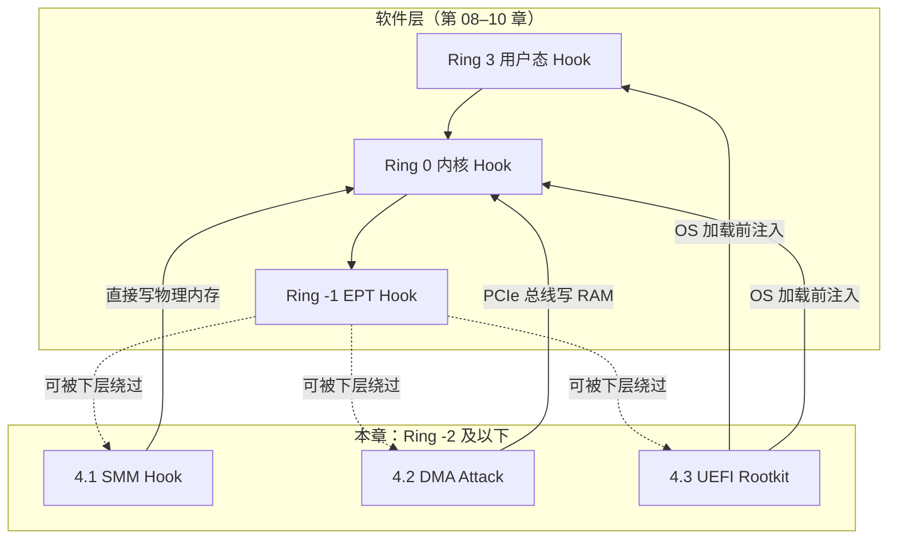
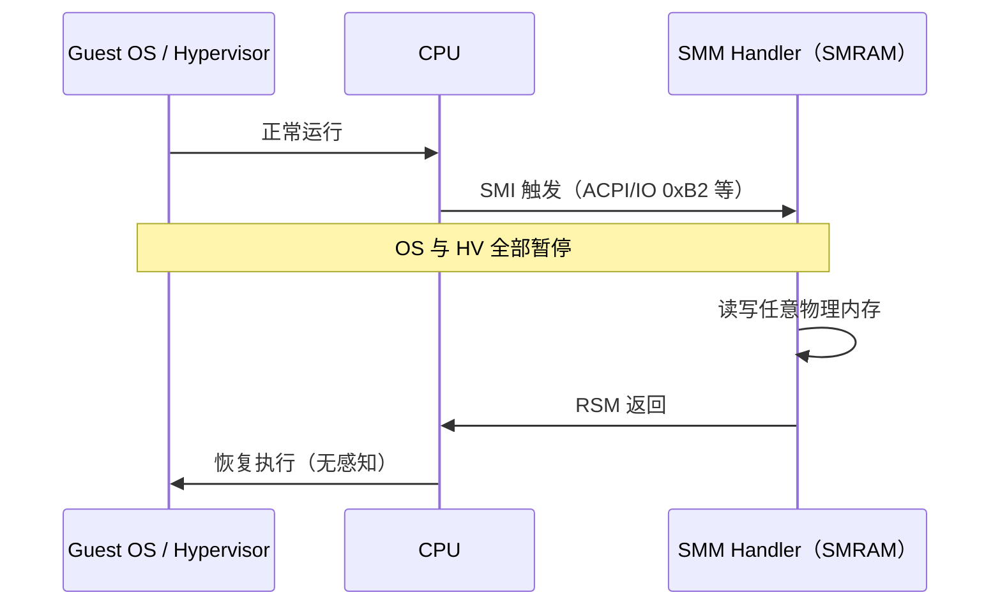
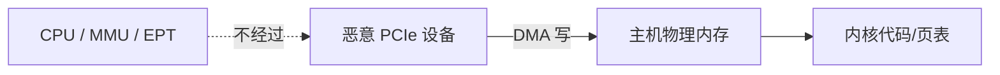
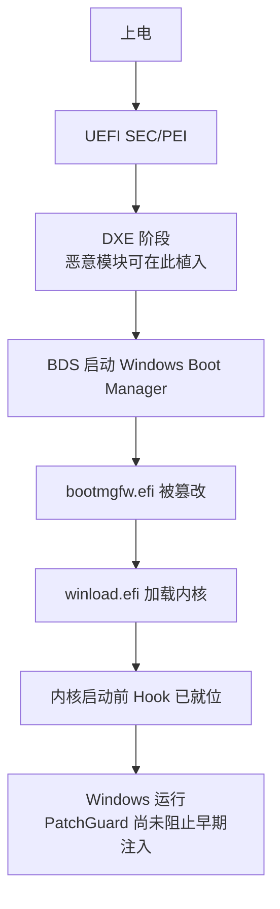
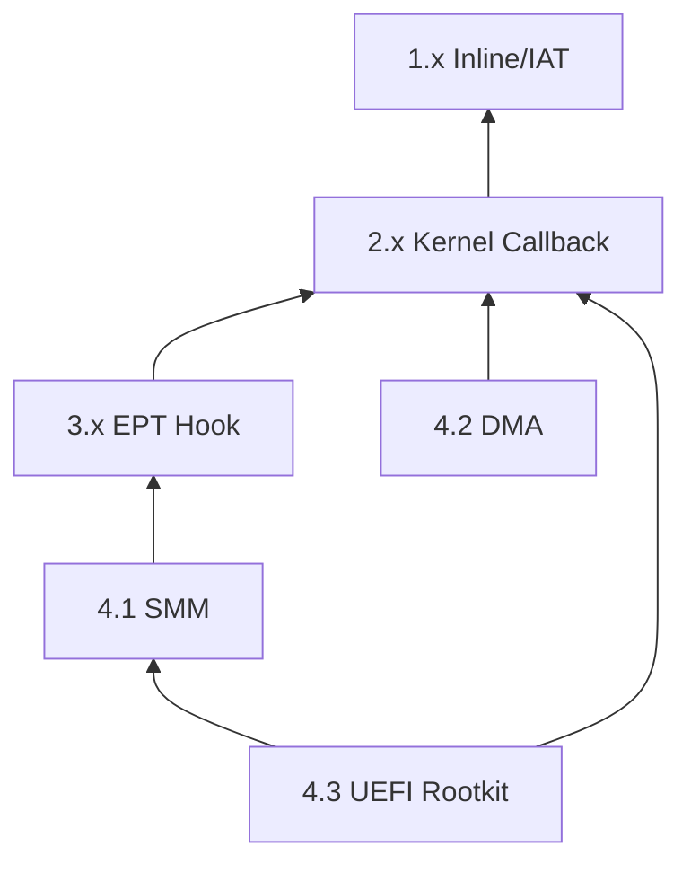

# 11_Windows 全架构 - 硬件/固件级 Hook（Ring -2 及以下）

这一层已经超越常规软件范畴，涉及 **CPU SMM、PCIe DMA、UEFI 固件** 等硬件/固件机制。即使 Ring -1 Hypervisor 在 SMI 期间也会被暂停，对 SMRAM 内容无可见性。本章技术是 Hook 隐蔽性链条的**最底层**，也是部署成本、法律风险最高的层级。

> **权限层级（准确口径）**：
> Ring 3（用户态）< Ring 0（内核）< Ring -1（Hypervisor/VMX Root）< **Ring -2（SMM）** < **固件/硬件（UEFI、DMA 设备）**

---

## 导读：硬件/固件 Hook 技术全景



### 技术速查对比表

| 编号 | 技术 | 常用度（攻击研究） | 隐蔽性 | 前置条件 | 现代 Windows 防御 | 清除难度 |
|------|------|-------------------|--------|----------|-------------------|----------|
| 4.1 | SMM Hook | ★★☆☆☆ | ★★★★★ | 固件漏洞/物理访问 | SMRAM 锁、BIOS 更新 | 需刷写固件 |
| 4.2 | DMA Attack | ★★★☆☆ | ★★★★★ | 物理接入 PCIe/TB 设备 | VT-d/IOMMU、Kernel DMA Protection | 拔设备即可 |
| 4.3 | UEFI Rootkit | ★★★☆☆ | ★★★★★ | SPI 写入权限 | Secure Boot、Boot Guard、Measured Boot | 重装系统**无效** |

### 与第 08/09/10 章的关系

| 层次 | 章节 | 谁能防御谁 |
|------|------|-----------|
| Ring 3 | 第 08 章 | 可被内核/下层全部绕过 |
| Ring 0 | 第 09 章 | 可被 Hypervisor/下层绕过 |
| Ring -1 | 第 10 章 | 可被 SMM/DMA/UEFI 绕过 |
| Ring -2 | 本章 4.1 | SMI 期间 Hypervisor 暂停 |
| 硬件 | 本章 4.2/4.3 | 绕过 CPU MMU/EPT |

### 阅读建议

- **理解权限链**：先读第 10 章 EPT Hook，再读本章体会"更底层 = 更不可见"
- **防御视角**：4.2 DMA 重点看 IOMMU；4.3 UEFI 重点看 Secure Boot / Measured Boot
- **研究工具**：[CHIPSEC](https://github.com/chipsec/chipsec)、[PCILeech](https://github.com/ufrisk/pcileech)、UEFI 固件扫描

---

## 4.1 SMM Hook（系统管理模式）

### 技术定位

**理论最高软件相关特权**。SMM（System Management Mode）由 CPU 硬件触发，代码在 SMRAM 中执行，对 OS 和 Hypervisor 不可见。实际利用需固件漏洞、恶意 SMI Handler 或物理/供应链攻击，**非普通开发者技术**。

### 原理

SMM（System Management Mode）是 x86 CPU 中最高特权级的执行模式，比 Ring -1（Hypervisor）还高。SMM 代码运行在 SMRAM 中，对操作系统和 Hypervisor 完全不可见。

```c
权限层级：
Ring 3 (User) < Ring 0 (Kernel) < Ring -1 (Hypervisor) < Ring -2 (SMM)

SMM 的超能力：
- 拥有独立的、不可被访问的内存（SMRAM）
- 可以任意修改任何 CPU 寄存器状态
- 执行期间所有中断被屏蔽
- 独立的代码空间，操作系统不可见/不可访问
- 从 SMRAM 返回时 CPU 恢复之前的状态，无法感知 SMM 曾执行
```



### SMI 触发来源（现实场景）

| 触发方式 | 说明 |
|----------|------|
| ACPI 定时器 | 周期性 SMI，可做持久监控 |
| I/O 端口 `0xB2` | `outb` 触发 SMI（需平台支持） |
| Legacy USB SMI | 旧平台 USB 控制器相关 |
| 固件 SMI Handler | UEFI/BIOS 注册的 Handler 被篡改 |

### 攻击方式

```c
// SMM 攻击需要固件层面的漏洞利用
// 一旦在 SMRAM 中植入代码：

void SmmHookHandler(SMM_SAVE_STATE* saveState) {
// 获取被暂停的操作系统状态
ULONG64kernelCr3 = saveState->Cr3;
ULONG64guestRip = saveState->Rip;

// 直接通过物理地址修改内核内存（绕过所有保护）
// 因为 SMM 可以直接访问所有物理内存
PVOIDtargetPhysAddr = TranslateVaToPhys(kernelCr3, targetVa);

// 修改内核代码/数据
    WritePhysicalMemory(targetPhysAddr, hookCode, hookSize);

// 完成后返回，CPU 恢复正常执行
// 操作系统和 Hypervisor 完全无法感知
}

// 触发 SMI 的方式（周期性执行 Hook 逻辑）：
// - 利用 ACPI 定时器触发 SMI
// - 写入特定 I/O 端口触发 SMI (outb 0xB2, value)
// - 利用 USB controller 触发 Legacy USB SMI
```

### 更易理解的 SMM 攻击链（概念步骤）

```c
// 精简版：理解 SMM Hook 的必要条件（非可运行 exploit）

// 步骤 1：获得 SMRAM 写入能力（最难）
//   - 利用 UEFI 固件漏洞（如 SMM Callout 未校验缓冲区）
//   - 或物理接入 SPI 编程器刷写固件

// 步骤 2：在 SMRAM 中注册恶意 SMI Handler
//   - 篡改现有 Handler 入口
//   - 或新增 SMI 分发逻辑

// 步骤 3：SMI 触发时修改 Guest 物理内存
void MaliciousSmiHandler(void) {
    // saveState 中保存了触发 SMI 时 CPU 完整上下文
    // 可直接写内核代码页、页表、IDT 等——无需绕过 EPT
    PatchKernelMemoryViaPhysicalAddress(...);
    // RSM 返回，无人知晓
}
```

### 已知研究与漏洞方向（真实案例）

| 项目/事件 | 说明 |
|-----------|------|
| **ThinkPwn**（2015） | 联想等平台 SMM 漏洞，可写 SMRAM |
| **CHIPSEC** `smm` 模块 | 检测 SMM 配置错误、SMRAM 未锁定 |
| **CVE-2018-4251** 等 | 多款笔记本 SMM 权限提升 |
| Intel **BIOS Guard** / **SMM_SUPERVISOR** | 缓解恶意 SMM 代码执行 |

### 防御措施

| 防御 | 说明 |
|------|------|
| SMRAM Lock | 锁定后 OS 无法映射 SMRAM |
| BIOS Guard | 限制固件运行时修改 |
| SMM_CODE_CHK | 部分平台校验 SMM 代码完整性 |
| 固件及时更新 | 修补 SMI Handler 漏洞 |
| 硬件调试器审计 | JTAG 级别检测（企业/取证） |

### 检测难度：★★★★★（理论不可检测）

* SMRAM 对操作系统完全不可见
* CPU 在 SMM 期间外部不响应，没有时间线索暴露
* 即使 Hypervisor 也在 SMI 期间被暂停
* 唯一检测方式：硬件调试器（JTAG）、固件签名验证（Secure Boot）、CHIPSEC 固件审计

> **说明**："理论不可检测"指 OS/HV 层无法直接观测；固件完整性校验与供应链审计仍是现实防线。

---

## 4.2 DMA Attack（直接内存访问攻击）

### 技术定位

**物理接入类攻击**，研究与应用均较活跃。通过 PCIe/Thunderbolt 设备的 DMA 能力直接读写主机物理内存，**无需在目标系统执行代码**。防御侧核心依赖 **IOMMU（VT-d/AMD-Vi）** 与 Windows **Kernel DMA Protection**。

### 原理

通过 PCIe/Thunderbolt 设备的 DMA（Direct Memory Access）能力，直接读写主机物理内存，完全绕过 CPU 的所有保护机制（含 EPT）。不需要在目标系统上执行任何代码。



### 攻击设备

* PCIe 恶意设备（伪装成网卡等）
* Thunderbolt 外接设备
* FireWire 设备（**旧系统，现代 Windows 基本弃用**）
* 恶意 NIC 固件（如 Intel AMT 相关漏洞利用）

| 设备类型 | 现代状态 |
|----------|----------|
| Thunderbolt 3/4 | 仍常见，需 Security Level 策略 |
| PCIe 扩展卡 | 台式机/服务器风险 |
| FireWire | **已弃用**，Win10+ 极少见 |
| USB4（TB 兼容） | 继承 Thunderbolt 安全模型 |

### 实现概述

```c
// 在恶意 PCIe 设备的固件中：
void DmaHookInstall() {
// 扫描物理内存，定位 Windows 内核
PHYSICAL_ADDRESSntBase = ScanForKernelBase();

// 定位目标函数（通过特征码匹配）
PHYSICAL_ADDRESStargetFunc = FindFunctionBySignature(ntBase);

// 通过 DMA 直接写入物理内存
// 绕过 CPU 的 MMU/EPT，没有任何权限检查
    DmaWrite(targetFunc, hookCode, hookCodeSize);

// 或者更隐蔽：修改页表来实现类似 PTE Hook 的效果
PHYSICAL_ADDRESSpteAddr = CalculatePtePhysAddr(targetFunc);
    DmaWrite(pteAddr, &modifiedPte, sizeof(MMPTE));
}
```

### 更易理解的攻击流程（PCILeech 思路）

```c
// 精简版：FPGA/USB3380 等硬件 + 软件框架的逻辑（概念）

// 1. 设备接入 PCIe/Thunderbolt，枚举为合法 DMA Master
// 2. 若 IOMMU 未启用或存在漏洞窗口：
//    - 扫描物理内存找 ntoskrnl 基址（特征码 MZ/PE）
//    - 定位目标函数
//    - DMA 写入 shellcode / inline hook
// 3. 若 IOMMU 已启用（Kernel DMA Protection）：
//    - 仅能访问驱动分配的 DMA 缓冲区，攻击失败

BOOL TryDmaPatch(PHYSICAL_ADDRESS target, PVOID patch, SIZE_T size) {
    if (!IsIommuEnabled()) {
        return DmaWritePhysical(target, patch, size);  // 无 IOMMU 时可行
    }
    return FALSE;  // 现代 Win10+ 笔记本默认阻断
}
```

### 开源参考工具（真实项目）

| 工具 | 用途 |
|------|------|
| [PCILeech](https://github.com/ufrisk/pcileech) | DMA 攻击研究与取证框架 |
| [MemProcFS](https://github.com/ufrisk/MemProcFS) | 通过 DMA 挂载物理内存为文件系统 |
| CHIPSEC `dma` 测试 | 检测 IOMMU 配置是否正确 |

### 防御

* **IOMMU (VT-d / AMD-Vi)**：为 DMA 设备创建独立 IOVA 地址空间，禁止随意访问系统 RAM
* **Kernel DMA Protection (Windows 10 1803+)**：外部 PCIe 设备在登录解锁前禁止 DMA
* **Thunderbolt Security Level**：用户授权模式 / 安全模式 / 禁用
* **Pre-boot DMA Protection**：部分 OEM 在固件层限制冷启动 DMA

### Kernel DMA Protection 状态检查

```powershell
# 管理员 PowerShell：检查内核 DMA 保护是否启用
Get-CimInstance -ClassName Win32_DeviceGuard -Namespace root\Microsoft\Windows\DeviceGuard |
    Select-Object -Property AvailableSecurityProperties, SecurityServicesConfigured
# SecurityServicesConfigured 含 2 表示 Kernel DMA Protection
```

### 检测难度：★★★★★（无 IOMMU 时不可检测）

* 有 IOMMU + Kernel DMA Protection 时，外部设备 DMA 范围被严格限制
* 已接入的恶意设备在 OS 层难以区分（行为像正常 DMA Master）
* 防御重点在**固件策略与物理端口管控**，而非 OS 内 Hook 检测

---

## 4.3 BIOS/UEFI Rootkit

### 技术定位

**持久化攻击的终极形态之一**。在 UEFI 固件 SPI Flash 中植入恶意代码，OS 加载前即获得控制权。重装系统、更换硬盘**无法清除**；需重刷固件或使用 OEM 恢复。

### 原理

在 UEFI 固件中植入恶意代码。由于 UEFI 在操作系统之前执行，可以在 OS 加载前修改任何数据（包括 bootloader、内核加载器），绕过内核保护。即使重装系统、更换硬盘也无法清除。



### 已知案例

* **LoJax (2018)**：第一个野外发现的 UEFI rootkit（ESET 披露）
* **MosaicRegressor (2020)**：针对外交官的 UEFI 植入物
* **CosmicStrand (2022)**：修改 UEFI 固件的持久化攻击（Qihoo 360 披露）
* **BlackLotus (2023)**：绕过 Secure Boot 的 UEFI bootkit（ESET 披露）

### 攻击流程

```c
1. 获取 SPI Flash 写入权限（利用固件漏洞或物理访问）
2. 在 UEFI DXE 阶段植入恶意模块
3. 恶意模块在 OS 加载时注入代码到 Windows Boot Manager
4. Boot Manager 加载内核时注入代码到内核加载器
5. 加载的内核带有预装 Hook（此时 Secure Boot/PatchGuard 尚未初始化）
```

### UEFI 启动阶段速查

| 阶段 | 全称 | Hook 植入点 |
|------|------|-------------|
| SEC | Security | 最早，通常受 Boot Guard 保护 |
| PEI | Pre-EFI Initialization | 芯片组初始化 |
| DXE | Driver Execution | **最常见恶意 DXE 驱动植入点** |
| BDS | Boot Device Selection | 选择启动项、加载 Boot Manager |
| TSL | Transient System Load | OS Loader 执行 |

### 防御体系（现代 PC 标配组件）

| 技术 | 作用 |
|------|------|
| **Secure Boot** | 只允许签名的 Boot/EFI 二进制执行 |
| **Intel Boot Guard / AMD HWP** | 硬件校验固件完整性，防 SPI 篡改 |
| **Measured Boot + TPM** | 将启动各阶段哈希记入 PCR，远程认证可发现异常 |
| **Windows Device Guard** | 与 TPM/Secure Boot 联动 |
| **UEFI 写保护** | SPI Flash 在 OS 运行时锁定写入 |

### BlackLotus 绕 Secure Boot 要点（真实技术点）

| 步骤 | 说明 |
|------|------|
| 利用已吊销但仍被允许的 EFI 签名 | 旧版 `bootmgfw.efi` 等 |
| 或漏洞 CVE-2022-21894（baton drop） | 在 Win11 修复前用于禁用 SB |
| 植入后持久驻留 SPI Flash | 重装 Windows 不影响固件 |

> 微软已通过补丁和吊销证书缓解；**保持 Windows + 固件更新**是关键。

### 固件检测工具

| 工具 | 用途 |
|------|------|
| [CHIPSEC](https://github.com/chipsec/chipsec) | 平台安全评估、SPI/SMM/UEFI 检测 |
| ESET UEFI Scanner | 检测已知 UEFI rootkit 特征 |
| OEM 固件更新工具 | 官方重刷干净固件 |

### 检测难度：★★★★★

* 重装系统无法清除
* 操作系统层面几乎不可检测
* 需要专用固件扫描工具（如 CHIPSEC、UEFI Toolkit）
* Secure Boot + Measured Boot 可阻止/发现未授权固件（已知绕过已被修补）

---

## 全架构 Hook 总览对比表

| 层次 | 章节 | 代表技术 | 隐蔽性 | PatchGuard/HV 可防？ | 典型防御 |
|------|------|----------|--------|---------------------|----------|
| Ring 3 | 第 08 章 | IAT / Inline Hook | ★★☆☆☆ | 不涉及 | 内存扫描 |
| Ring 0 | 第 09 章 | Minifilter / ObCallback | ★★★☆☆ | PG 监控传统 Hook | 驱动签名、回调枚举 |
| Ring -1 | 第 10 章 | EPT Hook | ★★★★★ | PG 读取可被骗 | HV 检测、VBS |
| Ring -2 | 4.1 SMM | SMM Handler 篡改 | ★★★★★ | HV 暂停不可防 | 固件更新、CHIPSEC |
| 硬件 | 4.2 DMA | PCIe DMA 写 RAM | ★★★★★ | EPT 不经过 | IOMMU、Kernel DMA Protection |
| 固件 | 4.3 UEFI | SPI Flash 植入 | ★★★★★ | OS 未加载即中招 | Secure Boot、Boot Guard、TPM |



---

## 技术演进路线图

```
2001–2006（XP 时代 — 无保护）
│  IAT/EAT Hook → Inline Hook → SSDT Hook → IDT Hook
│  无 PatchGuard，用户态/内核 Hook 横行
│
2006–2012（Vista/7 — PatchGuard 登场）
│  PatchGuard v1 → SSDT/IDT Hook 阵亡
│  DKOM、MSR Hook、PG 绕过混战
│
2012–2015（Win8/8.1 — DSE 强化）
│  驱动签名强制 → BYOVD 兴起
│  Infinity Hook、Kernel Callback 成为主流
│
2015–2018（Win10 — HVCI/VBS 部署）
│  HVCI 限制动态代码 → EPT Hook 研究爆发
│  PTE Base 随机化
│
2018–2022（虚拟化军备竞赛）
│  HyperPlatform、hvpp、HyperHide 等框架成熟
│  VMFUNC、MSR Bitmap、CPUID 反检测组合
│  反作弊开始检测 Hypervisor 存在
│
2022–2026（固件层成为焦点）
│  VBS、Credential Guard 普及
│  UEFI Rootkit 商业化（BlackLotus、CosmicStrand）
│  Kernel DMA Protection 成为笔记本标配
│  Intel TDX / AMD SEV 推进硬件隔离
│
未来趋势：
│  机密计算（TDX/SEV/CCA）缩小可信边界
│  启动链硬件度量（TPM PCR）成为企业标配
│  战场：固件供应链 + DMA 物理口 + SMM 配置错误
```

---

## 结语

Windows Hook 技术经过 20+ 年的进化，已从简单的 IAT 修改，发展到需要阅读 Intel VT-x 手册的 EPT Hook，再到本章的 SMM/DMA/UEFI 等硬件固件层。

每一道微软加固的防线，都催生了更底层的一次突破：

* 用户态被拦 → 进内核（第 08 → 09 章）
* 内核被 PatchGuard 监控 → Infinity Hook / 合法回调（第 09 章）
* 内核结构不能碰 → Hypervisor EPT（第 10 章）
* Hypervisor 被检测 → SMM / UEFI / DMA（本章）

**核心公理：谁控制了更底层的抽象，谁就拥有更强的控制权。** 上层的检测手段可以被下层伪造或绕过——EPT Hook 之后在纯软件层面的完整性读取可被欺骗，而 SMM/DMA/UEFI 则连"软件执行环境"本身都能先于 OS 改写。

**现实建议**：

| 角色 | 建议 |
|------|------|
| 开发者 | 优先使用第 09 章合法内核回调，不要触碰 PG 监控结构 |
| 安全研究 | 从第 08 章到第 10 章循序渐进；本章仅作威胁建模 |
| 防御方 | 启用 Secure Boot + TPM + Kernel DMA Protection + 固件更新 |
| 取证 | OS 层无发现时，升级到 CHIPSEC/固件镜像比对 |

> 全架构 Hook 系列（第 08–11 章）至此形成完整链条：**Ring 3 → Ring 0 → Ring -1 → Ring -2/固件**。绝大多数合法产品停留在 Ring 0；Ring -1 及以下属于高阶威胁研究与国家级/供应链攻击范畴。
